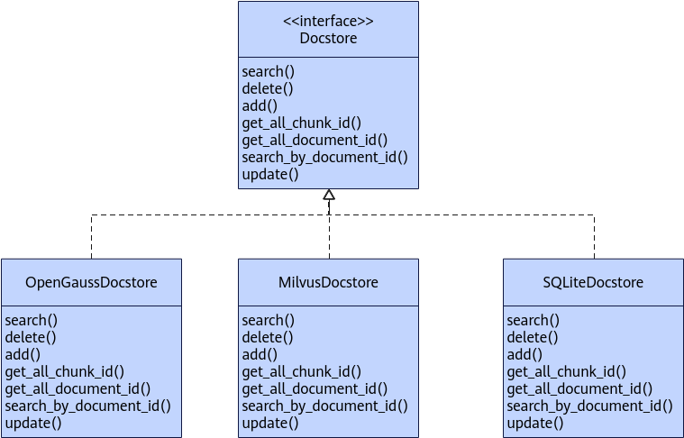
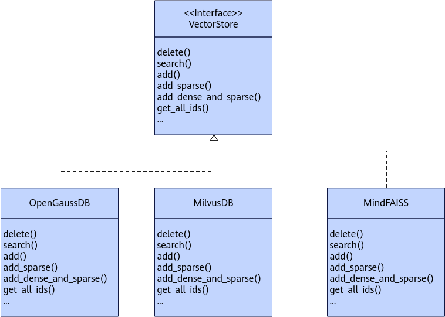

## 数据库<a name="ZH-CN_TOPIC_0000002018595193"></a>

### 关系型数据库<a name="ZH-CN_TOPIC_0000001982155116"></a>

#### 数据库结构<a name="ZH-CN_TOPIC_0000002088913762"></a>

##### KnowledgeModel类<a name="ZH-CN_TOPIC_0000002124359997"></a>

```
class KnowledgeModel(Base):
    __tablename__ = "knowledge_table"

    id = Column(Integer, primary_key=True, autoincrement=True)
    knowledge_id = Column(Integer, nullable=False)
    knowledge_name = Column(String, comment="知识库名称")
    user_id = Column(String, comment="用户id")
    role = Column(Enum("admin", "member"), comment="用户角色，admin: 管理员, member: 仅查询")
    create_time = Column(DateTime, comment="创建时间", default=datetime.datetime.utcnow)
    __table_args__ = (
        UniqueConstraint('knowledge_name', 'user_id', name="knowledge_name"),
        {"sqlite_autoincrement": True}
    )
```


##### DocumentModel类<a name="ZH-CN_TOPIC_0000002088760430"></a>

```
class DocumentModel(Base):
    __tablename__ = "document_table"

    document_id = Column(Integer, primary_key=True, autoincrement=True)
    knowledge_id = Column(Integer, comment="知识库ID", nullable=False)
    knowledge_name = Column(String, comment="知识库名称")
    document_name = Column(String, comment="文档名称")
    document_file_path = Column(String, comment="文档路径")
    create_time = Column(DateTime, comment="创建时间", default=datetime.datetime.utcnow)
    __table_args__ = (
        UniqueConstraint('knowledge_id', 'document_name', name="knowledge_id"),
        {"sqlite_autoincrement": True}
    )
```


##### ChunkModel类<a name="ZH-CN_TOPIC_0000002088920278"></a>

上传文档时，chunk\_id和向量数据库中的id一致。

```
class ChunkModel(Base):
    __tablename__ = "chunks_table"

    chunk_id = Column(Integer, primary_key=True, comment="主键ID", autoincrement="auto")
    document_id = Column(Integer, comment="文档ID")
    document_name = Column(String(255), comment="文档名称")
    chunk_content = Column(TEXT, comment="文本内容")
    chunk_metadata = Column(JSON, comment="元数据")
    create_time = Column(DateTime(timezone=True), server_default=text("CURRENT_TIMESTAMP"), comment="创建时间")
    __table_args__ = (
        Index('ix_document_id', 'document_id'),
        Index('ix_create_time', 'create_time')
    )
```


#### 文本数据库继承关系<a name="ZH-CN_TOPIC_0000002237897244"></a>

**图 1**  文本数据库继承关系<a name="fig1947119335531"></a>  



#### Docstore<a name="ZH-CN_TOPIC_0000002018714733"></a>

##### 类功能<a name="ZH-CN_TOPIC_0000001982155140"></a>

**功能描述<a name="section29524313490"></a>**

抽象类，处理关系数据库。

**函数原型<a name="section546771414342"></a>**

```
from mx_rag.storage.document_store import Docstore
class Docstore(ABC)
```


##### add<a name="ZH-CN_TOPIC_0000001982155232"></a>

**功能描述<a name="section1031631414920"></a>**

将document\_id对应的多个知识片段添加到数据库。

**函数原型<a name="section1247913102108"></a>**

```
@abstractmethod
def add(documents, document_id)
```


##### delete<a name="ZH-CN_TOPIC_0000002018595269"></a>

**功能描述<a name="section1031631414920"></a>**

删除document\_id对应的所有知识片段。

**函数原型<a name="section1247913102108"></a>**

```
@abstractmethod
def delete(document_id)
```


##### search<a name="ZH-CN_TOPIC_0000002018714785"></a>

**功能描述<a name="section126871434117"></a>**

通过知识片段chunk\_id获取对应的内容。

**函数原型<a name="section868519111050"></a>**

```
@abstractmethod
def search(chunk_id) -> MxDocument
```


##### get\_all\_chunk\_id<a name="ZH-CN_TOPIC_0000002230991353"></a>

**功能描述<a name="section126871434117"></a>**

查询所有知识片段对应的ID，一个文档切分成多个chunk时，入库时一个document\_id对应多个chunk\_id。

**函数原型<a name="section868519111050"></a>**

```
@abstractmethod
def get_all_chunk_id(self) -> List[int]
```


##### get\_all\_document\_id<a name="ZH-CN_TOPIC_0000002195791126"></a>

**功能描述<a name="section126871434117"></a>**

查询所有文档对应的ID，一个文档切分成多个chunk时，入库时一个document\_id对应多个chunk\_id。

**函数原型<a name="section868519111050"></a>**

```
@abstractmethod
def get_all_document_id(self) -> List[int]
```


##### update<a name="ZH-CN_TOPIC_0000002286901430"></a>

**功能描述<a name="section126871434117"></a>**

更新关系数据库的chunk片段

**函数原型<a name="section868519111050"></a>**

```
@abstractmethod
def update(chunk_ids: List[int], texts: List[str])
```


##### search\_by\_document\_id<a name="ZH-CN_TOPIC_0000002321460913"></a>

**功能描述<a name="section126871434117"></a>**

根据document\_id返回对应的文档片段

**函数原型<a name="section868519111050"></a>**

```
@abstractmethod
def search_by_document_id(document_id: int)
```


#### OpenGaussDocstore<a name="ZH-CN_TOPIC_0000002174665966"></a>

##### 类功能<a name="ZH-CN_TOPIC_0000002174506258"></a>

**功能描述<a name="section957011509130"></a>**

提供OpenGauss知识数据库，主要存储切分后的chunk信息。

**函数原型<a name="section12411139493"></a>**

```
from mx_rag.storage.document_store import OpenGaussDocstore
OpenGaussDocstore(engine, encrypt_fn, decrypt_fn, enable_bm25, index_name)
```

**输入参数说明<a name="section1054013414143"></a>**

|参数名|数据类型|可选/必选|说明|
|--|--|--|--|
|engine|Engine|必选|Engine实例，具体说明请参考<a href="https://docs.sqlalchemy.org/en/20/core/connections.html#sqlalchemy.engine.Engine">Engine</a>。限制使用opengauss方言。<br>>[!NOTE] 说明 Engine由用户控制传入，请使用安全的连接方式。|
|encrypt_fn|Callable[[str], str]|可选|回调方法，返回值为字符串且长度不超过128*1024*1024，对[ChunkModel类](#chunkmodel类)的chunk内容加密，输出为字符串。add保存时，数据库保存的是chunk字段经过encrypt_fn方法处理后的数据。<br>> [!NOTICE] 须知 如果上传的文档涉及银行卡号、身份证号、护照号、口令等个人数据，请配置该参数保证个人数据安全。|
|decrypt_fn|Callable[[str], str]|可选|回调方法，返回值为字符串且长度不超过16*1024*1024，对ChunkModel类的chunk内容解密，输出为字符串。search返回时，返回的是chunk字段经过decrypt_fn方法处理后的数据。|
|enable_bm25|bool|可选|配置数据库是否支持bm25稀疏检索，若此参数配置为False，则全文检索功能不可用(full_text_search方法始终返回[ ])，默认为True。|
|index_name|str|可选|创建的bm25检索的名称，需要满足正则表达式^[a-zA-Z0-9_-]{6,64}$，即只能由大小写字母、数字、下划线组成，且长度为6-64，默认为"chunks_content_bm25"。|


**调用示例<a name="section139398168249"></a>**

```
import getpass
from sqlalchemy import URL, create_engine
from mx_rag.storage.document_store import MxDocument, OpenGaussDocstore
def encrypt_fn(value):
    # 安全的加密方法
    return value
def decrypt_fn(value):
    # 安全的解密方法
    return value
username = "<username>"

host = "<host>"
port = "<port>"
database = "database"
url = URL.create(
   "opengauss+psycopg2",
   username=username,
   password=getpass.getpass(),
   host=host,
   port=port,
   database=database
)
connect_args = {
    'sslmode': 'verify-full',
    'sslrootcert': "path_to root cert",
    'sslkey': "path_to key",
    'sslcert': "path_to cert",
    'sslpassword': getpass.getpass(prompt="cert key password:")
}
engine = create_engine(url, connect_args=connect_args)
chunk_store = OpenGaussDocstore(engine=engine, encrypt_fn=encrypt_fn, decrypt_fn=decrypt_fn)
texts = ["示例", "文本"]
metadatas = [{} for _ in texts]
doc = [MxDocument(page_content=t, metadata=m, document_name="1.docx") for t, m in zip(texts, metadatas)]
document_id = 1
chunk_store.add(doc, document_id)
idx = chunk_store.get_all_chunk_id()
document = chunk_store.search(idx[0])
print(document.page_content)
print(chunk_store.full_text_search("文本", filter_dict={"document_id": [0]}))
print(chunk_store.full_text_search("文本", filter_dict={"document_id": [document_id]}))
chunk_store.update(idx[:2], ["text1", "text2"])
print(chunk_store.delete(document_id))
chunk_store.search_by_document_id(document_id)
```


##### add<a name="ZH-CN_TOPIC_0000002209906697"></a>

**功能描述<a name="section5434255810"></a>**

在关系型数据库中保存文档的切片信息。

**函数原型<a name="section18789201331417"></a>**

```
def add(documents, document_id)
```

**输入参数说明<a name="section19434210583"></a>**

|参数名|数据类型|可选/必选|说明|
|--|--|--|--|
|documents|List[MxDocument]，MxDocument参见[MxDocument](#mxdocument)|必选|文档切片对象列表，不能为空列表，列表长度不能超过1000 * 1000。|
|document_id|int|必选|文档ID，参见数据库模型[DocumentModel类](#documentmodel类)。|


**返回值说明<a name="section11818153884917"></a>**

|数据类型|说明|
|--|--|
|List[int]|文档存储后的ID列表。|


##### delete<a name="ZH-CN_TOPIC_0000002209832349"></a>

**功能描述<a name="section5434255810"></a>**

在关系型数据库中删除文档的切片信息。

**函数原型<a name="section18789201331417"></a>**

```
def delete(document_id)
```

**输入参数说明<a name="section19434210583"></a>**

|参数名|数据类型|可选/必选|说明|
|--|--|--|--|
|document_id|int|必选|文档ID，参见数据库模型[DocumentModel类](#documentmodel类)。|


**返回值说明<a name="section11818153884917"></a>**

|数据类型|说明|
|--|--|
|List[int]|被删除的文档ID列表。|


##### search<a name="ZH-CN_TOPIC_0000002174665970"></a>

**功能描述<a name="section5434255810"></a>**

在关系型数据库中搜索文档信息。

**函数原型<a name="section18789201331417"></a>**

```
def search(chunk_id)
```

**输入参数说明<a name="section19434210583"></a>**

|参数名|数据类型|可选/必选|说明|
|--|--|--|--|
|chunk_id|int|必选|文档索引，取值范围为大于等于0。|


**返回值说明<a name="section11818153884917"></a>**

|数据类型|说明|
|--|--|
|Optional[MxDocument]|查询到结果时返回MxDocument类实例，无结果时返回None。MxDocument参见[MxDocument](#mxdocument)。|


##### get\_all\_chunk\_id<a name="ZH-CN_TOPIC_0000002174506270"></a>

**功能描述<a name="section5434255810"></a>**

查询所有知识片段对应的ID，一个文档切分成多个chunk时，入库时一个document\_id对应多个chunk\_id。

**函数原型<a name="section18789201331417"></a>**

```
def get_all_chunk_id()
```

**返回值说明<a name="section11818153884917"></a>**

|数据类型|说明|
|--|--|
|List[int]|返回关系数据库所有文档片段ID组成的List。|


##### get\_all\_document\_id<a name="ZH-CN_TOPIC_0000002195631538"></a>

**功能描述<a name="section5434255810"></a>**

查询所有文档对应的ID，一个文档切分成多个chunk时，入库时一个document\_id对应多个chunk\_id。

**函数原型<a name="section18789201331417"></a>**

```
def get_all_document_id()
```

**返回值说明<a name="section11818153884917"></a>**

|数据类型|说明|
|--|--|
|List[int]|返回关系数据库所有文档ID组成的List。|


##### full\_text\_search<a name="ZH-CN_TOPIC_0000002265065250"></a>

**功能描述<a name="section5434255810"></a>**

在关系型数据库中搜索文档信息。如果创建OpenGaussDocstore实例时，参数enable\_bm25设置为False，则无法使用此接口，会返回空列表。

**函数原型<a name="section18789201331417"></a>**

```
def full_text_search(query, top_k, filter_dict) -> List[MxDocument]
```

**输入参数说明<a name="section19434210583"></a>**

|参数名|数据类型|可选/必选|说明|
|--|--|--|--|
|query|str|必选|待检索的文本信息，长度范围(0, 1000 * 1000]|
|top_k|int|可选|返回检索到的最匹配的chunk数量，默认值为3，若该参数的值大于实际检索到的有效chunk数量，则只返回有效的chunk，取值范围(0, 10000]|
|filter_dict|Dict|必选|由检索条件组成的字典，当前只支持对document_id进行过滤，过滤的文档id以列表形式传入，id列表长度不超过1000*1000。例如，需要在document_id为1，2，4这几篇文档中过滤，则传入的字典为{"document_id": [1, 2, 4]}。|


**返回值说明<a name="section11818153884917"></a>**

|数据类型|说明|
|--|--|
|List[MxDocument]|查询到结果时返回MxDocument类实例组成的列表，无结果时返回空列表。MxDocument参见[MxDocument](#mxdocument)。enable_bm25为False返回值为[]。|


##### drop<a name="ZH-CN_TOPIC_0000002265008298"></a>

**功能描述<a name="section5434255810"></a>**

删除当前实例管理的数据库

**函数原型<a name="section18789201331417"></a>**

```
def drop()
```


##### search\_by\_document\_id<a name="ZH-CN_TOPIC_0000002321478693"></a>

**功能描述<a name="section5434255810"></a>**

通过document\_id获取对应文档片段。

**函数原型<a name="section18789201331417"></a>**

```
def search_by_document_id(document_id: int)
```

**输入参数说明<a name="section1568918322512"></a>**

|参数名|数据类型|可选/必选|说明|
|--|--|--|--|
|document_id|int|必选|文档索引，取值范围为大于等于0。|


**返回值说明<a name="section11818153884917"></a>**

|数据类型|说明|
|--|--|
|List[MxDocument]|查询到结果时返回MxDocument类实例组成的列表，无结果时返回空列表。MxDocument参见[MxDocument](#mxdocument)。|


##### update<a name="ZH-CN_TOPIC_0000002286919214"></a>

**功能描述<a name="section5434255810"></a>**

更新关系数据库中的文档片段。

**函数原型<a name="section18789201331417"></a>**

```
def update(chunk_ids: List[int], texts: List[str])
```

**输入参数说明<a name="section1568918322512"></a>**

|参数名|数据类型|可选/必选|说明|
|--|--|--|--|
|chunk_ids|List[int]|必选|文档待更新id列表，列表长度范围(0, 1000000]|
|texts|List[str]|必选|更新文档内容列表，列表长度范围(0, 1000000], 字符串长度范围[1, 128*1024*1024]。chunk_ids列表和texts列表一一对应。|


#### MilvusDocstore<a name="ZH-CN_TOPIC_0000002195480665"></a>

##### 类功能<a name="ZH-CN_TOPIC_0000002160273930"></a>

**功能描述<a name="section957011509130"></a>**

提供基于Milvus的知识数据库，主要存储切分后的chunk信息。

**函数原型<a name="section12411139493"></a>**

```
from mx_rag.storage.document_store import MilvusDocstore
MilvusDocstore(client, collection_name, enable_bm25, bm25_k1, bm25_b, auto_flush)
```

**输入参数说明<a name="section1054013414143"></a>**

|参数名|数据类型|可选/必选|说明|
|--|--|--|--|
|client|MilvusClient|必选|MilvusClient实例，具体说明请参考<a href="https://milvus.io/api-reference/pymilvus/v2.4.x/MilvusClient/Client/MilvusClient.md">MilvusClient</a>。<br>> [!NOTE] 说明 MilvusClient由用户控制传入，请使用安全的连接方式。|
|collection_name|str|可选|集合名称，不能为空，最大长度为1024，默认为doc_store|
|enable_bm25|bool|可选|是否开启bm25稀疏向量检索，默认为True，如果此参数设置为False，则全文检索功能不可用(full_text_search方法始终返回[ ])|
|bm25_k1|float|可选|bm25稀疏向量检索时控制词频饱和度。数值越大，术语频率在文档排序中的重要性越高。取值范围[1.2, 2.0], 默认为1.2，具体说明请参考<a href="https://milvus.io/docs/zh/full-text-search.md#Full-Text-Search">Milvus全文检索</a>相关部分|
|bm25_b|float|可选|bm25稀疏向量检索时控制文档长度标准化的程度。取值范围[0, 1]，默认为0.75。具体说明请参考<a href="https://milvus.io/docs/zh/full-text-search.md#Full-Text-Search">Milvus全文检索</a>相关部分|
|auto_flush|bool|可选|数据变更时是否自动刷新内存数据，默认为True。|
|encrypt_fn|Callable[[str], str]|可选|回调方法，返回值为字符串且长度不超过128*1024*1024，enable_bm25为False时生效，当调用add或update时，使用encrypt_fn方法对文档page_content加密后入库。<br>> [!NOTICE] 须知 如果上传的文档涉及银行卡号、身份证号、护照号、口令等个人数据，请配置该参数保证个人数据安全。|
|decrypt_fn|Callable[[str], str]|可选|回调方法，返回值为字符串且长度不超过16*1024*1024，enable_bm25为False时生效，调用查询类接口时对使用decrypt_fn对page_content解密后返回。|


**调用示例<a name="section139398168249"></a>**

```
import getpass
from pymilvus import MilvusClient
from mx_rag.storage.document_store import MxDocument, MilvusDocstore
client = MilvusClient("https://x.x.x.x:port", user="xxx", password=getpass.getpass(), secure=True,   client_pem_path="path_to/client.pem",   client_key_path="path_to/client.key",   ca_pem_path="path_to/ca.pem",   server_name="localhost")

chunk_store = MilvusDocstore(client)
text = ["示例", "文本"]
metadata_list = [{} for _ in text]
doc = [MxDocument(page_content=t, metadata=m, document_name="1.docx") for t, m in zip(text, metadata_list)]
document_id = 1
chunk_store.add(doc, document_id)
ids = chunk_store.get_all_chunk_id()
document = chunk_store.search(ids[0])
print(document.page_content)
print(chunk_store.full_text_search("文本", filter_dict={"document_id": [0]}))
print(chunk_store.full_text_search("文本", filter_dict={"document_id": [document_id]}))
chunk_store.update([0, 1], ["text1", "text2"])
print(chunk_store.delete(document_id))
chunk_store.search_by_document_id(document_id)
```


##### add<a name="ZH-CN_TOPIC_0000002160114186"></a>

**功能描述<a name="section5434255810"></a>**

在数据库中保存文档的切片信息。

**函数原型<a name="section18789201331417"></a>**

```
def add(documents, document_id)
```

**输入参数说明<a name="section19434210583"></a>**

|参数名|数据类型|可选/必选|说明|
|--|--|--|--|
|documents|List[MxDocument]，MxDocument参见[MxDocument](#mxdocument)|必选|文档切片对象列表，不能为空列表，列表长度不能超过1000 * 1000。|
|document_id|int|必选|文档ID，参见数据库模型[DocumentModel类](#documentmodel类)。|


**返回值说明<a name="section11818153884917"></a>**

|数据类型|说明|
|--|--|
|List[int]|文档存储后的ID列表。|


##### delete<a name="ZH-CN_TOPIC_0000002195515009"></a>

**功能描述<a name="section5434255810"></a>**

在数据库中删除文档的切片信息。

**函数原型<a name="section18789201331417"></a>**

```
def delete(document_id)
```

**输入参数说明<a name="section19434210583"></a>**

|参数名|数据类型|可选/必选|说明|
|--|--|--|--|
|document_id|int|必选|文档ID，参见数据库模型[DocumentModel类](#documentmodel类)|


**返回值说明<a name="section11818153884917"></a>**

|数据类型|说明|
|--|--|
|int|被删除的文档计数。|


##### search<a name="ZH-CN_TOPIC_0000002195480669"></a>

**功能描述<a name="section5434255810"></a>**

在数据库中搜索文档信息。

**函数原型<a name="section18789201331417"></a>**

```
def search(chunk_id)
```

**输入参数说明<a name="section19434210583"></a>**

|参数名|数据类型|可选/必选|说明|
|--|--|--|--|
|chunk_id|int|必选|文档索引，取值范围为大于等于0。|


**返回值说明<a name="section11818153884917"></a>**

|数据类型|说明|
|--|--|
|Optional[MxDocument]|查询到结果时返回MxDocument类实例，无结果时返回None。MxDocument参见[MxDocument](#mxdocument)。|


##### get\_all\_chunk\_id<a name="ZH-CN_TOPIC_0000002195492801"></a>

**功能描述<a name="section5434255810"></a>**

在关系型数据库中查询文档片段对应id。

**函数原型<a name="section18789201331417"></a>**

```
def get_all_chunk_id()
```

**返回值说明<a name="section11818153884917"></a>**

|数据类型|说明|
|--|--|
|List[int]|返回关系数据库所有文档片段ID组成的List。|


##### get\_all\_document\_id<a name="ZH-CN_TOPIC_0000002230991357"></a>

**功能描述<a name="section5434255810"></a>**

查询所有文档对应的id，一个文档切分成多个chunk时，入库时一个document\_id对应多个chunk\_id。

**函数原型<a name="section18789201331417"></a>**

```
def get_all_document_id()
```

**返回值说明<a name="section11818153884917"></a>**

|数据类型|说明|
|--|--|
|List[int]|返回关系数据库所有文档ID组成的List。|


##### full\_text\_search<a name="ZH-CN_TOPIC_0000002256361794"></a>

**功能描述<a name="section5434255810"></a>**

在数据库中搜索文本信息，搜索使用BM25稀疏向量检索，如果创建MilvusDocstore实例时，参数enable\_bm25设置为False，则无法使用此接口，会返回空列表。

**函数原型<a name="section18789201331417"></a>**

```
def full_text_search(query, top_k, drop_ratio_search, filter_dict)
```

**输入参数说明<a name="section19434210583"></a>**

|参数名|数据类型|可选/必选|说明|
|--|--|--|--|
|query|str|必选|检索的文本内容，长度取值范围(0, 1000 * 1000]|
|top_k|int|可选|返回检索到的最匹配的chunk数量，默认值为3，若该参数的值大于实际检索到的有效chunk数量，则只返回有效的chunk, 取值范围(0, 10000]|
|drop_ratio_search|float|可选|在bm25稀疏向量搜索过程中排除的小向量值的比例。该选项可通过指定忽略查询向量中最小值的比例，对搜索过程进行微调。它有助于平衡搜索精度和性能。drop_ratio_search的值越小，这些小值对最终得分的贡献就越小。通过忽略一些小值，可以提高搜索性能，同时将对精确度的影响降到最低。取值范围[0, 1)，默认为0.2，具体说明请参考<a href="https://milvus.io/docs/zh/index.md?tab=sparse">Milvus稀疏嵌入</a>相关部分|
|filter_dict|Dict|必选|由检索条件组成的字典，当前只支持对document_id进行过滤，过滤的文档id以列表形式传入，id列表长度不超过1000*1000。例如，需要在document_id为1，2，4这几篇文档中过滤，则传入的字典为{"document_id": [1, 2, 4]}。|


**返回值说明<a name="section11818153884917"></a>**

|数据类型|说明|
|--|--|
|List[MxDocument]|查询到结果时返回MxDocument类实例组成的列表，无结果时返回空列表。MxDocument参见[MxDocument](#mxdocument)。|


##### client<a name="ZH-CN_TOPIC_0000002293680285"></a>

**功能描述<a name="section5434255810"></a>**

获取实例的milvus代理。

**函数原型<a name="section18789201331417"></a>**

```
@property
def client()
```

**返回值说明<a name="section11818153884917"></a>**

|数据类型|说明|
|--|--|
|MilvusClient|实例的Milvus代理。|


##### collection\_name<a name="ZH-CN_TOPIC_0000002293753349"></a>

**功能描述<a name="section5434255810"></a>**

获取实例的milvus服务collection名字。

**函数原型<a name="section18789201331417"></a>**

```
@property
def collection_name()
```

**返回值说明<a name="section11818153884917"></a>**

|数据类型|说明|
|--|--|
|str|实例的Milvus服务器的collection名字。|


##### drop\_collection<a name="ZH-CN_TOPIC_0000002259183232"></a>

**功能描述<a name="section5434255810"></a>**

删除实例的milvus服务collection数据。

**函数原型<a name="section18789201331417"></a>**

```
def drop_collection()
```


##### search\_by\_document\_id<a name="ZH-CN_TOPIC_0000002287022500"></a>

**功能描述<a name="section5434255810"></a>**

通过document\_id获取对应文档片段

**函数原型<a name="section18789201331417"></a>**

```
def search_by_document_id(document_id: int)
```

**输入参数说明<a name="section1568918322512"></a>**

|参数名|数据类型|可选/必选|说明|
|--|--|--|--|
|document_id|int|必选|文档索引，取值范围为大于等于0。|


**返回值说明<a name="section11818153884917"></a>**

|数据类型|说明|
|--|--|
|List[MxDocument]|查询到结果时返回MxDocument类实例组成的列表，无结果时返回空列表。MxDocument参见[MxDocument](#mxdocument)。|


##### update<a name="ZH-CN_TOPIC_0000002321591745"></a>

**功能描述<a name="section5434255810"></a>**

更新关系数据库中的文档片段。

**函数原型<a name="section18789201331417"></a>**

```
def update(chunk_ids: List[int], texts: List[str])
```

**输入参数说明<a name="section1568918322512"></a>**

|参数名|数据类型|可选/必选|说明|
|--|--|--|--|
|chunk_ids|List[int]|必选|文档待更新id列表，列表长度范围(0, 1000000]|
|texts|List[str]|必选|更新文档内容列表，列表长度范围(0, 1000000], 字符串长度范围[1, 128*1024*1024]。chunk_ids列表和texts列表一一对应。|


**返回值说明<a name="section12421614192614"></a>**

无


##### flush<a name="ZH-CN_TOPIC_0000002334293685"></a>

**功能描述<a name="section5434255810"></a>**

刷新未加载的数据到内存，在使用add、delete、update等操作后对数据进行了变更，需要调用此接口更新内存数据。

**函数原型<a name="section18789201331417"></a>**

```
def flush()
```

**输入参数说明<a name="section1568918322512"></a>**

无

**返回值说明<a name="section12421614192614"></a>**

无


#### SQLiteDocstore<a name="ZH-CN_TOPIC_0000002018595457"></a>

##### 类功能<a name="ZH-CN_TOPIC_0000001981995376"></a>

**功能描述<a name="section957011509130"></a>**

提供sqlite知识数据库，主要存储切分后的chunk信息。

**函数原型<a name="section12411139493"></a>**

```
from mx_rag.storage.document_store import SQLiteDocstore
SQLiteDocstore(db_path, encrypt_fn, decrypt_fn)
```

**输入参数说明<a name="section1054013414143"></a>**

|参数名|数据类型|可选/必选|说明|
|--|--|--|--|
|db_path|str|必选|关系型数据库存储路径，必须为有效路径，路径的长度最大为1024，文件名长度不能超过200，不能包含".."，存放路径不能在路径列表中：["/etc", "/usr/bin", "/usr/lib", "/usr/lib64", "/sys/", "/dev/", "/sbin", "/tmp"]。|
|encrypt_fn|Callable[[str], str]|可选|回调方法，返回值为字符串且长度不超过128*1024*1024，对[ChunkModel类](#chunkmodel类)的chunk内容加密，输出为字符串。add保存时，数据库保存的是chunk字段经过encrypt_fn方法处理后的数据。<br>> [!NOTICE] 须知如果上传的文档涉及银行卡号、身份证号、护照号、口令等个人数据，请配置该参数保证个人数据安全。|
|decrypt_fn|Callable[[str], str]|可选|回调方法，返回值为字符串且长度不超过16*1024*1024，对[ChunkModel类](#chunkmodel类)的chunk内容解密，输出为字符串。search返回时，返回的是chunk字段经过decrypt_fn方法处理后的数据。|


**调用示例<a name="section139398168249"></a>**

```
from mx_rag.storage.document_store import MxDocument, SQLiteDocstore
def encrypt_fn(value):
    # 安全的加密方法
    return value
def decrypt_fn(value):
    # 安全的解密方法
    return value
chunk_store = SQLiteDocstore(db_path="./sql.db", encrypt_fn=encrypt_fn, decrypt_fn=decrypt_fn)
text = ["示例", "文本"]
metadata = [{} for _ in text]
doc = [MxDocument(page_content=t, metadata=m, document_name="1.docx") for t, m in zip(text, metadata)]
document_id = 1
chunk_store.add(doc, document_id)
idx = chunk_store.get_all_chunk_id()
document = chunk_store.search(idx[0])
print(document.page_content)
chunk_store.update(idx[:2], ["text1", "text2"])
print(chunk_store.delete(document_id))
chunk_store.search_by_document_id(document_id)
```


##### add<a name="ZH-CN_TOPIC_0000002018714881"></a>

**功能描述<a name="section5434255810"></a>**

在关系型数据库中保存文档的切片信息。

**函数原型<a name="section18789201331417"></a>**

```
def add(documents, document_id)
```

**输入参数说明<a name="section19434210583"></a>**

|参数名|数据类型|可选/必选|说明|
|--|--|--|--|
|documents|List[MxDocument]，MxDocument参见[MxDocument](#mxdocument)|必选|文档切片对象列表，不能为空列表，列表长度不能超过1000 * 1000。|
|document_id|int|必选|文档ID，参见数据库模型[DocumentModel类](#documentmodel类)|


**返回值说明<a name="section11818153884917"></a>**

|数据类型|说明|
|--|--|
|List[int]|文档存储后的ID列表。|


##### delete<a name="ZH-CN_TOPIC_0000001981995368"></a>

**功能描述<a name="section5434255810"></a>**

在关系型数据库中删除文档的切片信息。

**函数原型<a name="section18789201331417"></a>**

```
def delete(document_id)
```

**输入参数说明<a name="section19434210583"></a>**

|参数名|数据类型|可选/必选|说明|
|--|--|--|--|
|document_id|int|必选|文档ID，参见数据库模型[DocumentModel类](#documentmodel类)。|


**返回值说明<a name="section11818153884917"></a>**

|数据类型|说明|
|--|--|
|List[int]|被删除的文档ID列表。|


##### search<a name="ZH-CN_TOPIC_0000002018595225"></a>

**功能描述<a name="section5434255810"></a>**

在关系型数据库中搜索文档信息。

**函数原型<a name="section18789201331417"></a>**

```
def search(chunk_id)
```

**输入参数说明<a name="section19434210583"></a>**

|参数名|数据类型|可选/必选|说明|
|--|--|--|--|
|chunk_id|int|必选|文档索引，取值范围为大于等于0。|


**返回值说明<a name="section11818153884917"></a>**

|数据类型|说明|
|--|--|
|Optional[MxDocument]|查询到结果时返回MxDocument类实例，无结果时返回None。MxDocument参见[MxDocument](#mxdocument)。|


##### get\_all\_chunk\_id<a name="ZH-CN_TOPIC_0000002047005589"></a>

**功能描述<a name="section5434255810"></a>**

查询所有知识片段对应的ID，一个文档切分成多个chunk时，入库时一个document\_id对应多个chunk\_id。

**函数原型<a name="section18789201331417"></a>**

```
def get_all_chunk_id()
```

**返回值说明<a name="section11818153884917"></a>**

|数据类型|说明|
|--|--|
|List[int]|返回关系数据库所有文档片段id组成的List。|


##### get\_all\_document\_id<a name="ZH-CN_TOPIC_0000002231036849"></a>

**功能描述<a name="section5434255810"></a>**

查询所有文档对应的ID，一个文档切分成多个chunk时，入库时一个document\_id对应多个chunk\_id。

**函数原型<a name="section18789201331417"></a>**

```
def get_all_document_id()
```

**返回值说明<a name="section11818153884917"></a>**

|数据类型|说明|
|--|--|
|List[int]|返回关系数据库所有文档ID组成的List。|


##### search\_by\_document\_id<a name="ZH-CN_TOPIC_0000002321478697"></a>

**功能描述<a name="section5434255810"></a>**

通过document\_id获取对应文档片段。

**函数原型<a name="section18789201331417"></a>**

```
def search_by_document_id(document_id: int)
```

**输入参数说明<a name="section1568918322512"></a>**

|参数名|数据类型|可选/必选|说明|
|--|--|--|--|
|document_id|int|必选|文档索引，取值范围为大于等于0。|


**返回值说明<a name="section11818153884917"></a>**

|数据类型|说明|
|--|--|
|List[MxDocument]|查询到结果时返回MxDocument类实例组成的列表，无结果时返回空列表。MxDocument参见[MxDocument](#mxdocument)。|


##### update<a name="ZH-CN_TOPIC_0000002286919218"></a>

**功能描述<a name="section5434255810"></a>**

更新关系数据库中的文档片段。

**函数原型<a name="section18789201331417"></a>**

```
def update(chunk_ids: List[int], texts: List[str])
```

**输入参数说明<a name="section1568918322512"></a>**

|参数名|数据类型|可选/必选|说明|
|--|--|--|--|
|chunk_ids|List[int]|必选|文档待更新id列表，列表长度范围(0, 1000000]|
|texts|List[str]|必选|更新文档内容列表，列表长度范围(0, 1000000], 字符串长度范围[1, 128*1024*1024]。chunk_ids列表和texts列表一一对应。|


#### MxDocument<a name="ZH-CN_TOPIC_0000002095455945"></a>

##### 类功能<a name="ZH-CN_TOPIC_0000002059377330"></a>

**功能描述<a name="section29524313490"></a>**

自定义的MxDocument类，用于存放文档加载解析后的数据接口。

**函数原型<a name="section546771414342"></a>**

```
from mx_rag.storage.document_store import MxDocument
class MxDocument(BaseModel):
    page_content: str
    metadata: dict
    document_name: str
```

**输入参数说明<a name="section1054013414143"></a>**

|参数名|数据类型|可选/必选|说明|
|--|--|--|--|
|page_content|str|必选|切分后的文本，长度范围[0, 16MB]。|
|metadata|dict|可选|元数据，比如{'source': '/home/HwHiAiUser/gaokao.txt'}，字典长度不能超过1024，字典中的字符串长度不能超过128*1024*1024，字典嵌套深度不能超过1。|
|document_name|str|必选|文件名称，长度范围[0, 1024]。|


**调用示例<a name="section130714373472"></a>**

```
from langchain_community.document_loaders import TextLoader
from mx_rag.storage.document_store import MxDocument
loader = TextLoader("/xxx/gaokao.txt", encoding="utf-8")
document = loader.load()[0]
mx_document = MxDocument(page_content=document.page_content, metadata=document.metadata, document_name="gaokao.txt")
```


### 向量数据库<a name="ZH-CN_TOPIC_0000001982155024"></a>

#### 向量数据库间继承关系<a name="ZH-CN_TOPIC_0000002237897600"></a>

**图 1**  向量数据库间继承关系<a name="fig7330104615533"></a>  



#### VectorStore<a name="ZH-CN_TOPIC_0000002020335701"></a>

##### 类功能<a name="ZH-CN_TOPIC_0000002020495217"></a>

**功能描述<a name="section957011509130"></a>**

提供向量数据库抽象类。

**函数原型<a name="section12411139493"></a>**

```
from mx_rag.storage.vectorstore import VectorStore
VectorStore(ABC)
```


##### save\_local<a name="ZH-CN_TOPIC_0000001983815872"></a>

**功能描述<a name="section5434255810"></a>**

保存索引到磁盘。

**函数原型<a name="section18789201331417"></a>**

```
def save_local()
```


##### get\_save\_file<a name="ZH-CN_TOPIC_0000001983975580"></a>

**功能描述<a name="section5434255810"></a>**

返回向量存储的文件路径。

**函数原型<a name="section18789201331417"></a>**

```
def get_save_file()
```


##### get\_ntotal<a name="ZH-CN_TOPIC_0000002020335705"></a>

**功能描述<a name="section5434255810"></a>**

返回向量总数。

**函数原型<a name="section18789201331417"></a>**

```
def get_ntotal()
```

**返回值说明<a name="section11818153884917"></a>**

|数据类型|说明|
|--|--|
|int|向量数据库中的向量总数。|


##### add<a name="ZH-CN_TOPIC_0000002020495221"></a>

**功能描述<a name="section5434255810"></a>**

向量存入向量数据库。

**函数原型<a name="section18789201331417"></a>**

```
@abstractmethod
def add(ids, embeddings, document_id)
```

**参数说明<a name="section19434210583"></a>**

|参数名|数据类型|是否必选|说明|
|--|--|--|--|
|ids|List[int]|必选|待添加向量的索引ID列表，ids长度范围[0, 1000万)。|
|embeddings|ndarray|必选|numpy的数组对象。|
|document_id|int|可选|待添加向量所属文档的id|


##### add\_sparse<a name="ZH-CN_TOPIC_0000002183967889"></a>

**功能描述<a name="section5434255810"></a>**

稀疏向量存入向量数据库。

**函数原型<a name="section18789201331417"></a>**

```
@abstractmethod
def add_sparse(ids, sparse_embeddings)
```

**参数说明<a name="section19434210583"></a>**

|参数名|数据类型|是否必选|说明|
|--|--|--|--|
|ids|List[int]|必选|待添加向量的索引ID列表，ids长度范围[0, 1000万)。|
|sparse_embeddings|List[Dict[int, float]]|必选|稀疏向量对象。|


##### add\_dense\_and\_sparse<a name="ZH-CN_TOPIC_0000002184046229"></a>

**功能描述<a name="section5434255810"></a>**

稠密向量和稀疏向量存入向量数据库。

**函数原型<a name="section18789201331417"></a>**

```
@abstractmethod
def add_dense_and_sparse(ids, dense_embeddings, sparse_embeddings)
```

**参数说明<a name="section19434210583"></a>**

|参数名|数据类型|是否必选|说明|
|--|--|--|--|
|ids|List[int]|必选|待添加向量的索引ID列表，ids长度范围[0, 1000万)。|
|dense_embeddings|ndarray|必选|numpy的数组对象。|
|sparse_embeddings|List[Dict[int, float]]|必选|稀疏向量对象。|


##### delete<a name="ZH-CN_TOPIC_0000001983815876"></a>

**功能描述<a name="section5434255810"></a>**

通过ID列表删除向量数据库中的数据。

**函数原型<a name="section18789201331417"></a>**

```
@abstractmethod
def delete(ids)
```

**参数说明<a name="section19434210583"></a>**

|参数名|数据类型|是否必选|说明|
|--|--|--|--|
|ids|List[int]|必选|待删除向量的索引ID列表，ids长度范围[0, 1000万)。|


##### search<a name="ZH-CN_TOPIC_0000001983975584"></a>

**功能描述<a name="section5434255810"></a>**

在数据库中检索与传入的向量相似的向量。

**函数原型<a name="section18789201331417"></a>**

```
@abstractmethod
def search(embeddings, k, filter_dict)
```

**参数说明<a name="section19434210583"></a>**

|参数名|数据类型|是否必选|说明|
|--|--|--|--|
|embeddings|Union[List[List[float], List[Dict[int, float]]]|必选|欲检索的向量对象，可以为稠密向量或者稀疏向量。|
|k|int|可选|返回的相似向量的个数。|
|filter_dict|Dict|可选|由检索条件组成的字典，当前只支持对document_id进行过滤，过滤的文档id以列表形式传入，id列表长度不超过1000*1000。例如，需要在document_id为1，2，4这几篇文档中过滤，则传入的字典为{"document_id": [1, 2, 4]}。|


##### search\_with\_threshold<a name="ZH-CN_TOPIC_0000002044574261"></a>

**功能描述<a name="section5434255810"></a>**

在数据库中检索与传入的向量相似的向量，并根据阈值进行过滤。

**函数原型<a name="section18789201331417"></a>**

```
def search_with_threshold(embeddings, k, threshold, filter_dict)
```

**参数说明<a name="section19434210583"></a>**

|参数名|数据类型|是否必选|说明|
|--|--|--|--|
|embeddings|Union[ndarray, List[Dict[int, float]]]|必选|稠密向量或稀疏向量，如果为前者则其类型为ndarray，如果是后者则其类型为List[Dict[int, float]]。|
|k|int|可选|返回的相似向量的个数，默认为3，取值范围(0, 10000]。|
|threshold|float|可选|分数阈值，默认为0.1，取值范围[0.0, 1.0]。|
|filter_dict|Dict|可选|由检索条件组成的字典，当前只支持对document_id进行过滤，过滤的文档id以列表形式传入，id列表长度不超过1000*1000。例如，需要在document_id为1，2，4这几篇文档中过滤，则传入的字典为{"document_id": [1, 2, 4]}。|


**返回值说明<a name="section11818153884917"></a>**

|数据类型|说明|
|--|--|
|List[List[float]], List[List[int]]|检索到的最相似的k个向量的得分和ID。|


##### as\_retriever<a name="ZH-CN_TOPIC_0000002008456268"></a>

**功能描述<a name="section5434255810"></a>**

将向量数据库转换为向量检索。

**函数原型<a name="section18789201331417"></a>**

```
def as_retriever(**kwargs):
```

**参数说明<a name="section19434210583"></a>**

|参数名|数据类型|是否必选|说明|
|--|--|--|--|
|**kwargs|Dict[str, Any]|必选|参见[参数说明](./retrieval.md#类功能)|


**返回值说明<a name="section11818153884917"></a>**

|数据类型|说明|
|--|--|
|Retriever|转换之后的向量检索器对象|


##### get\_all\_ids<a name="ZH-CN_TOPIC_0000002047006713"></a>

**功能描述<a name="section5434255810"></a>**

获取向量数据所有向量的ID。

**函数原型<a name="section18789201331417"></a>**

```
@abstractmethod
def get_all_ids()
```


##### update<a name="ZH-CN_TOPIC_0000002321571421"></a>

**功能描述<a name="section5434255810"></a>**

更新向量数据库的数据。

**函数原型<a name="section18789201331417"></a>**

```
@abstractmethod
def update(ids: List[int], dense: Optional[np.ndarray] = None,
           sparse: Optional[List[Dict[int, float]]] = None):
```

**参数说明<a name="section4913105143615"></a>**

|参数名|数据类型|可选/必选|说明|
|--|--|--|--|
|ids|List[int]|必选|向量数据库要更新的id列表，id列表和向量列表需要一一对应，ids长度范围[0, 1000万)。|
|dense|Optional[np.ndarray]|可选|调用embed_documents返回的稠密向量，dense和sparse不能同时为None|
|sparse|Optional[List[Dict[int, float]]]|可选|调用embed_documents返回的稀疏向量，dense和sparse不能同时为None|


**返回值说明<a name="section12421614192614"></a>**

无


#### VectorStorageFactory<a name="ZH-CN_TOPIC_0000002020319369"></a>

##### 类功能<a name="ZH-CN_TOPIC_0000001983959262"></a>

**功能描述<a name="section957011509130"></a>**

向量数据库的工厂方法类。

**函数原型<a name="section18789201331417"></a>**

```
from mx_rag.storage.vectorstore import VectorStorageFactory
class VectorStorageFactory(ABC):
    _NPU_SUPPORT_VEC_TYPE = {
        "opengauss_db": OpenGaussDB.create,
        "npu_faiss_db": MindFAISS.create,
        "milvus_db": MilvusDB.create
    }
```


##### create\_storage<a name="ZH-CN_TOPIC_0000002020478913"></a>

**功能描述<a name="section5434255810"></a>**

类方法，用于创建向量数据库。

**函数原型<a name="section18789201331417"></a>**

```
@classmethod
def create_storage(cls, **kwargs) -> Optional[VectorStore]
```

**参数说明<a name="section19434210583"></a>**

|参数名|数据类型|是否必选|说明|
|--|--|--|--|
|**kwargs|Dict[str, Any]|必选|<li>如果vector_type为npu_faiss_db，则参见[create](#create-2)。<li>如果vector_type为milvus_db，则参见[create](#create-1)。<li>如果vector_type为opengauss_db，则参见[create](#create)。|


**返回值说明<a name="section11818153884917"></a>**

|数据类型|说明|
|--|--|
|Optional[VectorStore]|返回构造成功的向量数据库实例，如果创建失败则会返回None|


**调用示例<a name="section131221025202020"></a>**

-   创建npu\_faiss\_db

    ```
    from mx_rag.storage.vectorstore import VectorStorageFactory
    storage = VectorStorageFactory.create_storage(vector_type="npu_faiss_db", x_dim = 1024,  devs[1], load_local_index="faiss.index")
    ```

-   创建milvus\_db

    ```
    import getpass
    from mx_rag.storage.vectorstore import VectorStorageFactory
    client = MilvusClient("https://x.x.x.x:port", user="xxx", password=getpass.getpass(), token="xxx", secure=True,   client_pem_path="path_to/client.pem",   client_key_path="path_to/client.key",   ca_pem_path="path_to/ca.pem",   server_name="localhost")
    storage = VectorStorageFactory.create_storage(vector_type="milvus_db", x_dim=1024,  client=client)
    ```


#### OpenGaussDB<a name="ZH-CN_TOPIC_0000002177106756"></a>

##### 类功能<a name="ZH-CN_TOPIC_0000002212547193"></a>

**功能描述<a name="section957011509130"></a>**

提供基于OpenGauss的向量数据库。

**函数原型<a name="section12411139493"></a>**

```
from mx_rag.storage.vectorstore import OpenGaussDB
OpenGaussDB(engine, collection_name, search_mode, index_type, metric_type)
```

**参数说明<a name="section1054013414143"></a>**

|参数名|数据类型|可选/必选|说明|
|--|--|--|--|
|engine|Engine|必选|Engine实例，具体说明请参考<a href="https://docs.sqlalchemy.org/en/20/core/connections.html#sqlalchemy.engine.Engine">Engine</a>。限制使用opengauss方言。<br>> [!NOTE] 说明Engine由用户控制传入，请使用安全的连接方式。|
|collection_name|str|可选|集合名称，不能为空，最大长度为1024，仅限python有效标识符，默认为vectorstore。|
|search_mode|SearchMode|可选|检索模式，当前支持三种模式，包括稠密检索（DENSE），稀疏检索(SPARSE)和混合检索（HYBRID），默认为稠密检索。类型介绍可参见[SearchMode](#search_mode)。|
|index_type|str|可选|向量检索类型，当前支持IVFFLAT，HNSW，默认为HNSW，该字段在稠密检索和混合检索模式时，针对稠密向量有效。稀疏向量检索类型为HNSW，不支持配置。|
|metric_type|str|可选|向量距离计算方式，支持IP，L2，COSINE，默认为IP。|


**返回类型<a name="section53998444524"></a>**

|数据类型|说明|
|--|--|
|OpenGaussDB|OpenGaussDB对象。|


**调用示例<a name="section17626179103717"></a>**

```
import getpass
import numpy as np
from mx_rag.storage.vectorstore import OpenGaussDB, SearchMode
from sqlalchemy import URL, create_engine

# OpenGauss
username = "demo"
password = getpass.getpass()
host = "<host here>"
port = "<port here>"
database = "testdb"

# vector config
dim = 128 
n_emb = 1000

url = URL.create(
   "opengauss+psycopg2",
   username=username,
   password=password,
   host=host,
   port=port,
   database=database
)
connect_args = {
    'sslmode': 'verify-full',
    'sslrootcert': "path_to root cert",
    'sslkey': "path_to key",
    'sslcert': "path_to cert",
    'sslpassword': getpass.getpass(prompt="cert key password:")
}

# create an engine
engine = create_engine(url, pool_size=20, max_overflow=10, pool_pre_ping=True, connect_args=connect_args) 
# search mode defaults to DENSE
# similarity strategy defaults to FLAT_IP
dense_store = OpenGaussDB.create(
    engine=engine,
    dense_dim=dim
)

# add vectors
dense_embeddings = np.random.randn(n_emb, dim)
ids = list(range(n_emb))
dense_store.add(ids, dense_embeddings)

# search vectors
res = dense_store.search(dense_embeddings[:3].tolist(), k=3)
print(res)

# delete vectors
count = dense_store.delete(ids)
print(count)

# update vector
dense_store.update([1], dense_embeddings[:1])

# drop table
dense_store.drop_collection()
```


##### create<a name="ZH-CN_TOPIC_0000002177266524"></a>

**功能描述<a name="section5434255810"></a>**

创建一个OpenGaussDB对象。

**函数原型<a name="section18789201331417"></a>**

```
@classmethod
def create(**kwargs)
```

**输入参数说明<a name="section19434210583"></a>**

> **说明：** 
>此方法所有入参均需要通过关键字参数传递

|参数名|数据类型|可选/必选|说明|
|--|--|--|--|
|engine|Engine|必选|kwargs中的参数，参考[类功能](#milvusdb)的入参，必选参数必须传入，否则将抛出KeyError。|
|index_type|str|可选|向量检索类型，当前支持IVFFLAT,  HNSW，默认为HNSW，该字段在稠密检索和混合检索模式时，针对稠密向量有效。稀疏向量检索类型固定为HNSW，不支持配置。|
|metric_type|str|可选|向量距离计算方式，支持IP，L2，COSINE，默认为IP。|
|collection_name|str|可选|集合名称，不能为空，最大长度为1024，仅限python有效标识符，默认为vectorstore。|
|search_mode|SearchMode|可选|检索模式，当前支持三种模式，包括稠密检索（DENSE），稀疏检索（SPARSE）和混合检索（HYBRID），默认为稠密检索。类型介绍可参见[SearchMode](#search_mode)。|
|dense_dim|int|可选|稠密向量维度。|
|sparse_dim|int|可选|稀疏向量维度，默认为100000。具体请根据稀疏向量模型词库规模进行设置，如bge-m3稀疏模型词库规模为250002。|
|params|dict|可选|索引类型的额外参数，默认为"None"。为None情况下会设置为空字典。对应add_index方法参数中的params，参考opengauss<a href="https://docs.opengauss.org/zh/docs/latest/docs/SQLReference/%E5%90%91%E9%87%8F%E7%B4%A2%E5%BC%95.html">向量索引介绍</a>。字典校验，字典中字符串长度不能超过1024，字典中包含的可迭代序列长度不能超过1024，字典长度不能超过1024，字典嵌套深度不能超过2层。参数配置多一层类型"sparse"、"dense"用于指示对应是参数是给稠密或稀疏检索使用。配置示例如下：{"dense": {"lists": 200},"sparse": {"m": 16, "ef_construction": 64}}|


**返回值说明<a name="section11818153884917"></a>**

|数据类型|说明|
|--|--|
|OpenGaussDB|OpenGaussDB对象。|


##### create\_collection<a name="ZH-CN_TOPIC_0000002212472785"></a>

**功能描述<a name="section5434255810"></a>**

在向量数据库中创建指定collection并设置索引方式。

**函数原型<a name="section18789201331417"></a>**

```
def create_collection(dense_dim, sparse_dim,  params)
```

**参数说明<a name="section19434210583"></a>**

|参数名|数据类型|可选/必选|说明|
|--|--|--|--|
|dense_dim|int|可选|向量长度，在稠密和混合检索模式下不能为None，默认为None。|
|sparse_dim|int|可选|稀疏向量维度，默认为100000。|
|params|dict|可选|索引类型的额外参数，默认为None。为None情况下会设置为空字典。字典校验，字典中字符串长度不能超过1024，字典中包含的可迭代序列长度不能超过1024，字典长度不能超过1024，字典嵌套深度不能超过2层。参数配置多一层类型"sparse"、"dense"用于指示对应是参数是给稠密或稀疏检索使用。配置示例如下：{"dense": {"lists": 200},"sparse": {"m": 16, "ef_construction": 64}}|


##### drop\_collection<a name="ZH-CN_TOPIC_0000002177106760"></a>

**函数功能<a name="section5434255810"></a>**

向量数据库中删除指定的集合。

**函数原型<a name="section18789201331417"></a>**

```
def drop_collection()
```


##### add<a name="ZH-CN_TOPIC_0000002212547197"></a>

**功能描述<a name="section5434255810"></a>**

向量数据库添加文本索引。先将文本块embed得到向量，然后把向量存入向量数据库。

**函数原型<a name="section18789201331417"></a>**

```
def add(ids: List[int], embeddings: np.ndarray, document_id)
```

**参数说明<a name="section19434210583"></a>**

|参数名|数据类型|可选/必选|说明|
|--|--|--|--|
|ids|List[int]|必选|待添加向量的索引ID列表，ids长度范围[0, 1000万)。|
|embeddings|ndarray|必选|numpy的数组对象。|
|document_id|int|可选|待添加向量所属文档的id|


> **说明：** 
>embeddings的shape必须等于2，embeddings包含的向量数量需要等于ids的长度，单次添加向量的总数小于1000万。


##### add\_sparse<a name="ZH-CN_TOPIC_0000002177266528"></a>

**功能描述<a name="section5434255810"></a>**

向量数据库添加文本索引。先将文本块进行稀疏表示得到稀疏向量，然后把向量存入向量数据库。

**函数原型<a name="section18789201331417"></a>**

```
def add_sparse(ids, sparse_embeddings, document_id)
```

**参数说明<a name="section19434210583"></a>**

|参数名|数据类型|可选/必选|说明|
|--|--|--|--|
|ids|List[int]|必选|待添加向量的索引ID列表，ids长度范围[0, 1000万)。|
|sparse_embeddings|List[Dict[int, float]]|必选|稀疏向量对象。|
|document_id|int|可选|待添加向量所属文档的id|


> **说明：** 
>sparse\_embeddings包含的向量数量需要等于ids的长度，单次添加向量的总数小于1000万。


##### add\_dense\_and\_sparse<a name="ZH-CN_TOPIC_0000002212472789"></a>

**功能描述<a name="section5434255810"></a>**

向量数据库添加文本索引。先将文本块embedding得到稠密向量和稀疏向量，然后把向量存入向量数据库。

**函数原型<a name="section18789201331417"></a>**

```
def add_dense_and_sparse(ids, dense_embeddings, sparse_embeddings, document_id)
```

**参数说明<a name="section19434210583"></a>**

|参数名|数据类型|是否必选|说明|
|--|--|--|--|
|ids|List[int]|必选|待添加向量的索引ID列表，ids长度范围[0, 1000万)。|
|dense_embeddings|ndarray|必选|numpy的数组对象。|
|sparse_embeddings|List[Dict[int, float]]|必选|稀疏向量对象。|
|document_id|int|可选|待添加向量所属文档的id|


> **说明：** 
>-   dense\_embeddings的shape必须等于2，dense\_embeddings包含的向量数量需要等于ids的长度。
>-   sparse\_embeddings包含的向量数量需要等于ids的长度，单次添加向量的总数小于1000万。


##### delete<a name="ZH-CN_TOPIC_0000002177106764"></a>

**功能描述<a name="section5434255810"></a>**

通过ID列表删除向量数据库中的数据。

**函数原型<a name="section18789201331417"></a>**

```
def delete(ids)
```

**参数说明<a name="section19434210583"></a>**

|参数名|数据类型|可选/必选|说明|
|--|--|--|--|
|ids|List[int]|必选|待删除向量的索引ID列表，ids长度范围[0, 1000万)。|


**返回值说明<a name="section11818153884917"></a>**

|数据类型|说明|
|--|--|
|int|删除的向量的个数。|


##### search<a name="ZH-CN_TOPIC_0000002212547201"></a>

**功能描述<a name="section5434255810"></a>**

在数据库中检索与传入的向量相似的向量。

**函数原型<a name="section18789201331417"></a>**

```
def search(embeddings, k, filter_dict)
```

**参数说明<a name="section19434210583"></a>**

|参数名|数据类型|可选/必选|说明|
|--|--|--|--|
|embeddings|Union[List[List[float]], List[Dict[int, float]]]|必选|稠密向量或稀疏向量，如果为前者则其类型为List[List[float]]，如果是后者则其类型为List[Dict[int, float]]。|
|k|int|可选|返回的相似向量的个数，取值大于0，默认为“3”，取值范围(0, 10000]。|
|filter_dict|Dict|可选|由检索条件组成的字典，当前只支持对document_id进行过滤，过滤的文档id以列表形式传入，id列表长度不超过1000*1000。例如，需要在document_id为1，2，4这几篇文档中过滤，则传入的字典为{"document_id": [1, 2, 4]}。|


**返回值说明<a name="section11818153884917"></a>**

|数据类型|说明|
|--|--|
|Tuple[List[List[float]], List[List[int]]]|返回2个数据，第一个数据表示相似向量的得分列表，第二个数据表示相似向量的ID列表。|


##### get\_all\_ids<a name="ZH-CN_TOPIC_0000002177266532"></a>

**功能描述<a name="section5434255810"></a>**

获取向量数据所有向量的ID。

**函数原型<a name="section18789201331417"></a>**

```
def get_all_ids() -> List[int]
```

**返回值说明<a name="section11818153884917"></a>**

|数据类型|说明|
|--|--|
|List[int]|返回向量数据库所有向量的ID组成的List。|


##### update<a name="ZH-CN_TOPIC_0000002286937324"></a>

**功能描述<a name="section5434255810"></a>**

根据id更新向量数据库中的向量。

**函数原型<a name="section18789201331417"></a>**

```
def update(ids, dense, sparse)
```

**参数说明<a name="section4913105143615"></a>**

|参数名|数据类型|可选/必选|说明|
|--|--|--|--|
|ids|List[int]|必选|向量数据库要更新的id列表，id列表和向量列表需要一一对应，ids长度范围[0, 1000万)。|
|dense|Optional[np.ndarray]|可选|调用embed_documents返回的稠密向量，dense和sparse不能同时为None|
|sparse|Optional[List[Dict[int, float]]]|可选|调用embed_documents返回的稀疏向量，dense和sparse不能同时为None|


#### MilvusDB<a name="ZH-CN_TOPIC_0000001982155136"></a>

##### 类功能<a name="ZH-CN_TOPIC_0000001981995348"></a>

**功能描述<a name="section957011509130"></a>**

提供基于Milvus的向量数据库。对同一个数据库的collection，add和add\_sparse以及add\_dense\_and\_sparse需独立使用，混用会导致失败。

**函数原型<a name="section12411139493"></a>**

```
from mx_rag.storage.vectorstore import MilvusDB
MilvusDB(client, collection_name, search_mode, auto_id, index_type, metric_type, auto_flush)
```

**参数说明<a name="section1054013414143"></a>**

|参数名|数据类型|可选/必选|说明|
|--|--|--|--|
|client|MilvusClient|必选|MilvusClient实例，具体说明请参考<a href="https://milvus.io/api-reference/pymilvus/v2.4.x/MilvusClient/Client/MilvusClient.md">MilvusClient</a>。<br>> [!NOTE] 说明 MilvusClient由用户控制传入，请使用安全的连接方式。|
|collection_name|str|可选|集合名称，不能为空，最大长度为1024，默认为rag_sdk。|
|search_mode|SearchMode|可选|检索模式，当前支持三种模式，包括稠密检索（DENSE），稀疏检索(SPARSE)和混合检索（HYBRID），默认为稠密检索。类型介绍可参见[SearchMode](#search_mode)。|
|auto_id|bool|可选|主键是否自增，默认为False。|
|index_type|str|可选|向量检索类型，当前只支持FLAT, IVF_FLAT, IVF_PQ, HNSW，默认为FLAT，该字段在稠密检索和混合检索模式时，针对稠密向量有效。稀疏向量检索类型固定为SPARSE_INVERTED_INDEX，不支持配置。|
|metric_type|str|可选|向量距离计算方式，支持IP，L2，COSINE，默认为L2，该字段在稠密检索和混合检索模式时，针对稠密向量有效。稀疏向量距离计算方式固定为IP，不支持配置。|
|auto_flush|bool|可选|数据变更时是否自动刷新内存数据，默认为True。|


**返回类型<a name="section53998444524"></a>**

|数据类型|说明|
|--|--|
|MilvusDB|MilvusDB对象。|


**调用示例<a name="section17626179103717"></a>**

```
import getpass
from pymilvus import MilvusClient
from mx_rag.storage.vectorstore import MilvusDB
import numpy as np
client = MilvusClient("https://x.x.x.x:port", user="xxx", password=getpass.getpass(), secure=True,   client_pem_path="path_to/client.pem",   client_key_path="path_to/client.key",   ca_pem_path="path_to/ca.pem",   server_name="localhost")
vector_store = MilvusDB.create(client=client,  x_dim=1024)
vecs = np.random.randn(3, 1024)
vector_store.add([0, 1, 2], vecs)
print(vector_store.get_all_ids())
vector_store.delete([1])
vector_store.get_all_ids()
print(vector_store.search(vecs[1:2, :].tolist()))
vector_store.update([0], vecs[:1])
vector_store.drop_collection()
```


##### create<a name="ZH-CN_TOPIC_0000002009270488"></a>

**功能描述<a name="section5434255810"></a>**

创建一个MilvusDB对象。

**函数原型<a name="section18789201331417"></a>**

```
@staticmethod
def create(**kwargs)
```

**输入参数说明<a name="section19434210583"></a>**

> **说明：** 
>此方法所有入参均需要通过关键字参数传递

|参数名|数据类型|可选/必选|说明|
|--|--|--|--|
|client|MilvusClient|必选|kwargs中参数，参考[类功能](./databases.md#milvusdb)的入参，必选参数必须传入，否则将抛出KeyError。|
|params|dict|可选|索引类型的额外参数，默认为{}，对应add_index方法参数中的params，参考Milvus Index-a-Collection。字典校验，字典中字符串长度不能超过1024，字典中包含的可迭代序列长度不能超过1024，字典长度不能超过1024，字典嵌套深度不能超过2层。参数配置多一层类型"sparse"、"dense"用于指示对应是参数是给稠密或稀疏检索使用。配置示例如下：<br>{<br>"dense":  {"nlist": 128}，<br>"sparse": {"inverted_index_algo": "DAAT_MAXSCORE"}<br>}|
|x_dim|int|可选|向量维度。方法内会调用MilvusClient.create_collection方法，参考<a href="https://milvus.io/docs/index-vector-fields.md?tab=floating#Index-a-Collection">create_collection</a>。|
|collection_name|str|可选|集合名称，方法内会调用MilvusClient.set_collection_name方法，参考[set_collection_name](#set_collection_name)，默认值"rag_sdk"。|
|search_mode|SearchMode|可选|检索模式，当前支持三种模式，包括稠密检索（DENSE），稀疏检索(SPARSE)和混合检索（HYBRID），默认值稠密"DENSE"。类型介绍可参见[search_mode](#search_mode)。|
|auto_id|bool|可选|主键是否自增，默认为False。|
|index_type|str|可选|向量检索类型，当前只支持FLAT, IVF_FLAT, IVF_PQ, HNSW，默认为"FLAT"，该字段在稠密检索和混合检索模式时，针对稠密向量有效。稀疏向量检索类型固定为SPARSE_INVERTED_INDEX，不支持配置。|
|metric_type|str|可选|向量距离计算方式，支持IP，L2，COSINE，默认为"L2"，该字段在稠密检索和混合检索模式时，针对稠密向量有效。稀疏向量距离计算方式固定为IP，不支持配置。|
|auto_flush|bool|可选|数据变更时是否自动刷新内存数据，默认为"True"。|


**返回值说明<a name="section11818153884917"></a>**

|数据类型|说明|
|--|--|
|MilvusDB|MilvusDB对象。|


##### set\_collection\_name<a name="ZH-CN_TOPIC_0000002018714721"></a>

**功能描述<a name="section5434255810"></a>**

设置collection的名字。

**函数原型<a name="section18789201331417"></a>**

```
def set_collection_name(collection_name: str)
```

**参数说明<a name="section19434210583"></a>**

|参数名|数据类型|可选/必选|说明|
|--|--|--|--|
|collection_name|str|必选|collection名字，不能为空，支持的最大长度为1024。|


##### create\_collection<a name="ZH-CN_TOPIC_0000001981995392"></a>

**功能描述<a name="section5434255810"></a>**

在向量数据库中创建指定collection并设置索引方式。

**函数原型<a name="section18789201331417"></a>**

```
def create_collection(x_dim,  params)
```

**参数说明<a name="section19434210583"></a>**

|参数名|数据类型|可选/必选|说明|
|--|--|--|--|
|x_dim|int|必选|向量长度，0 ＜ x_dim ≤ 1024 * 1024，默认值为None。|
|params|dict|可选|索引类型的额外参数，默认为None。为None情况下会设置为空字典，参考<a href="milvus In-memory-Index">milvus In-memory-Index</a>。字典校验，字典中字符串长度不能超过1024，字典中包含的可迭代序列长度不能超过1024，字典长度不能超过1024，字典嵌套深度不能超过2层。参数配置多一层类型"sparse"、"dense"用于指示对应是参数是给稠密或稀疏检索使用。配置示例如下：<br>{<br>"sparse": {},<br>"dense": {}<br>}|


##### search\_mode<a name="ZH-CN_TOPIC_0000002509353579"></a>

**功能描述<a name="section5434255810"></a>**

获取实例的检索模式。

**函数原型<a name="section18789201331417"></a>**

```
@property
def search_mode()
```

**返回值说明<a name="section11818153884917"></a>**

|数据类型|说明|
|--|--|
|SearchMode|实例的检索模式。|


##### client<a name="ZH-CN_TOPIC_0000002477433606"></a>

**功能描述<a name="section5434255810"></a>**

获取实例的milvus代理。

**函数原型<a name="section18789201331417"></a>**

```
@property
def client()
```

**返回值说明<a name="section11818153884917"></a>**

|数据类型|说明|
|--|--|
|MilvusClient|实例的Milvus代理。|


##### collection\_name<a name="ZH-CN_TOPIC_0000002477273622"></a>

**功能描述<a name="section5434255810"></a>**

获取实例的milvus服务collection名字。

**函数原型<a name="section18789201331417"></a>**

```
@property
def collection_name()
```

**返回值说明<a name="section11818153884917"></a>**

|数据类型|说明|
|--|--|
|str|实例的Milvus服务器的collection名字。|


##### drop\_collection<a name="ZH-CN_TOPIC_0000002018595405"></a>

**函数功能<a name="section5434255810"></a>**

向量数据库中删除指定的集合。

**函数原型<a name="section18789201331417"></a>**

```
def drop_collection()
```


##### add<a name="ZH-CN_TOPIC_0000002018595213"></a>

**功能描述<a name="section5434255810"></a>**

向量数据库添加文本索引。先将文本块embed得到向量，然后把向量存入向量数据库。

**函数原型<a name="section18789201331417"></a>**

```
def add(ids: List[int], embeddings: np.ndarray, document_id, docs, metadatas)
```

**参数说明<a name="section19434210583"></a>**

|参数名|数据类型|可选/必选|说明|
|--|--|--|--|
|ids|List[int]|必选|待添加向量的索引ID列表。|
|embeddings|ndarray|必选|numpy的数组对象。|
|document_id|int|可选|待添加向量所属文档的id|
|docs|List[str]|可选|待添加向量的文本。|
|metadatas|List[dict]|可选|待添加向量的文本元数据信息。|


> [!NOTE] 说明
>embeddings的shape必须等于2，embeddings包含的向量数量需要等于ids的长度，docs包含的文档数需要等于ids的长度，单次添加向量的总数小于1000万。


##### add\_sparse<a name="ZH-CN_TOPIC_0000002184043725"></a>

**功能描述<a name="section5434255810"></a>**

向量数据库添加文本索引。先将文本块进行稀疏表示得到稀疏向量，然后把向量存入向量数据库。

**函数原型<a name="section18789201331417"></a>**

```
def add_sparse(ids, sparse_embeddings, document_id, docs, metadatas)
```

**参数说明<a name="section19434210583"></a>**

|参数名|数据类型|可选/必选|说明|
|--|--|--|--|
|ids|List[int]|必选|待添加向量的索引ID列表，ids长度范围[0, 1000万)。|
|sparse_embeddings|List[Dict[int, float]]|必选|稀疏向量对象。|
|document_id|int|可选|待添加向量所属文档的id|
|docs|List[str]|可选|待添加向量的文本。|
|metadatas|List[dict]|可选|待添加向量的文本元数据信息。|


> [!NOTE] 说明
>sparse\_embeddings包含的向量数量需要等于ids的长度，docs包含的文档数需要等于ids的长度，单次添加向量的总数小于1000万。


##### add\_dense\_and\_sparse<a name="ZH-CN_TOPIC_0000002148646436"></a>

**功能描述<a name="section5434255810"></a>**

向量数据库添加文本索引。先将文本块embed得到稠密向量和稀疏向量，然后把向量存入向量数据库。

**函数原型<a name="section18789201331417"></a>**

```
def add_dense_and_sparse(ids, dense_embeddings, sparse_embeddings, docs, metadatas, **kwargs)
```

**参数说明<a name="section19434210583"></a>**

|参数名|数据类型|是否必选|说明|
|--|--|--|--|
|ids|List[int]|必选|待添加向量的索引ID列表，ids长度范围[0, 1000万)。|
|dense_embeddings|ndarray|必选|numpy的数组对象。|
|sparse_embeddings|List[Dict[int, float]]|必选|稀疏向量对象。|
|docs|List[str]|可选|待添加向量的文本。|
|metadatas|List[dict]|可选|待添加向量的文本元数据信息。|
|kwargs|Dict|可选|关键字参数，当前仅支持document_id，为待添加向量所属文档的id，传入的其余关键字参数均无效|


> [!NOTE] 说明
>dense\_embeddings的shape必须等于2，dense\_embeddings包含的向量数量需要等于ids的长度，sparse\_embeddings包含的向量数量需要等于ids的长度，docs包含的文档数需要等于ids的长度，单次添加向量的总数小于1000万。


##### delete<a name="ZH-CN_TOPIC_0000001982155156"></a>

**功能描述<a name="section5434255810"></a>**

通过ID列表删除向量数据库中的数据。

**函数原型<a name="section18789201331417"></a>**

```
def delete(ids)
```

**参数说明<a name="section19434210583"></a>**

|参数名|数据类型|可选/必选|说明|
|--|--|--|--|
|ids|List[int]|必选|待删除向量的索引ID列表，ids长度范围[0, 1000万)。|


**返回值说明<a name="section11818153884917"></a>**

|数据类型|说明|
|--|--|
|int|删除的向量的个数。|


##### search<a name="ZH-CN_TOPIC_0000002018595285"></a>

**功能描述<a name="section5434255810"></a>**

在数据库中检索与传入的向量相似的向量。

**函数原型<a name="section18789201331417"></a>**

```
def search(embeddings, k, filter_dict,  **kwargs)
```

**参数说明<a name="section19434210583"></a>**

|参数名|数据类型|可选/必选|说明|
|--|--|--|--|
|embeddings|Union[List[List[float]], List[Dict]]|必选|稠密向量或稀疏向量，如果为前者则其类型为List[List[float]]，如果是后者则其类型为List[dict]。|
|k|int|可选|返回的相似向量的个数，取值大于0，默认为“3”，取值范围(0, 10000]。|
|filter_dict|Dict|可选|由检索条件组成的字典，当前只支持对document_id进行过滤，过滤的文档id以列表形式传入，id列表长度不超过1000*1000。例如，需要在document_id为1，2，4这几篇文档中过滤，则传入的字典为{"document_id": [1, 2, 4]}，filter_dict默认值为None。|
|kwargs|Dict|可选|关键字参数，可用于指定MilvusClient search方法的关键字参数，其中output_fields可以指定返回的字段。|


**返回值说明<a name="section11818153884917"></a>**

|数据类型|说明|
|--|--|
|Tuple[List[List[float]], List[List[int]],  List[List[List]]]|返回3个数据，第一个数据表示相似向量的得分列表，第二个数据表示相似向量的ID列表。第3个数据表示由kwargs指定的output_fields指定的字段值。|


##### get\_all\_ids<a name="ZH-CN_TOPIC_0000002047006533"></a>

**功能描述<a name="section5434255810"></a>**

获取向量数据所有向量的ID。

**函数原型<a name="section18789201331417"></a>**

```
def get_all_ids() -> List[int]
```

**返回值说明<a name="section11818153884917"></a>**

|数据类型|说明|
|--|--|
|List[int]|返回向量数据库所有向量的ID组成的List。|


##### update<a name="ZH-CN_TOPIC_0000002321656781"></a>

**功能描述<a name="section5434255810"></a>**

根据id更新向量数据库中的向量

**函数原型<a name="section18789201331417"></a>**

```
def update(ids, dense, sparse)
```

**参数说明<a name="section4913105143615"></a>**

|参数名|数据类型|可选/必选|说明|
|--|--|--|--|
|ids|List[int]|必选|向量数据库要更新的id列表，id列表和向量列表需要一一对应，ids长度范围[0, 1000万)。|
|dense|Optional[np.ndarray]|可选|调用embed_documents返回的稠密向量，dense和sparse不能同时为None|
|sparse|Optional[List[Dict[int, float]]]|可选|调用embed_documents返回的稀疏向量，dense和sparse不能同时为None|


**返回值说明<a name="section12421614192614"></a>**

无


##### has\_collection<a name="ZH-CN_TOPIC_0000002470973972"></a>

**功能描述<a name="section101091303127"></a>**

在向量数据库中判断指定collection是否存在。

**函数原型<a name="section1856217101124"></a>**

```
def has_collection(collection_name: str)
```

**参数说明<a name="section188652164126"></a>**

|参数名|数据类型|可选/必选|说明|
|--|--|--|--|
|collection_name|str|必选|collection名字，不能为空，支持的最大长度为1024。|


**返回值说明<a name="section11818153884917"></a>**

|数据类型|说明|
|--|--|
|bool|如果向量数据库中存在参数collection_name对应的collection则返回True，否则返回False|


##### flush<a name="ZH-CN_TOPIC_0000002334333857"></a>

**功能描述<a name="section5434255810"></a>**

刷新未加载的数据到内存，在使用add、delete、update等操作后对数据进行了变更，需要调用此接口更新内存数据。

**函数原型<a name="section18789201331417"></a>**

```
def flush()
```

**输入参数说明<a name="section1568918322512"></a>**

无

**返回值说明<a name="section12421614192614"></a>**

无


#### MindFAISS<a name="ZH-CN_TOPIC_0000002018595281"></a>

##### 类功能<a name="ZH-CN_TOPIC_0000002018595453"></a>

**功能描述<a name="section957011509130"></a>**

提供基于FAISS的向量数据库。

**函数原型<a name="section12411139493"></a>**

```
from mx_rag.storage.vectorstore import MindFAISS
MindFAISS(x_dim, devs, load_local_index, index_type, metric_type, auto_save)
```

**输入参数说明<a name="section1054013414143"></a>**

|参数名|数据类型|可选/必选|说明|
|--|--|--|--|
|x_dim|int|必选|向量维度，取值范围为大于0，小于等于1024 * 1024。|
|devs|List[int]|必选|设备列表，当前仅支持设置一个设备。|
|load_local_index|str|必选|本地索引路径，路径长度不能超过1024，文件名长度不能超过255，不能为软链接且不允许存在".."路径不能在路径列表中: ["/etc", "/usr/bin", "/usr/lib", "/usr/lib64", "/sys/", "/dev/", "/sbin","/tmp"]。|
|index_type|str|可选|向量检索类型，当前只支持FLAT，默认为FLAT|
|metric_type|str|可选|向量距离计算方式，支持IP，L2，COSINE，默认为L2|
|auto_save|bool|可选|是否自动保存索引，取值为True或False，默认为True。|


> [!NOTE] 说明 
>若“auto\_save”设置为“False”，则MindFAISS不会自动保存向量到离线知识库，需要手动调用[save\_local\(\)](#save_local-1)来保存向量数据库到离线知识库，否则程序退出后未保存的向量将丢失，有可能导致关系数据库和向量数据库的数据不一致，从而造成程序运行失败的问题。

**调用示例<a name="section87272117253"></a>**

```
from mx_rag.storage.vectorstore import MindFAISS
import numpy as np
vector_store = MindFAISS.create(x_dim=1024,  devs=[0],
                                        load_local_index='/path/to/index')
vecs = np.random.randn(3, 1024)
vector_store.add([0, 1, 2], vecs)
vector_store.get_ntotal()
vector_store.get_all_ids()
vector_store.delete([1])
vector_store.get_all_ids()
vector_store.search(vecs[1:2, :].tolist())
vector_store.save_local()
vector_store.get_save_file()
vector_store.update([1], vecs[:1])
```


##### create<a name="ZH-CN_TOPIC_0000001982155260"></a>

**功能描述<a name="section5434255810"></a>**

创建一个MindFAISS对象。

**函数原型<a name="section18789201331417"></a>**

```
@staticmethod
def create(**kwargs)
```

**输入参数说明<a name="section19434210583"></a>**

|参数名|数据类型|可选/必选|说明|
|--|--|--|--|
|kwargs|dict|必选|关键字参数，参考[类功能](#类功能-8)的入参，必选参数必须传入，否则将抛出KeyError。|


**返回值说明<a name="section11818153884917"></a>**

|数据类型|说明|
|--|--|
|MindFAISS|MindFAISS对象。|


##### save\_local<a name="ZH-CN_TOPIC_0000001981995468"></a>

**功能描述<a name="section5434255810"></a>**

保存索引缓存至磁盘，保存路径为load\_local\_index指定的路径。

**函数原型<a name="section18789201331417"></a>**

```
def save_local()
```


##### get\_save\_file<a name="ZH-CN_TOPIC_0000002020522305"></a>

**功能描述<a name="section5434255810"></a>**

返回索引存储的文件路径。

**函数原型<a name="section18789201331417"></a>**

```
def get_save_file()
```

**返回值说明<a name="section11818153884917"></a>**

|数据类型|说明|
|--|--|
|str|索引存储的文件路径。|


##### get\_ntotal<a name="ZH-CN_TOPIC_0000001983842960"></a>

**功能描述<a name="section5434255810"></a>**

返回向量数据库中保存的向量总数。

**函数原型<a name="section18789201331417"></a>**

```
def get_ntotal() -> int
```

**返回值说明<a name="section11818153884917"></a>**

|数据类型|说明|
|--|--|
|int|向量数据库中保存的向量总数。|


##### add<a name="ZH-CN_TOPIC_0000001982155256"></a>

**函数功能<a name="section5434255810"></a>**

把向量存入向量数据库。

**函数原型<a name="section18789201331417"></a>**

```
def add(ids, embeddings, document_id)
```

**输入参数说明<a name="section19434210583"></a>**

|参数名|数据类型|可选/必选|说明|
|--|--|--|--|
|ids|List[int]|必选|向量对应的ID列表，ids长度范围[0, 1000万)。|
|embeddings|np.ndarray|必选|待存入的文本向量。|
|document_id|int|可选|继承自基类，MindFAISS不支持该参数。|


> [!NOTE] 说明 
>embeddings的shape必须等于2，embeddings包含的向量数量需要等于ids的长度，添加向量的总数小于1000万。


##### add\_sparse<a name="ZH-CN_TOPIC_0000002184099717"></a>

**函数功能<a name="section5434255810"></a>**

继承自基类，不支持。

**函数原型<a name="section18789201331417"></a>**

```
def add_sparse(ids, sparse_embeddings)
```


##### add\_dense\_and\_sparse<a name="ZH-CN_TOPIC_0000002148818866"></a>

**函数功能<a name="section5434255810"></a>**

继承自基类，不支持。

**函数原型<a name="section18789201331417"></a>**

```
def add_dense_and_sparse(ids, dense_embeddings, sparse_embeddings)
```


##### delete<a name="ZH-CN_TOPIC_0000002018714893"></a>

**功能描述<a name="section5434255810"></a>**

通过向量的ID列表删除向量数据库中的数据。

**函数原型<a name="section18789201331417"></a>**

```
def delete(ids)
```

**输入参数说明<a name="section19434210583"></a>**

|参数名|数据类型|可选/必选|说明|
|--|--|--|--|
|ids|List[int]|必选|待删除的向量ID列表，可以为空列表，ids长度范围[0, 1000万)。|


##### search<a name="ZH-CN_TOPIC_0000001981995412"></a>

**功能描述<a name="section5434255810"></a>**

在数据库中检索与传入的向量相似的文档。

**函数原型<a name="section18789201331417"></a>**

```
def search(embeddings, k, filter_dict)
```

**参数说明<a name="section19434210583"></a>**

|参数名|数据类型|可选/必选|说明|
|--|--|--|--|
|embeddings|List[List[float]]|必选|向量嵌入对象。向量的数量取值范围[1, 1024 * 1024)。|
|k|int|可选|返回的相似向量的个数，取值大于0，默认为“3”，取值范围为(0, 10000]。|
|filter_dict|Dict|可选|预留，MindFAISS当前暂不支持过滤检索。|


**返回值说明<a name="section11818153884917"></a>**

|数据类型|说明|
|--|--|
|Tuple[List[List[float]], List[List[int]]]|返回2个数据，第一个数据表示相似向量的得分列表，第二个数据表示相似向量的ID列表。|


##### get\_all\_ids<a name="ZH-CN_TOPIC_0000002047006297"></a>

**功能描述<a name="section5434255810"></a>**

获取向量数据所有向量的ID。

**函数原型<a name="section18789201331417"></a>**

```
def get_all_ids() -> List[int]
```

**返回值说明<a name="section11818153884917"></a>**

|数据类型|说明|
|--|--|
|List[int]|返回向量数据库所有向量的ID组成的List。|


##### update<a name="ZH-CN_TOPIC_0000002287040604"></a>

**功能描述<a name="section5434255810"></a>**

根据id更新向量数据库中的向量。

**函数原型<a name="section18789201331417"></a>**

```
def update(ids, dense, sparse)
```

**参数说明<a name="section4913105143615"></a>**

|参数名|数据类型|可选/必选|说明|
|--|--|--|--|
|ids|List[int]|必选|向量数据库要更新的id列表，id列表和向量列表需要一一对应，ids长度范围[0, 1000万)。|
|dense|Optional[np.ndarray]|必选|调用embed_documents返回的稠密向量，dense不能为None|
|sparse|Optional[List[Dict[int, float]]]|可选|继承自基类，不支持稀疏向量|


#### SearchMode<a name="ZH-CN_TOPIC_0000002148644820"></a>

##### 类功能<a name="ZH-CN_TOPIC_0000002183963765"></a>

检索模式枚举类。

检索模式当前支持三种模式，包括稠密检索（DENSE）、稀疏检索\(SPARSE\)和混合检索（HYBRID）。

-   稠密检索：数据库中向量字段只包含稠密类型。
-   稀疏检索：数据库中向量字段只包含稀疏类型。
-   混合检索：数据库中存放的字段中同时包含稠密和稀疏两种类型。

**函数原型<a name="section12411139493"></a>**

```
from mx_rag.storage.vectorstore import SearchMode
class SearchMode(Enum):
    DENSE = 0
    SPARSE = 1
    HYBRID = 2
```


