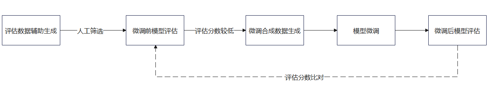

## embedding模型微调<a name="ZH-CN_TOPIC_0000002452821649"></a>

### 总体说明<a name="ZH-CN_TOPIC_0000002419262736"></a>

由于一般的embedding模型是在通用的数据集上进行训练的，导致在一些用户的特殊应用领域上存在精度不足进而导致检索增强效果较差的现象，为了解决这一问题，提供了可以帮助用户在相应特殊领域上快速方便的进行embedding模型微调的方法。该方法主要包括评估数据辅助生成、模型评估、微调合成数据自动生成、模型微调这几个部分。

-   评估数据辅助生成方法：根据用户提供的可以代表相应领域的典型文本，通过LLM辅助生成一些问答对，再通过人工筛选从中挑选一些具备较多该领域词汇的问答对，从而能较好的评估embedding模型在该领域的精度。
-   模型评估：基于sentence-transformers框架提供的评估方法，使用辅助生成并经过人工筛选后的评估数据集，对embedding模型精度进行评估，包括召回率等指标。
-   微调合成数据自动生成：根据用户提供相应领域的原始文本集，通过LLM自动生成微调合成数据集，再经过多种自动筛选方式挑选出最适合该领域的微调数据。
-   模型微调：基于sentence-transformers框架提供的模型微调方法，使用自动生成并筛选后的微调合成数据，对embedding模型进行微调并输出修改后的模型。

用户在使用embedding模型微调方法时，可以参考如下流程：




### 微调合成数据自动生成方法<a name="ZH-CN_TOPIC_0000002452701765"></a>

#### 类功能<a id="ZH-CN_TOPIC_0000002419102888"></a>

**功能描述<a name="section5434255810"></a>**

进行微调合成数据自动生成的类，给用户提供原始文档集切分处理，基于切分后的文本生成及筛选微调合成数据。

**函数原型<a name="section18789201331417"></a>**

-   微调合成数据配置类：

    ```
    from mx_rag.tools.finetune.generator import DataProcessConfig
    @dataclass
    class DataProcessConfig():
        generate_qd_prompt: str = GENERATE_QD_PROMPT
        llm_preferred_prompt: str = SCORING_QD_PROMPT
        question_number: int = 3
        featured: bool = True
        featured_percentage: float = 0.8
        preferred: bool = True
        llm_threshold_score: float = 0.8
        rewrite: bool = True
        query_rewrite_number: int = 2
    ```

-   微调合成数据方法类：

    ```
    from mx_rag.tools.finetune.generator import TrainDataGenerator
    TrainDataGenerator(llm: Text2TextLLM, dataset_path: str, reranker: Reranker, encrypt_fn, decrypt_fn)
    ```

**输入参数说明<a name="section19434210583"></a>**

微调合成数据配置类DataProcessConfig参数详情：

|参数名|数据类型|可选/必选|说明|
|--|--|--|--|
|generate_qd_prompt|str|可选|微调合成数据自动生成所用prompt，用户可根据相应领域进行修改，微调效果更佳。默认值为GENERATE_QD_PROMPT，字符串长度范围(0, 1*1024*1024]|
|llm_preferred_prompt|str|可选|微调合成数据筛选过程所用prompt，用户可根据相应领域进行修改，微调效果更佳。默认值为SCORING_QD_PROMPT，字符串长度范围(0, 1*1024*1024]|
|question_number|int|可选|每个原始文本切片对应生成的问题数，该数量越大，生成的问题角度越全面，有利于微调效果，但是耗时较长，默认值为3，取值范围(0, 20]|
|featured|bool|可选|基于BM25+Reranker数据相关性评分融合筛选，默认值为True|
|featured_percentage|float|可选|基于BM25+Reranker融合筛选后比例, 取值范围(0.0, 1.0)，默认值为0.8。|
|preferred|bool|可选|基于LLM数据相关性评分筛选，默认值为True|
|llm_threshold_score|float|可选|基于LLM数据相关性评分筛选后比例, 取值范围(0.0, 1.0)，默认值为0.8。|
|rewrite|bool|可选|基于LLM对生成的数据进行语义多角度重写扩充，默认值为True|
|query_rewrite_number|int|可选|针对每个问答对重写扩充的数量，默认值为2，取值范围(0, 20]|


GENERATE\_QD\_PROMPT和SCORING\_QD\_PROMPT定义如下：

```
GENERATE_QD_PROMPT = """阅读文章，生成一个相关的问题，例如：
文章：气候变化对海洋生态系统造成了严重的影响，其中包括海洋温度上升、海平面上升、酸化等问题。这些变化对海洋生物种群分布、生态圈的稳定性以及渔业等方面都产生了深远影响。在全球变暖的背景下，保护海洋生态系统已经成为当务之急。 
问题：气候变化对海洋生态系统的影响主要体现在哪些方面？
文章：零售业是人工智能应用的另一个重要领域。通过数据分析和机器学习算法，零售商可以更好地了解消费者的购买行为、趋势和偏好。人工智能技术可以帮助零售商优化库存管理、推荐系统、市场营销等方面的工作，提高销售额和客户满意度。
问题：人工智能是如何帮助零售商改善客户体验和销售业绩的？
请仿照样例对以下文章提{question_number}个相关问题：
文章：{doc}
输出格式为以下，按照问题1，问题2...进行编号，冒号后面不要再出现数字编号：
问题1：...
...
"""
SCORING_QD_PROMPT = """您的任务是评估给定问题与文档之间的相关性。相关性评分应该在0到1之间，其中1表示非常相关，0表示不相关。评分应该基于文档内容回答问题的直接程度。
请仔细阅读问题和文档，然后基于以下标准给出一个相关性评分：
- 如果文档直接回答了问题，给出接近1的分数。
- 如果文档与问题相关，但不是直接回答，给出一个介于0和1之间的分数，根据相关程度递减。
- 如果文档与问题不相关，给出0。
例如：
问题：小明昨天吃了什么饭？
文档：小明昨天和朋友出去玩，还聚了餐，吃的海底捞，真是快乐的一天。
因为文档直接回答了问题的内容，因此给出0.99的分数
问题：小红学习成绩怎么样？
文档：小红在班上上课积极，按时完成作业，帮助同学，被老师评为了班级积极分子。
文档中并没有提到小红的学习成绩，只是提到了上课积极，按时完成作业，因此给出0.10的分数
请基于上述标准，为以下问题与文档对给出一个相关性评分，评分分数保留小数点后2位数：
问题: {query}
文档: {doc}
"""
```

微调合成数据方法类TrainDataGenerator参数介绍：

|参数名|数据类型|可选/必选|说明|
|--|--|--|--|
|llm|Text2TextLLM|必选|用于微调合成数据生成及筛选的大模型，详情请参考[Text2TextLLM](./llm_client.md#text2textllm)|
|dataset_path|str|必选|自动生成和筛选后的微调合成数据集文件存储目录，路径长度取值范围为[1,1024]。路径不能包含软链接且不允许存在".."。<br>存放路径不能在路径列表中：["/etc", "/usr/bin", "/usr/lib", "/usr/lib64", "/sys/", "/dev/", "/sbin", "/tmp"]。|
|reranker|Reranker|必选|用于微调合成数据筛选过程中的reranker，详情请参考[Reranker](./reranker.md#rerank)|
|encrypt_fn|Callable[[str], str]|可选|对生成的Q-D对进行加密存储，默认为None，即不加密处理 <br>> [!NOTICE] 须知 如果上传的文档涉及银行卡号、身份证号、护照号、口令等个人数据，请配置该参数保证个人数据安全。|
|decrypt_fn|Callable[[str], str]|可选|对已存储的Q-D对进行解密处理，默认为None。|


**调用示例<a name="section175571825169"></a>**

```
from paddle.base import libpaddle
from langchain_community.document_loaders import TextLoader
from langchain_text_splitters import RecursiveCharacterTextSplitter
from mx_rag.document import LoaderMng
from mx_rag.document.loader import DocxLoader
from mx_rag.llm import Text2TextLLM
from mx_rag.reranker.local import LocalReranker
from mx_rag.tools.finetune.generator import TrainDataGenerator, DataProcessConfig

from mx_rag.utils import ClientParam


llm = Text2TextLLM(model_name="Llama3-8B-Chinese-Chat", base_url="https://{ip}:{port}/v1/chat/completions", 
client_param=ClientParam(ca_file="/path/to/ca.crt")
)
reranker = LocalReranker("/home/data/bge-reranker-large", dev_id=0)
dataset_path = "path to data_output"  # 微调合成数据集的输出地址

document_path = "path to document dir"  # 用户提供的原始文档集所在地址

loader_mng = LoaderMng()

loader_mng.register_loader(loader_class=TextLoader, file_types=[".txt", ".md"])
loader_mng.register_loader(loader_class=DocxLoader, file_types=[".docx"])

# 加载文档切分器，使用langchain的
loader_mng.register_splitter(splitter_class=RecursiveCharacterTextSplitter,
                             file_types=[".docx", ".txt", ".md"],
                             splitter_params={"chunk_size": 750,
                                              "chunk_overlap": 150,
                                              "keep_separator": False
                                              }
                             )

train_data_generator = TrainDataGenerator(llm, dataset_path, reranker)

split_doc_list = train_data_generator.generate_origin_document(document_path=document_path, loader_mng=loader_mng)
config = DataProcessConfig()
train_data_generator.generate_train_data(split_doc_list, config)

```


#### generate\_origin\_document<a name="ZH-CN_TOPIC_0000002452821653"></a>

**功能描述<a name="section5434255810"></a>**

对用户提供的原始文本集进行解析并切分处理，用于后续的微调合成数据生成。

**函数原型<a name="section18789201331417"></a>**

```
def generate_origin_document(document_path: str, loader_mng: LoaderMng, filter_func: Callable[[List[str]], List[str]])
```

**输入参数说明<a name="section19434210583"></a>**

|参数名|数据类型|是否必选|说明|
|--|--|--|--|
|document_path|str|必选|用户提供的原始文档集所在目录地址，目录长度取值范围为[1,1024]。路径不能包含软链接且不允许存在".."。|
|loader_mng|LoaderMng|必选|文件加载解析器，详情请参考[LoaderMng](./knowledge_management.md#loadermng)|
|filter_func|Callable|可选|对解析切分后的文档片段进行数据清洗回调函数，入参和出参都为List[str]，默认值为None|


**返回值说明<a name="section11818153884917"></a>**

|数据类型|说明|
|--|--|
|list[str]|原始文本文档切分列表|


#### generate\_train\_data<a name="ZH-CN_TOPIC_0000002419262740"></a>

**功能描述<a name="section5434255810"></a>**

对文本列表中的每个文本生成一定数量的问题，再经过多轮筛选及数据重写扩充等手段提高微调数据质量，最终输出用于微调embedding模型的数据集。

**函数原型<a name="section18789201331417"></a>**

```
def generate_train_data(split_doc_list: list[str], data_process_config: DataProcessConfig, batch_size: int)
```

**输入参数说明<a name="section19434210583"></a>**

|参数名|数据类型|是否必选|说明|
|--|--|--|--|
|split_doc_list|list[str]|必选|原始文本列表, 列表长度范围[1, 1000*1000], 字符串长度范围[1, 128*1024*1024]|
|data_process_config|DataProcessConfig|必选|微调合成数据方法配置选项，详情请参考[类功能](#ZH-CN_TOPIC_0000002419102888)中DataProcessConfig类描述|
|batch_size|int|可选|微调数据生成时并发条数，默认值为8，取值范围(0, 1024]|


### 评估数据辅助生成方法<a name="ZH-CN_TOPIC_0000002452701769"></a>

#### 类功能<a name="ZH-CN_TOPIC_0000002419102892"></a>

**功能描述<a name="section5434255810"></a>**

辅助用户生成模型评估数据集的类，给用户提供原始文档数据集，基于文本生成评估数据集。用户需对生成的评估集进行人工筛选，挑选出符合该领域特征的问答对，才能较好的评估模型在该领域的精度。

**函数原型<a name="section18789201331417"></a>**

```
from mx_rag.tools.finetune.generator.eval_data_generator import EvalDataGenerator
EvalDataGenerator(llm: Text2TextLLM, dataset_path: str, encrypt_fn, decrypt_fn)
```

**输入参数说明<a name="section19434210583"></a>**

|参数名|数据类型|可选/必选|说明|
|--|--|--|--|
|llm|Text2TextLLM|必选|用于生成评估数据集的大模型，详情请参考[Text2TextLLM](./llm_client.md#text2textllm)|
|dataset_path|str|必选|评估数据集文件存储目录, 路径长度取值范围为[1,1024]。路径不能包含软链接且不允许存在".."。<br>存放路径不能在路径列表中：["/etc", "/usr/bin", "/usr/lib", "/usr/lib64", "/sys/", "/dev/", "/sbin", "/tmp"]。|
|encrypt_fn|Callable[[str], str]|可选|回调函数，返回值为字符串且长度不超过128*1024*1024，对生成的Q-D对进行加密存储，默认为None，即不加密处理。<br>> [!NOTICE] 须知 如果上传的文档涉及银行卡号、身份证号、护照号、口令等个人数据，请配置该参数保证个人数据安全。|
|decrypt_fn|Callable[[str], str]|可选|回调函数，返回值为字符串且长度不超过128*1024*1024，对已存储的Q-D对进行解密处理，默认为None。|


**调用示例<a name="section175571825169"></a>**

```
from paddle.base import libpaddle
from langchain_community.document_loaders import TextLoader
from langchain_text_splitters import RecursiveCharacterTextSplitter
from mx_rag.document import LoaderMng
from mx_rag.document.loader import DocxLoader
from mx_rag.llm import Text2TextLLM
from mx_rag.tools.finetune.generator.eval_data_generator import EvalDataGenerator
from mx_rag.utils import ClientParam

llm = Text2TextLLM(model_name="Llama3-8B-Chinese-Chat", base_url="https://{ip}:{port}/v1/chat/completions", 
client_param=ClientParam(ca_file="/path/to/ca.crt")
)

dataset_path = "path to data_output"  # 微调合成数据集的输出地址

document_path = "path to document dir"  # 用户提供的原始文档集所在地址

eval_data_generator = EvalDataGenerator(llm, dataset_path)

loader_mng = LoaderMng()

loader_mng.register_loader(loader_class=TextLoader, file_types=[".txt", ".md"])
loader_mng.register_loader(loader_class=DocxLoader, file_types=[".docx"])

# 加载文档切分器，使用langchain的
loader_mng.register_splitter(splitter_class=RecursiveCharacterTextSplitter,
                             file_types=[".docx", ".txt", ".md"],
                             splitter_params={"chunk_size": 750,
                                              "chunk_overlap": 150,
                                              "keep_separator": False
                                              }
                             )

split_doc_list = eval_data_generator.generate_origin_document(document_path=document_path, loader_mng=loader_mng)

eval_data_generator.generate_evaluate_data(split_doc_list)
```


#### generate\_origin\_document<a name="ZH-CN_TOPIC_0000002452821657"></a>

**功能描述<a name="zh-cn_topic_0000002212438517_section5434255810"></a>**

对用户提供的原始文本集进行解析并切分处理，用于后续的微调合成数据生成。

**函数原型<a name="zh-cn_topic_0000002212438517_section18789201331417"></a>**

```
def generate_origin_document(document_path: str, loader_mng: LoaderMng, filter_func: Callable[[List[str]], List[str]])
```

**输入参数说明<a name="zh-cn_topic_0000002212438517_section19434210583"></a>**

|参数名|数据类型|是否必选|说明|
|--|--|--|--|
|document_path|str|必选|用户提供的原始文档集所在目录地址，目录长度取值范围为[1,1024]。路径不能包含软链接且不允许存在".."|
|loader_mng|LoaderMng|必选|文件加载解析器，详情请参考[LoaderMng](./knowledge_management.md#loadermng)|
|filter_func|Callable|可选|对解析切分后的文档片段进行数据清洗回调函数，入参和出参都为List[str]，默认值为None|


**返回值说明<a name="zh-cn_topic_0000002212438517_section11818153884917"></a>**

|数据类型|说明|
|--|--|
|list[str]|原始文本文档切分列表|


#### generate\_evaluate\_data<a name="ZH-CN_TOPIC_0000002419262744"></a>

**功能描述<a name="section5434255810"></a>**

对文本列表中的每个文本生成一定数量的问题，最终生成该领域的初步评估数据集，用于下一步的人工筛选。

**函数原型<a name="section18789201331417"></a>**

```
def generate_evaluate_data(split_doc_list: list[str], generate_qd_prompt: str , question_number: int, batch_size: int)
```

**输入参数说明<a name="section19434210583"></a>**

|参数名|数据类型|是否必选|说明|
|--|--|--|--|
|split_doc_list|list[str]|必选|原始文本列表, 列表长度范围[1, 1000*1000], 字符串长度范围[1, 128*1024*1024]|
|generate_qd_prompt|str|可选|生成评估数据集的prompt，用户可根据领域特点进行修改, 长度取值范围(0, 1*1024*1024]，默认值为GENERATE_QD_PROMPT|
|question_number|int|可选|每个原始文本切片对应生成的问题数，该数量越大，生成的问题角度越全面，有利于微调效果，但是耗时较长，默认值为3, 取值范围(0, 20]|
|batch_size|int|可选|评估数据生成时并发条数，默认值为8，取值范围(0, 1024]|


GENERATE\_QD\_PROMPT定义如下：

```
GENERATE_QD_PROMPT = """阅读文章，生成一个相关的问题，例如：
文章：气候变化对海洋生态系统造成了严重的影响，其中包括海洋温度上升、海平面上升、酸化等问题。这些变化对海洋生物种群分布、生态圈的稳定性以及渔业等方面都产生了深远影响。在全球变暖的背景下，保护海洋生态系统已经成为当务之急。 
问题：气候变化对海洋生态系统的影响主要体现在哪些方面？
文章：零售业是人工智能应用的另一个重要领域。通过数据分析和机器学习算法，零售商可以更好地了解消费者的购买行为、趋势和偏好。人工智能技术可以帮助零售商优化库存管理、推荐系统、市场营销等方面的工作，提高销售额和客户满意度。
问题：人工智能是如何帮助零售商改善客户体验和销售业绩的？
请仿照样例对以下文章提{question_number}个相关问题：

文章：{doc}

输出格式为以下，按照问题1，问题2...进行编号，冒号后面不要再出现数字编号：
问题1：...
...

""":
```


### 模型评估和微调方法<a name="ZH-CN_TOPIC_0000002452701773"></a>

评估和微调功能均基于sentence-transformers框架，本章节指导用户如何使用。

#### 评估功能<a name="ZH-CN_TOPIC_0000002419102896"></a>

主要基于sentence-transformers框架提供的InformationRetrievalEvaluator方法，使用前述评估数据辅助生成方法生成的评估数据集对embedding模型进行评估，评估成功后将会返回以下指标：

```
{'cosine_accuracy@1', 'cosine_accuracy@3', 'cosine_accuracy@5', 'cosine_accuracy@10', 'cosine_precision@1', 'cosine_precision@3', 'cosine_precision@5', 'cosine_precision@10', 'cosine_recall@1', 'cosine_recall@3', 'cosine_recall@5', 'cosine_recall@10', 'cosine_ndcg@10', 'cosine_mrr@10', 'cosine_map@100', 'dot_accuracy@1', 'dot_accuracy@3', 'dot_accuracy@5', 'dot_accuracy@10', 'dot_precision@1', 'dot_precision@3', 'dot_precision@5', 'dot_precision@10', 'dot_recall@1', 'dot_recall@3', 'dot_recall@5', 'dot_recall@10', 'dot_ndcg@10', 'dot_mrr@10', 'dot_map@100'}
```

**调用示例<a name="section175571825169"></a>**

```
import torch
import torch_npu
from sentence_transformers import SentenceTransformer
from sentence_transformers.evaluation import InformationRetrievalEvaluator
from datasets import load_dataset

torch.npu.set_device(torch.device("npu:0"))

model = SentenceTransformer("model_path", device="npu" if torch.npu.is_available() else "cpu")

eval_data = load_dataset("json", data_files="evaluate_data.jsonl", split="train")

eval_data = eval_data.add_column("id", range(len(eval_data)))

corpus = dict(
    zip(eval_data["id"], eval_data["corpus"])
)
queries = dict(
    zip(eval_data["id"], eval_data["query"])
)

relevant_docs = {}
for q_id in queries:
    relevant_docs[q_id] = [q_id]

evaluator = InformationRetrievalEvaluator(queries=queries, corpus=corpus, relevant_docs=relevant_docs, name="model_name")
result = evaluator(model)

print(result)
```


#### 微调功能<a name="ZH-CN_TOPIC_0000002452821661"></a>

主要基于sentence-transformers框架提供的SentenceTransformerTrainer，通过前述微调合成数据自动生成方法生成的数据集对embedding模型进行微调，相关微调训练参数及超参按照实际进行调整。

**调用示例<a name="section175571825169"></a>**

```
import torch
import torch_npu
from datasets import load_dataset
from sentence_transformers import SentenceTransformer
from sentence_transformers.losses import MultipleNegativesRankingLoss
from sentence_transformers import SentenceTransformerTrainingArguments
from sentence_transformers.training_args import BatchSamplers
from sentence_transformers import SentenceTransformerTrainer

torch.npu.set_device(torch.device("npu:0"))
model = SentenceTransformer("model_path", device="npu" if torch.npu.is_available() else "cpu")
train_loss = MultipleNegativesRankingLoss(model)
train_dataset = load_dataset("json", data_files="train_data.jsonl", split="train")
args = SentenceTransformerTrainingArguments(
    output_dir="output_dir",      # output directory and hugging face model ID
    num_train_epochs=4,                         # number of epochs
    per_device_train_batch_size=8,              # train batch size
    gradient_accumulation_steps=16,             # for a global batch size of 512
    warmup_ratio=0.1,                           # warmup ratio
    learning_rate=2e-5,                         # learning rate, 2e-5 is a good value
    lr_scheduler_type="cosine",                 # use constant learning rate scheduler
    optim="adamw_torch_fused",                  # use fused adamw optimizer
    batch_sampler=BatchSamplers.NO_DUPLICATES,  # MultipleNegativesRankingLoss benefits from no duplicate samples in a batch
    logging_steps=10,                           # log every 10 steps
)
trainer = SentenceTransformerTrainer(
    model=model, # bg-base-en-v1
    args=args,  # training arguments
    train_dataset=train_dataset.select_columns(["query", "corpus"]),  # training dataset
    loss=train_loss,
)
trainer.train()
trainer.save_model()
```


