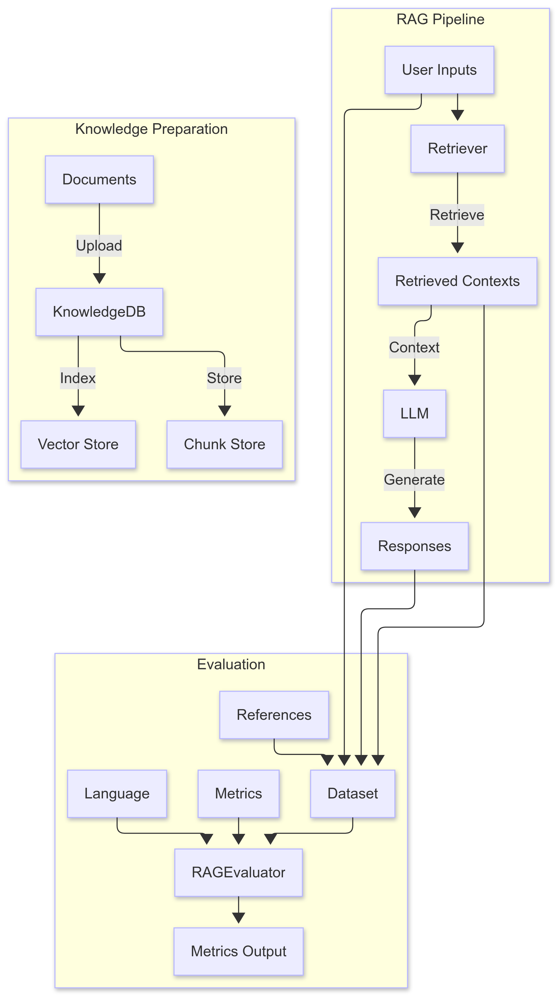

## 评估模块<a name="ZH-CN_TOPIC_0000001982155324"></a>

### 总体说明<a name="ZH-CN_TOPIC_0000002047705729"></a>

目前，RAG评测领域主流采用RAGAS模块。RAGAS具备完善的评估指标体系，应用广泛，并随着RAG技术的发展持续迭代更新。因此，基于RAGAS进行Ascend适配，可以提升该模块的灵活性和易用性，并且同时增强了对中文的适配能力。其评测流程如下：



支持的评测指标和说明如[表1](#table1226085519551)所示。详细指标说明可以参见[ragas官网](https://github.com/explodinggradients/ragas/tree/v0.1.9/docs/concepts/metrics)。

**表 1**  支持的评测指标和说明<a id="table1226085519551"></a>

|指标名|作用说明|所需参数|评测分数说明|
|--|--|--|--|
|answer_correctness|通过结合事实准确性和语义相似度，来衡量模型答案与标准答案之间的正确性。|[user_input, response, reference]|范围：[0, 1]，值越大越正确。该指标关注两方面：回答是否与事实相符（事实准确性）回答的表达是否与标准答案语义相近（语义相似度）只有既保证内容真实可靠，又能与参考答案意思相匹配，才算“正确”。得分越高，说明模型输出的答案既真实又语义吻合。|
|answer_relevancy|用于根据给定问题，评估答案的相关性。如果答案不完整、包含多余或不必要的信息，得分会被扣减。|[user_input, response]|分数范围为0到1，1为最佳。该指标关注答案内容是否紧扣问题，避免答非所问、信息冗余或遗漏关键点。得分越高，说明答案越贴合用户问题，且内容精炼、完整。分数越低，说明答案可能偏题、信息多余或遗漏，相关性差。|
|answer_similarity|用于衡量生成答案与标准答案在语义上的相似程度。该指标通常通过 cross encoder 分数进行量化。|[reference, response]|该指标关注的是两段文本（标准答案和生成答案）表达的意思有多接近，不要求字面完全一致。cross encoder 是一种用来评估两段文本语义相关性的深度学习模型，分数越高表示语义越接近。得分范围一般为0到1，越高表示语义越一致。|
|context_precision|衡量检索到的上下文中相关片段所占比例的指标。它的计算方式是对每个片段的 precision@k 求平均值。precision@k 指的是在前 k 个检索结果中，相关片段数量与总检索数量 k 之比。|[user_input, reference, retrieved_contexts]|范围：[0, 1]，值越大越相关。|
|context_recall|衡量系统成功检索出多少相关文档（或信息片段），重点在于不遗漏重要的内容。召回率越高，说明遗漏的相关文档越少。|[user_input, reference, retrieved_contexts]|范围：[0, 1]，值越大越相关。|
|context_entity_recall|根据参考答案和检索到的上下文中实体的数量来衡量召回率的指标。它计算的是参考答案中的实体，有多少比例在检索到的上下文中也出现了。|[reference, retrieved_contexts]|范围：[0, 1]，值越大越相关。|
|context_utilization|answer和contexts的相关性|[user_input, response, retrieved_contexts]|范围：[0, 1]，值越大越相关。|
|faithfulness|用于衡量系统的回答(response)与检索到的上下文内容(retrieved_contexts)在事实层面上的一致程度。|[user_input, response, retrieved_contexts]|分数范围为0到1，分数越高，表示一致性越好。|
|noise_sensitivity|衡量系统在使用相关或不相关的检索文档时，因给出错误回答而出错的频率。|[user_input, reference, response, retrieved_contexts]|该指标的分数范围是0到1，数值越低，说明系统性能越好。|
|nv_accuracy|衡量模型回答与参考标准答案的一致程度。具体方法是采用两条不同的“大模型判官”提示，让每个判官分别对模型的回答进行打分（分数为0、2或4）。然后将这两个评分都转换到[0,1]区间，取二者的平均值作为最终得分。|[user_input, response, reference]|该指标的分数范围是0到1，分数越高，说明模型的回答与标准答案越接近。|
|nv_context_relevance|用于评估检索到的上下文（片段或段落）是否与用户输入（问题）相关。评估方式是采用两条独立的“大模型判官”提示，让每个判官分别对相关性进行评分（分数为0、1或2）。然后将分数转换到[0,1]区间，并取二者平均值作为最终得分。|[user_input, retrieved_contexts]|该分数的范围为0到1，分数越高，表示检索到的上下文与用户问题的关联性越强。|
|nv_response_groundedness|衡量模型的回答在多大程度上得到了检索到的上下文的支持。它评估回答中的每一个论断或信息，是否都能在检索到的上下文中完全或部分找到依据|[response, retrieved_contexts]|该分数的范围为0到1，分数越高，表示回答得到检索到的上下文的支持越多。|


### RAGEvaluator<a name="ZH-CN_TOPIC_0000002039570353"></a>

#### 类功能<a name="ZH-CN_TOPIC_0000002003412142"></a>

**功能描述<a name="section957011509130"></a>**

RAGEvaluator 类为检索增强生成（RAG）系统评测提供了统一接口，支持自定义评估指标，并可根据不同语言（如英文或中文）对评测提示词进行适配。

**函数原型<a name="section1843313211"></a>**

```
from mx_rag.evaluate import RAGEvaluator
RAGEvaluator(llm: LLM, embeddings: Embeddings)
```

**输入参数说明<a name="section1054013414143"></a>**

|参数名|数据类型|可选/必选|说明|
|--|--|--|--|
|llm|LLM|必选|llm模块主要用于和大模型进行对话。需继承自langchain.llms.base.LLM，参考：[Text2TextLLM](./llm_client.md#text2textllm)|
|embeddings|Embeddings|必选|词嵌入模块评估时需要对用户问题进行向量化，必须是[TextEmbedding](./embedding.md#textembedding)或者[TEIEmbedding](./embedding.md#teiembedding)的实例之一。|


**调用示例<a name="section36441848853"></a>**

```

from datasets import Dataset

from mx_rag.embedding.service import TEIEmbedding
from mx_rag.llm import Text2TextLLM, LLMParameterConfig
from mx_rag.utils import ClientParam
from mx_rag.evaluate import RAGEvaluator

llm = Text2TextLLM(
    base_url="https://ip:port/v1/chat/completions",
    model_name="model name",
    llm_config=LLMParameterConfig(temperature=0.1, top_p=0.8),
    client_param=ClientParam(ca_file="/path/to/ca.crt"),
)
embeddings = TEIEmbedding(url="https://ip:port/embed", client_param=ClientParam(ca_file="/path/to/ca.crt"),)

sample_queries = [
    "谁提出了相对论？",
    "谁因对放射性的研究而两次获得诺贝尔奖？",
    "艾萨克·牛顿对科学有什么贡献？",
]
expected_responses = [
    "阿尔伯特·爱因斯坦提出了相对论，这一理论改变了我们对时间、空间和引力的理解。",
    "玛丽·居里是一位物理学家和化学家，她进行了关于放射性的开创性研究，并两次获得诺贝尔奖。",
    "艾萨克·牛顿阐述了运动定律和万有引力定律，为经典力学奠定了基础。",
]
retrieved_contexts = [["阿尔伯特·爱因斯坦的相对论彻底改变了我们对时间、空间和引力的认知。",
                       "相对论由阿尔伯特·爱因斯坦提出，这一理论革新了我们对时间、空间和引力的理解。",
                       "阿尔伯特·爱因斯坦通过提出相对论，重新定义了我们对时间、空间和引力的看法"],
                      ["玛丽·居里是一位杰出的物理学家和化学家，她在放射性研究方面做出了开创性贡献，并两次荣获诺贝尔奖。"
                       "作为物理学家和化学家，玛丽·居里在放射性领域的研究具有开创性意义，并因此两次获得诺贝尔奖。"
                       "玛丽·居里是一位著名的物理学家和化学家，她因在放射性研究中的开创性工作而两次获得诺贝尔奖"],
                      ["艾萨克·牛顿提出了运动定律和万有引力定律，为经典力学的发展奠定了基础。"
                       "艾萨克·牛顿通过阐述运动定律和万有引力定律，为经典力学体系的建立做出了奠基性贡献。"
                       "艾萨克·牛顿的运动定律和万有引力定律为经典力学的形成奠定了基石。"],
                      ]
# 大模型回答结果
responses = ["阿尔伯特·爱因斯坦提出了相对论",
             "玛丽·居里",
             "阐述了运动定律和万有引力定律，为经典力学奠定了基础。"]
dataset = []
for query, contexts, response, reference in zip(sample_queries, retrieved_contexts, responses, expected_responses):
    dataset.append(
        {
            'user_input': query,
            'response': response,
            'retrieved_contexts': contexts,
            'reference': reference
        }
    )
evaluation_dataset = Dataset.from_list(dataset)
evaluator = RAGEvaluator(llm=llm, embeddings=embeddings)
metrics = ["faithfulness", "answer_relevancy", "context_precision", "context_recall"]
result = evaluator.evaluate(
    metrics=metrics,
    dataset=evaluation_dataset.to_dict(),
    language="chinese"
)
print(result)

```


#### evaluate<a name="ZH-CN_TOPIC_0000002039570357"></a>

**功能描述<a name="section5434255810"></a>**

评测接口，用户输入字典格式的数据，然后按照用户指定的评测指标集合进行评测。如果要显示ragas打印的日志，请设置环境变量DISABLE\_RAGAS\_LOGGING为0。

**函数原型<a name="section18789201331417"></a>**

```
def evaluate(metrics, dataset, language, prompts_path, show_progress)
```

**参数说明<a name="section19434210583"></a>**

|参数名|数据类型|可选/必选|说明|
|--|--|--|--|
|metrics|list[str]|必选|评估指标集合，评估指标见[表1](#table1226085519551)。集合中指标个数限制为(0, 14]；并且每个metrics的名字字符数范围在[1,50]；metrics参数不能重复。当指标为answer_similarity时，返回的得分中其key为semantic_similarity。|
|dataset|Dict[str, Any]|必选|用户评估数据集，字典长度范围[1, 4]，字典格式如下：<li>user_input：List[str]格式，列表长度范围[0, 128]，字符范围[1, 1000000]。<li>response：List[str]格式，列表长度范围[0, 128]，字符范围[1, 1000000]。<li>retrieved_contexts：List[List[str]]格式，外层列表长度范围[1, 128]，内层列表长度范围[0, 128]，字符范围[1, 1000000]。<li>reference：List[str]格式，列表长度范围[0, 128]，字符范围[1, 1000000]。<br>其中user_input，response和reference的列表长度以及retrieved_contexts的外层列表长度要保持一致。|
|language|str|可选|本地化语言参数，如果指定将按照指定的语言进行评测。<br>默认值为None。如果不设置值，提示词将采用ragas自带的默认提示词。<br>支持的取值为"chinese"和"english"。|
|prompts_path|str|可选|本地化提示词参数，如果指定将结合language在prompt_dir目录寻找对应的提示词文件，如果找到则可以加速评估过程。目录下的各文件大小不能超过4MB、深度不超过64，且文件总个数不超过512。<br>默认值为None。<br>字符串长度限制[1, 255]。|
|show_progress|bool|可选|在评估期间是否显示进度条，默认不显示。|


**返回值说明<a name="section11818153884917"></a>**

|数据类型|说明|
|--|--|
|Optional[Dict[str, List[float]]]|函数返回一个字典，具体如下：<li>键（Keys）： 指标名称（字符串），例如 "answer_correctness"、"context_precision" 等。<li>值（Values）： 每个键对应一个浮点数列表，列表中的每个元素代表该指标在数据集各条样本上的评估得分。<li>如果评估过程中发生异常（如报错），函数会返回 None。|
