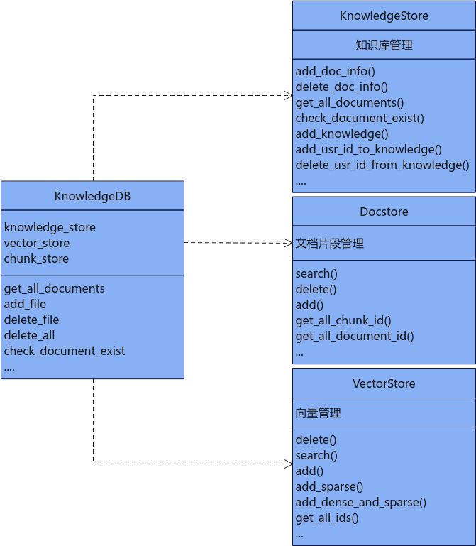
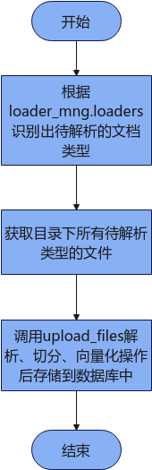
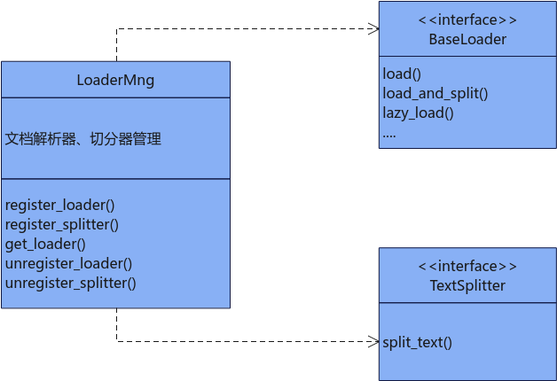

## 知识管理<a name="ZH-CN_TOPIC_0000002018595433"></a>

### 知识库文档管理<a name="ZH-CN_TOPIC_0000002018595305"></a>

#### 知识库依赖关系<a name="ZH-CN_TOPIC_0000002273067881"></a>



KnowledgeDB依赖了KnowledgeStore、Docstore、VectorStore实现对知识库文档片段及向量化入库。KnowledgeStore负责对知识库增删查操作，Docstore负责对文档片段增删改查操作，具体配置实例为（OpenGaussDocstore、MilvusDocstore、SQLiteDocstore），VectorStore负责对向量增删改查操作，具体实例配置为（OpenGaussDB、MilvusDB、MindFAISS）。


#### KnowledgeStore<a name="ZH-CN_TOPIC_0000001981995476"></a>

##### 类功能<a name="ZH-CN_TOPIC_0000002018595389"></a>

**功能描述<a name="section957011509130"></a>**

知识库管理类，提供知识库及知识库用户的增加、删除、查询等功能。

**函数原型<a name="section12411139493"></a>**

```
from mx_rag.knowledge import KnowledgeStore
KnowledgeStore(db_path)
```

**参数说明<a name="section1054013414143"></a>**

|参数名|数据类型|可选/必选|说明|
|--|--|--|--|
|db_path|str|必选|数据库路径，路径长度取值范围为[1, 1024]，路径不能为软链接且不允许存在".."，文件名长度不能超过200。存放路径不能在路径列表中：["/etc", "/usr/bin", "/usr/lib", "/usr/lib64", "/sys/", "/dev/", "/sbin", "/tmp"]。|


**调用示例<a name="section423192561211"></a>**

```
from mx_rag.knowledge import KnowledgeStore
# 初始化知识管理关系数据库
knowledge_store = KnowledgeStore(db_path="./sql.db")
user_id = "Default"
knowledge_store.add_knowledge("name", user_id, "admin")
knowledge_store.add_knowledge("name01", user_id, "admin")
print(knowledge_store.check_knowledge_exist("name", user_id))
knowledge_store.add_usr_id_to_knowledge("name", "Default01", "admin")
knowledge_store.add_usr_id_to_knowledge("name", "Default02", "member")
knowledge_store.delete_usr_id_from_knowledge("name", "Default02", "member")
print(knowledge_store.get_all_knowledge_info(user_id))
print(knowledge_store.get_all_usr_role_by_knowledge("name"))
print(knowledge_store.add_doc_info("name", "1.txt", "./sql.db", user_id))
documents = [document.document_name for document in knowledge_store.get_all_documents("name", user_id)]
print(documents)
print(knowledge_store.check_document_exist("name", "1.txt", user_id))
print(knowledge_store.delete_doc_info("name", "1.txt", user_id))
```


##### add\_knowledge<a name="ZH-CN_TOPIC_0000002218885156"></a>

**功能描述<a name="section957011509130"></a>**

添加知识库，用户角色role只能为管理员admin。

**函数原型<a name="section12411139493"></a>**

```
def add_knowledge(knowledge_name, user_id, role)
```

**参数说明<a name="section15391350195516"></a>**

|参数名|数据类型|可选/必选|说明|
|--|--|--|--|
|knowledge_name|str|必选|知识库名称，长度取值范围为[1, 1024]。|
|user_id|str|必选|用户ID，区分不同知识库，需要满足正则表达式^[a-zA-Z0-9_-]{6,64}$。|
|role|str|可选|用户角色，默认为'admin'。添加后该user_id默认可以操作该知识库。|


**返回值说明<a name="section14529112165813"></a>**

|数据类型|说明|
|--|--|
|int|返回添加的知识库对应的knowledge_id|


##### check\_knowledge\_exist<a name="ZH-CN_TOPIC_0000002254016469"></a>

**功能描述<a name="section51573195915"></a>**

查询该user\_id下是否有该知识库名称。

**函数原型<a name="section4732112119111"></a>**

```
def check_knowledge_exist(knowledge_name, user_id)
```

**参数说明<a name="section67420206523"></a>**

|参数名|数据类型|可选/必选|说明|
|--|--|--|--|
|knowledge_name|str|必选|知识库名称，长度取值范围为[1, 1024]。|
|user_id|str|必选|用户ID，区分不同知识库，需要满足正则表达式^[a-zA-Z0-9_-]{6,64}$。|


**返回值说明<a name="section6128201775012"></a>**

|数据类型|说明|
|--|--|
|bool|user_id下是否存在该知识库knowledge_name。|


##### add\_usr\_id\_to\_knowledge<a name="ZH-CN_TOPIC_0000002253685057"></a>

**功能描述<a name="section957011509130"></a>**

向指定知识库中添加用户，用户角色可以为管理员'admin'或仅有查询权限的成员'member'

**函数原型<a name="section12411139493"></a>**

```
def add_usr_id_to_knowledge(knowledge_name, user_id, role)
```

**参数说明<a name="section15391350195516"></a>**

|参数名|数据类型|可选/必选|说明|
|--|--|--|--|
|knowledge_name|str|必选|知识库名称，长度取值范围为[1, 1024]。|
|user_id|str|必选|用户ID，区分不同知识库，需要满足正则表达式^[a-zA-Z0-9_-]{6,64}$。|
|role|str|必选|用户角色，只能为知识库管理员'admin'或对知识库仅有查询权限的成员'member'，添加后使用对应user_id可以进行查询该知识库。|


##### delete\_usr\_id\_from\_knowledge<a name="ZH-CN_TOPIC_0000002089941390"></a>

**功能描述<a name="section1653621022013"></a>**

删除knowledge知识库中的用户，删除knowledge\_table表中的记录，参见[KnowledgeModel类](./databases.md#knowledgemodel类)

**函数原型<a name="section12411139493"></a>**

```
def delete_usr_id_from_knowledge(knowledge_name, user_id, role, force=False)
```

**参数说明<a name="section15391350195516"></a>**

|参数名|数据类型|可选/必选|说明|
|--|--|--|--|
|knowledge_name|str|必选|知识库名称，长度取值范围为[1, 1024]。|
|user_id|str|必选|需要删除的用户ID，区分不同知识库，需要满足正则表达式^[a-zA-Z0-9_]{6,64}$。|
|role|str|必选|用户对应的角色，只能为知识库管理员'admin'或对知识库仅有查询权限的成员'member'。如果user_id和role记录不存在，则报错。|
|force|bool|可选|若删除的知识库关联的用户只剩一个，是否继续强制删除，默认为False。|


##### get\_all\_knowledge\_info<a name="ZH-CN_TOPIC_0000002124527517"></a>

**功能描述<a name="section957011509130"></a>**

根据user\_id查询knowledge信息。

**函数原型<a name="section12411139493"></a>**

```
def get_all_knowledge_info(user_id)
```

**参数说明<a name="section15391350195516"></a>**

|参数名|数据类型|可选/必选|说明|
|--|--|--|--|
|user_id|str|必选|用户ID，区分不同知识库，需要满足正则表达式^[a-zA-Z0-9_-]{6,64}$。|


**返回值说明<a name="section14529112165813"></a>**

|数据类型|说明|
|--|--|
|List[KnowledgeModel]|返回user_id下的知识库信息，KnowledgeModel参见[KnowledgeModel类](./databases.md#knowledgemodel类)。


##### get\_all\_usr\_role\_by\_knowledge<a name="ZH-CN_TOPIC_0000002253844937"></a>

**功能描述<a name="section957011509130"></a>**

根据知识库名称knowledge\_name，查询该知识库下所有的用户id及用户角色。

**函数原型<a name="section12411139493"></a>**

```
def get_all_usr_role_by_knowledge(knowledge_name)
```

**参数说明<a name="section15391350195516"></a>**

|参数名|数据类型|可选/必选|说明|
|--|--|--|--|
|knowledge_name|str|必选|知识库名称，长度取值范围为[1, 1024]。|


**返回值说明<a name="section14529112165813"></a>**

|数据类型|说明|
|--|--|
|dict{user_id: role}|返回指定知识库下所有的用户id和用户角色，key为用户id，value为用户角色|


##### add\_doc\_info<a name="ZH-CN_TOPIC_0000002018595217"></a>

**功能描述<a name="section957011509130"></a>**

向知识库中添加一条文档名记录，仅知识库管理员有权限操作。add前请检查db文件大小，不能超过100GB。添加文档记录时，需保证剩余磁盘分区空间大于200MB。

**函数原型<a name="section12411139493"></a>**

```
def add_doc_info(knowledge_name, doc_name, file_path, user_id)
```

**参数说明<a name="section1054013414143"></a>**

|参数名|数据类型|可选/必选|说明|
|--|--|--|--|
|knowledge_name|str|必选|知识库名称，长度取值范围为[1, 1024]。|
|doc_name|str|必选|文档名称，文档名长度取值范围为[1, 1024]。|
|file_path|str|必选|文档上传路径，存入数据库中，路径长度范围[1, 1024]。|
|user_id|str|必选|用户ID，区分不同知识库，需要满足正则表达式^[a-zA-Z0-9_-]{6,64}$。|


**返回值说明<a name="section8995173984218"></a>**

|数据类型|说明|
|--|--|
|int|在表document_table增加记录，返回文档的document_id。|


##### delete\_doc\_info<a name="ZH-CN_TOPIC_0000001981995340"></a>

**功能描述<a name="section957011509130"></a>**

向知识库中删除一条文档名记录，仅user\_id为知识库管理员有权限操作。

**函数原型<a name="section12411139493"></a>**

```
def delete_doc_info(knowledge_name, doc_name, user_id)
```

**参数说明<a name="section1054013414143"></a>**

|参数名|数据类型|可选/必选|说明|
|--|--|--|--|
|knowledge_name|str|必选|知识库名称，长度取值范围为[1, 1024]。|
|doc_name|str|必选|文档名称，长度取值范围为[1, 1024]。|
|user_id|str|必选|用户id，区分不同知识库，需要满足正则表达式^[a-zA-Z0-9_-]{6,64}$。|


**返回值说明<a name="section8995173984218"></a>**

|数据类型|说明|
|--|--|
|int/None|在表document_table删除记录，返回删除文档的document_id，删除失败返回None。|


##### check\_document\_exist<a name="ZH-CN_TOPIC_0000002018714725"></a>

**功能描述<a name="section957011509130"></a>**

获取知识库中的文档记录是否存在。

**函数原型<a name="section12411139493"></a>**

```
def check_document_exist(knowledge_name, doc_name, user_id)
```

**参数说明<a name="section1054013414143"></a>**

|参数名|数据类型|可选/必选|说明|
|--|--|--|--|
|knowledge_name|str|必选|知识库名称，长度取值范围为[1, 1024]。|
|doc_name|str|必选|文档名称，长度取值范围为[1, 1024]。|
|user_id|str|必选|用户ID，区分不同知识库，需要满足正则表达式^[a-zA-Z0-9_-]{6,64}$。|


**返回值说明<a name="section8995173984218"></a>**

|数据类型|说明|
|--|--|
|bool|文档是否存在。|


##### get\_all\_documents<a name="ZH-CN_TOPIC_0000001981995464"></a>

**功能描述<a name="section957011509130"></a>**

获取知识库中所有文档记录。

**函数原型<a name="section12411139493"></a>**

```
def get_all_documents(knowledge_name, user_id)
```

**参数说明<a name="section1054013414143"></a>**

|参数名|数据类型|可选/必选|说明|
|--|--|--|--|
|knowledge_name|str|必选|知识库名称，长度取值范围为[1, 1024]。|
|user_id|str|必选|用户id，区分不同知识库，需要满足正则表达式^[a-zA-Z0-9_-]{6,64}$。|


**返回值说明<a name="section8995173984218"></a>**

|数据类型|说明|
|--|--|
|List[DocumentModel]|返回对应user_id和knowledge_name下的文档信息，DocumentModel参见[DocumentModel类](./databases.md#documentmodel类)。|


#### KnowledgeDB<a name="ZH-CN_TOPIC_0000001982155292"></a>

##### 类功能<a name="ZH-CN_TOPIC_0000001982155200"></a>

**功能描述<a name="section957011509130"></a>**

知识库管理的入口类，提供文档管理的功能。包括添加文档、删除文档，获取知识库中所有文档等功能。

**函数原型<a name="section38010117445"></a>**

```
from mx_rag.knowledge import KnowledgeDB
KnowledgeDB(knowledge_store, chunk_store, vector_store, knowledge_name, white_paths, max_file_count, user_id, lock)
```

**参数说明<a name="section1054013414143"></a>**

|参数名|数据类型|可选/必选|说明|
|--|--|--|--|
|knowledge_store|KnowledgeStore|必选|为知识库管理提供数据保存功能，保存已上传成功的文档名称。数据类型请参见[KnowledgeStore](#knowledgestore)。|
|chunk_store|Docstore|必选|为文档切片对象列表提供数据库存储功能。数据类型请参见[Docstore](./databases.md#docstore)。|
|vector_store|VectorStore|必选|向量数据库存储对象。数据类型请参见[VectorStore](./databases.md#vectorstore)。|
|knowledge_name|str|必选|知识库名称，用户可根据知识库主题自定义，长度取值范围：[1, 1024]。|
|white_paths|List[str]|必选|上传文档的白名单路径列表。列表长度取值范围：[1, 1024]，路径长度取值范围：[1, 1024]，路径不能为软链接且不允许存在".."。<br>上传的文档路径需要在白名单路径下才能上传成功。|
|max_file_count|int|可选|上传文档时，允许的最大处理数量，取值范围：[1, 8000]，不建议设置过大，默认值为1000。|
|user_id|str|必选|用户ID，区分不同知识库，需要满足正则表达式^[a-zA-Z0-9_-]{6,64}$。|
|lock|multiprocessing.synchronize.Lock或_thread.LockType|可选|如果用户需要多进程或者多线程调用此接口需要申请锁。默认值为None。可选值：<li>None：表示不使用锁，此时该接口不支持并发。<li>multiprocessing.Lock()：表示进程锁，此时该接口支持多进程调用。<li>threading.Lock()：表示线程锁。此时该接口支持多线程调用。|


> [!NOTE] 说明
>chunk\_store和vector\_store必须保障数据一致性（例如：关系数据库文件和向量数据库文件同时生成）。

**调用示例<a name="section119720129280"></a>**

```
import pathlib
from paddle.base import libpaddle
from mx_rag.embedding.local import TextEmbedding
from mx_rag.knowledge import KnowledgeStore, KnowledgeDB
from mx_rag.storage.document_store import SQLiteDocstore
from mx_rag.storage.vectorstore import MindFAISS
# 设置向量检索使用的NPU卡
dev = 0
# 加载embedding模型
embed_func = TextEmbedding("/path/to/model", dev_id=dev)
# 初始化向量数据库
vector_store = MindFAISS(x_dim=1024, devs=[dev], 
                         load_local_index="./faiss.index", auto_save=True)
# 初始化文档chunk 关系数据库
chunk_store = SQLiteDocstore(db_path="./sql.db")
# 初始化知识管理关系数据库
knowledge_store = KnowledgeStore(db_path="./sql.db")
#添加知识库及管理员
knowledge_store.add_knowledge(knowledge_name="test", user_id='Default', role='admin')
# 初始化知识管理
knowledge_db = KnowledgeDB(knowledge_store=knowledge_store, chunk_store=chunk_store, vector_store=vector_store,
                           knowledge_name="test", user_id="Default", white_paths=["/home/"])
file_path = pathlib.Path("./gaokao.txt")
knowledge_db.add_file(file=file_path,
                      texts=["test1", "test2"],
                      embed_func={"dense": embed_func.embed_documents},
                      metadatas=[{"source": "./gaokao.txt"}, {"source": "./gaokao.txt"}])
documents =[document.document_name for document in knowledge_db.get_all_documents()]
print(documents)
print(knowledge_db.check_document_exist(doc_name=file_path.name))

knowledge_db.delete_file(doc_name=file_path.name)
knowledge_db.delete_all()
```


##### add\_file<a name="ZH-CN_TOPIC_0000001981995424"></a>

**功能描述<a name="section5434255810"></a>**

将单个文档添加到知识库中，对文件切分后的信息进行embedding，保存至向量数据库，文档切片保存在文档数据库，并将文档记录保存在知识库数据库中，仅知识库管理员有权限操作。

**函数原型<a name="section18789201331417"></a>**

```
def add_file(file, texts, embed_func, metadatas)
```

**参数说明<a name="section19434210583"></a>**

|参数名|数据类型|可选/必选|说明|
|--|--|--|--|
|file|pathlib.Path|必选|上传文档的pathlib.Path对象，其中文件路径长度取值范围为[1, 1024]，不能为软链接且不允许存在".."，文件名长度不能超过200。存放路径不能在路径列表中：["/etc", "/usr/bin", "/usr/lib", "/usr/lib64", "/sys/", "/dev/", "/sbin", "/tmp"]。|
|texts|List[str]|必选|文档切片后的列表，需要和metadatas的数量保持一致，列表长度取值范围为[1, 1000 * 1000]，字符串长度取值范围为[1, 128 * 1024 * 1024]。|
|embed_func|dict|必选|嵌入函数，将文本或图片转换为向量。只允许{'dense': x, 'sparse': y}形式，x和y分别为稠密和稀疏向量的回调函数，xy不能同时为None。|
|metadatas|List[dict]|可选|文档切片的metadata，默认值为None，列表中元素字典的字符串长度不能超过128*1024*1024，字典长度不能超过1024，字典嵌套不能超过1层。需要和texts的数量保持一致，列表长度取值范围为[1, 1000 * 1000]。|


##### delete\_file<a name="ZH-CN_TOPIC_0000001981995624"></a>

**功能描述<a name="section5434255810"></a>**

在知识库中删除上传的文档，仅知识库管理员有权限操作。

**函数原型<a name="section18789201331417"></a>**

```
def delete_file(doc_name)
```

**参数说明<a name="section19434210583"></a>**

|参数名|数据类型|可选/必选|说明|
|--|--|--|--|
|doc_name|str|必选|待删除文档名，文档需已存在，长度取值范围为[1, 1024]。|


##### get\_all\_documents<a name="ZH-CN_TOPIC_0000001981995420"></a>

**功能描述<a name="section5434255810"></a>**

获取已上传的所有文档的名称。

**函数原型<a name="section18789201331417"></a>**

```
def get_all_documents()
```

**返回值说明<a name="section11818153884917"></a>**

|数据类型|说明|
|--|--|
|List[DocumentModel]|返回对应user_id下的文档信息，DocumentModel参见[DocumentModel类](./databases.md#documentmodel类)。|


##### check\_document\_exist<a name="ZH-CN_TOPIC_0000002018714825"></a>

**功能描述<a name="section5434255810"></a>**

检查文档是否已经添加到知识库中，调用了KnowledgeStore.check\_document\_exist。

**函数原型<a name="section18789201331417"></a>**

```
def check_document_exist(doc_name)
```

**参数说明<a name="section19434210583"></a>**

|参数名|数据类型|可选/必选|说明|
|--|--|--|--|
|doc_name|str|必选|文档名称，长度取值范围为[1, 1024]。|


**返回值说明<a name="section11818153884917"></a>**

|数据类型|说明|
|--|--|
|bool|文档是否存在。|


##### delete\_all<a name="ZH-CN_TOPIC_0000002089277208"></a>

**功能描述<a name="section2073173175111"></a>**

KnowledgeDB绑定了关系数据库、向量数据库以及user\_id和knowledge\_name，会删除关系数据库和向量数据库中的相关记录，然后删除知识库，仅知识库管理员有权限操作。清理关系数据库中涉及的表格参见[数据库结构](./databases.md#数据库结构)

**函数原型<a name="section36342025154918"></a>**

```
def delete_all()
```

**参数说明<a name="section67420206523"></a>**

无


#### 文档管理<a name="ZH-CN_TOPIC_0000001982155132"></a>

##### upload\_files<a name="ZH-CN_TOPIC_0000002018595361"></a>

**功能描述<a name="section5434255810"></a>**

上传文档，将文档保存在知识库中，仅知识库管理员有权限操作。如果文档重复，可选择强制覆盖。文档数据将明文存储，请注意安全风险。当上传的文档数量超过知识库的max\_file\_count最大限制时会失败，如果某个文档添加失败会抛出异常。

**函数原型<a name="section18789201331417"></a>**

```
from mx_rag.knowledge import upload_files
def upload_files(knowledge, files, loader_mng, embed_func, force)
```

**内部工作流程<a name="section19463105494212"></a>**


**参数说明<a name="section19434210583"></a>**

|参数名|数据类型|可选/必选|说明|
|--|--|--|--|
|knowledge|KnowledgeDB|必选|知识库对象，数据类型参见[KnowledgeDB](#knowledgedb)。|
|files|List[str]|必选|文档路径列表，路径长度取值范围为[1, 1024]，文件个数默认不超过1000个。文档路径不能为软链接且不允许存在".."。|
|loader_mng|LoaderMng|必选|提供文档解析函数的管理类对象，数据类型参见[LoaderMng](#loadermng)。|
|embed_func|Callable[[List[str]], List[List[float]]]或者dict|必选|嵌入函数，把文件信息转换为向量。直接传入回调方法默认按稠密处理，即{'dense': Callable, 'sparse': None}传入字典格式为{'dense': x, 'sparse': y}，x和y分别为稠密和稀疏向量的回调函数，xy不能同时为None。支持同时入库稠密和稀疏向量。|
|force|bool|可选|是否强制覆盖旧数据，如果选择否，文档重复会抛出异常。默认为False。|


**返回值说明<a name="section11818153884917"></a>**

|数据类型|说明|
|--|--|
|List[str]|添加到知识库中失败的文件列表。|


**调用示例<a name="section175571825169"></a>**

```
from mx_rag.embedding.local import TextEmbedding
from mx_rag.knowledge import KnowledgeStore, KnowledgeDB, upload_files, delete_files, FilesLoadInfo
from mx_rag.document import LoaderMng
from mx_rag.storage.document_store import SQLiteDocstore
from mx_rag.storage.vectorstore import MindFAISS
from langchain.text_splitter import RecursiveCharacterTextSplitter
from mx_rag.knowledge import upload_dir
from mx_rag.document.loader import DocxLoader, PdfLoader, ExcelLoader

loader_mng = LoaderMng()
loader_mng.register_loader(DocxLoader, [".docx"])
loader_mng.register_loader(PdfLoader, [".pdf"])
loader_mng.register_loader(ExcelLoader, [".xlsx"])
# loader_mng.register_loader(ImageLoader, [".png"])
loader_mng.register_splitter(RecursiveCharacterTextSplitter,
                             [".docx", ".pdf", ".xlsx"])
# 设置向量检索使用的NPU卡
dev = 0
# 加载embedding模型
emb = TextEmbedding("/path/to/model", dev_id=dev)
# 初始化向量数据库
vector_store = MindFAISS(x_dim=1024, devs=[dev], 
                         load_local_index="/path/to/index", auto_save=True)
# 初始化文档chunk 关系数据库
chunk_store = SQLiteDocstore(db_path="./sql.db")
# 初始化知识管理关系数据库
knowledge_store = KnowledgeStore(db_path="./sql.db")
#添加知识库及管理员
knowledge_store.add_knowledge(knowledge_name="test", user_id='Default', role='admin')
# 初始化知识管理
knowledge_db = KnowledgeDB(knowledge_store=knowledge_store, chunk_store=chunk_store, vector_store=vector_store,
                           knowledge_name="test", user_id='Default', white_paths=["/home/"])
# 上传领域知识文档
# 调用upload_files
upload_files(knowledge=knowledge_db, files=["/path/data/test.docx"], loader_mng=loader_mng,
             embed_func=emb.embed_documents, force=True)
# 上传领域知识文档目录
# 调用upload_dir
params = FilesLoadInfo(knowledge=knowledge_db, dir_path="/path/data/files", loader_mng=loader_mng,
                       embed_func=emb.embed_documents, force=True, load_image=False)
upload_dir(params=params)
# 调用delete_files
delete_files(knowledge_db, ["test.docx"])

```


##### upload\_dir<a name="ZH-CN_TOPIC_0000001982155264"></a>

**功能描述<a name="section5434255810"></a>**

将指定目录下的文档保存在知识库中，仅知识库管理员有权限操作。如果文档重复，可选择强制覆盖。文档数据明文存储，请注意安全风险。只遍历当前目录下的文件，不递归查找子目录文件，目录中未注册加载器的文件类型会跳过，当上传的文档数量超过知识库的max\_file\_count最大限制时会退出，如果某个文档添加失败会抛出异常。

**函数原型<a name="section18789201331417"></a>**

```
from mx_rag.knowledge import upload_dir, FilesLoadInfo
FilesLoadInfo(knowledge, dir_path, loader_mng, embed_func, force, load_image)
def upload_dir(params: FilesLoadInfo):
```

**内部工作流程<a name="section19463105494212"></a>**



**参数说明<a name="section19434210583"></a>**

|参数名|数据类型|可选/必选|说明|
|--|--|--|--|
|params|FilesLoadInfo|必选|上传目录的参数对象。具体类型介绍请参见[表1](#tableFilesLoadInfo)。|


**表 1**  FilesLoadInfo类型介绍
<a id="tableFilesLoadInfo"></a>

|参数名|数据类型|可选/必选|说明|
|--|--|--|--|
|knowledge|KnowledgeDB|必选|知识库对象，数据类型参见[KnowledgeDB](#knowledgedb)。|
|dir_path|str|必选|知识文档存放目录路径，路径长度取值范围为[1, 1024]，目录下文档路径不能为软链接且不允许存在".."。在upload_dir下限制路径下文件个数默认不超过8000个。|
|loader_mng|LoaderMng|必选|提供文档解析函数的管理类对象，数据类型参见[LoaderMng](#loadermng)。|
|embed_func|Callable[[List[str]], List[List[float]]]|必选|嵌入函数，把文件信息转换为向量。|
|force|bool|可选|是否强制覆盖旧数据，如果选择否，文档重复会抛出异常。默认为False。|
|load_image|bool|可选|是否支持图片类型文件，默认为False。如果选择False，表示只支持文档类型如".docx"、".txt"、".md"等，具体支持类型为loader_mng注册器中loader和splitter方法支持类型的交集。如果选择True表示只支持图片类型，支持的范围仅限于loader_mng注册器中loader方法支持的类型与[".jpg", ".png"]的交集。|


> [!NOTE] 说明 
>当支持文档类型的解析时，对应的embed\_func嵌入函数应该支持对应文档类型；当支持图片类型的解析时，对应的embed\_func嵌入函数也应该支持图片类型，否则会出现错误。

**返回值说明<a name="section11818153884917"></a>**

|数据类型|说明|
|--|--|
|List[str]|添加到知识库中失败的文件列表，包括不支持的文档类型文件和上传失败的文件。|


**调用示例<a name="section175571825169"></a>**

```
from mx_rag.embedding.local import TextEmbedding
from mx_rag.knowledge import KnowledgeStore, KnowledgeDB, upload_files, delete_files, FilesLoadInfo
from mx_rag.document import LoaderMng
from mx_rag.storage.document_store import SQLiteDocstore
from mx_rag.storage.vectorstore import MindFAISS
from langchain.text_splitter import RecursiveCharacterTextSplitter
from mx_rag.knowledge import upload_dir
from mx_rag.document.loader import DocxLoader, PdfLoader, ExcelLoader

loader_mng = LoaderMng()
loader_mng.register_loader(DocxLoader, [".docx"])
loader_mng.register_loader(PdfLoader, [".pdf"])
loader_mng.register_loader(ExcelLoader, [".xlsx"])
# loader_mng.register_loader(ImageLoader, [".png"])
loader_mng.register_splitter(RecursiveCharacterTextSplitter,
                             [".docx", ".pdf", ".xlsx"])
# 设置向量检索使用的NPU卡
dev = 0
# 加载embedding模型
emb = TextEmbedding("/path/to/model", dev_id=dev)
# 初始化向量数据库
vector_store = MindFAISS(x_dim=1024, devs=[dev], 
                         load_local_index="/path/to/index", auto_save=True)
# 初始化文档chunk 关系数据库
chunk_store = SQLiteDocstore(db_path="./sql.db")
# 初始化知识管理关系数据库
knowledge_store = KnowledgeStore(db_path="./sql.db")
#添加知识库及管理员
knowledge_store.add_knowledge(knowledge_name="test", user_id='Default', role='admin')
# 初始化知识管理
knowledge_db = KnowledgeDB(knowledge_store=knowledge_store, chunk_store=chunk_store, vector_store=vector_store,
                           knowledge_name="test", user_id='Default', white_paths=["/home/"])
# 上传领域知识文档
# 调用upload_files
upload_files(knowledge=knowledge_db, files=["/path/data/test.docx"], loader_mng=loader_mng,
             embed_func=emb.embed_documents, force=True)
# 上传领域知识文档目录
# 调用upload_dir
params = FilesLoadInfo(knowledge=knowledge_db, dir_path="/path/data/files", loader_mng=loader_mng,
                       embed_func=emb.embed_documents, force=True, load_image=False)
upload_dir(params=params)
# 调用delete_files
delete_files(knowledge_db, ["test.docx"])

```


##### delete\_files<a name="ZH-CN_TOPIC_0000002018714805"></a>

**功能描述<a name="section5434255810"></a>**

将知识库中指定的文档删除，如果知识库中不存在该文档则会跳过，文档列表为空会报错，仅知识库管理员有权限操作。

**函数原型<a name="section18789201331417"></a>**

```
from mx_rag.knowledge import delete_files
def delete_files(knowledge, doc_names)
```

**参数说明<a name="section19434210583"></a>**

|参数名|数据类型|可选/必选|说明|
|--|--|--|--|
|knowledge|KnowledgeDB|必选|知识库对象，数据类型参见[KnowledgeDB](#knowledgedb)。|
|doc_names|List[str]|必选|文档名列表，列表长度不能超过KnowledgeDB.max_file_count。|


**调用示例<a name="section175571825169"></a>**

```
from mx_rag.embedding.local import TextEmbedding
from mx_rag.knowledge import KnowledgeStore, KnowledgeDB, upload_files, delete_files, FilesLoadInfo
from mx_rag.document import LoaderMng
from mx_rag.storage.document_store import SQLiteDocstore
from mx_rag.storage.vectorstore import MindFAISS
from langchain.text_splitter import RecursiveCharacterTextSplitter
from mx_rag.knowledge import upload_dir
from mx_rag.document.loader import DocxLoader, PdfLoader, ExcelLoader

loader_mng = LoaderMng()
loader_mng.register_loader(DocxLoader, [".docx"])
loader_mng.register_loader(PdfLoader, [".pdf"])
loader_mng.register_loader(ExcelLoader, [".xlsx"])
# loader_mng.register_loader(ImageLoader, [".png"])
loader_mng.register_splitter(RecursiveCharacterTextSplitter,
                             [".docx", ".pdf", ".xlsx"])
# 设置向量检索使用的NPU卡
dev = 0
# 加载embedding模型
emb = TextEmbedding("/path/to/model", dev_id=dev)
# 初始化向量数据库
vector_store = MindFAISS(x_dim=1024, devs=[dev], 
                         load_local_index="/path/to/index", auto_save=True)
# 初始化文档chunk 关系数据库
chunk_store = SQLiteDocstore(db_path="./sql.db")
# 初始化知识管理关系数据库
knowledge_store = KnowledgeStore(db_path="./sql.db")
#添加知识库及管理员
knowledge_store.add_knowledge(knowledge_name="test", user_id='Default', role='admin')
# 初始化知识管理
knowledge_db = KnowledgeDB(knowledge_store=knowledge_store, chunk_store=chunk_store, vector_store=vector_store,
                           knowledge_name="test", user_id='Default', white_paths=["/home/"])
# 上传领域知识文档
# 调用upload_files
upload_files(knowledge=knowledge_db, files=["/path/data/test.docx"], loader_mng=loader_mng,
             embed_func=emb.embed_documents, force=True)
# 上传领域知识文档目录
# 调用upload_dir
params = FilesLoadInfo(knowledge=knowledge_db, dir_path="/path/data/files", loader_mng=loader_mng,
                       embed_func=emb.embed_documents, force=True, load_image=False)
upload_dir(params=params)
# 调用delete_files
delete_files(knowledge_db, ["test.docx"])

```


### 文档解析<a name="ZH-CN_TOPIC_0000002018595273"></a>

#### LoaderMng<a name="ZH-CN_TOPIC_0000001983248130"></a>

##### 类功能<a name="ZH-CN_TOPIC_0000001983250102"></a>

**功能描述<a name="section417673045914"></a>**

提供文档加载切分函数的管理功能。如果用户注册自定义的文本加载器，文本加载器需继承实现langchain\_core.document\_loaders.base.BaseLoader；如果用户注册自定义文本分割器，自定义的文本分割器需继承实现langchain\_text\_splitters.base.TextSplitter。

待解析的文档需UTF-8格式编码，否则可能解析失败。

**函数原型<a name="section99811443115916"></a>**

```
from mx_rag.document import LoaderMng
LoaderMng()
```

**调用示例<a name="section721715411913"></a>**

```
from mx_rag.document.loader import ExcelLoader
from mx_rag.document import LoaderMng
from langchain.text_splitter import RecursiveCharacterTextSplitter
loader_mng = LoaderMng()
# 调用register_loader
loader_mng.register_loader(ExcelLoader, [".xlsx"])
# 调用register_splitter
loader_mng.register_splitter(RecursiveCharacterTextSplitter, [".xlsx", ".docx"],
                             {"chunk_size": 4000, "chunk_overlap": 20, "keep_separator": False})
# 调用get_loader
loader_info = loader_mng.get_loader(".xlsx")
loader = loader_info.loader_class(file_path="/path/data/test.xlsx", **loader_info.loader_params)
# 调用get_splitter
splitter_info = loader_mng.get_splitter(".xlsx")
splitter = splitter_info.splitter_class(**splitter_info.splitter_params)
docs = loader.load_and_split(splitter)
print(docs)
# 调用unregister_loader
loader_mng.unregister_loader(ExcelLoader)
# 调用unregister_splitter
loader_mng.unregister_splitter(RecursiveCharacterTextSplitter)
```


##### 依赖关系<a name="ZH-CN_TOPIC_0000002238084840"></a>

**图 1**  依赖关系<a name="fig1325663483420"></a>  


实现了BaseLoader和TextSplitter抽象基类的对象都支持注册到LoaderMng类中。


##### register\_loader<a name="ZH-CN_TOPIC_0000002019849945"></a>

**功能描述<a name="section19326282005"></a>**

注册文档加载函数，最大支持注册1000个loader。

**函数原型<a name="section1467253414016"></a>**

```
def register_loader(loader_class, file_types, loader_params)
```

**参数说明<a name="section329514395011"></a>**

|参数名|数据类型|可选/必选|说明|
|--|--|--|--|
|loader_class|BaseLoader|必选|文档加载函数，只能为继承自langchain_core.document_loaders.base.BaseLoader的子类。|
|file_types|List[str]|必选|文件扩展名列表。支持文档类型数取值范围[1, 32]，文档扩展名长度取值范围为[1,32]。参数配置如[".txt", ".docx"]|
|loader_params|Dict[str, Any]|可选|文档加载函数所需要传入的参数，默认为None，参数配置中的字符串长度不能超过1024，字典长度不能超过1024，字典嵌套不能超过1层。|


##### register\_splitter<a name="ZH-CN_TOPIC_0000001983409838"></a>

**功能描述<a name="section179971573816"></a>**

注册文档切分函数，最大支持加载1000个splitter。

**函数原型<a name="section117561235698"></a>**

```
def register_splitter(splitter_class, file_types, splitter_param)
```

**参数说明<a name="section2060384020916"></a>**

|参数名|数据类型|可选/必选|说明|
|--|--|--|--|
|splitter_class|TextSplitter|必选|文档切分函数，只能为继承自langchain的TextSplitter的子类。|
|file_types|List[str]|必选|文件扩展名列表。支持文档类型数取值范围[1, 32]，文档扩展名长度取值范围为[1,32]。不支持“.jpg”和“.png”格式的文件。参数配置如[".txt", ".docx"]|
|splitter_params|Dict[str, Any]|可选|文档切分函数所需要传入的参数，默认为None，参数配置中的字符串长度不能超过1024，字典长度不能超过1024，字典嵌套不能超过2层。以langchain为例，当使用的splitter_class为RecursiveCharacterTextSplitter时，splitter_params可以传入的参数为{"chunk_size": 4000, "chunk_overlap": 20, "keep_separator": False}，其中chunk_size定义切割块大小，chunk_overlap定义切割块之间重叠部分大小，keep_separator表示切分符是否保留，默认的切分符是["\n\n", "\n", " ", ""]。|


##### get\_loader<a name="ZH-CN_TOPIC_0000002019969469"></a>

**功能描述<a name="section198410241691"></a>**

获取文档加载函数。

**函数原型<a name="section1588410551598"></a>**

```
def get_loader(file_suffix)
```

**参数说明<a name="section7838185915917"></a>**

|参数名|数据类型|可选/必选|说明|
|--|--|--|--|
|file_suffix|str|必选|文件扩展名，长度取值范围为[1,32]。参数配置如".txt"、".docx"等|


**返回值说明<a name="section22791364103"></a>**

|参数名|说明|
|--|--|
|LoaderInfo|返回的LoaderInfo实例包含了对应文件类型的加载器的信息，包括加载器的类以及需要传递的参数。|


##### get\_splitter<a name="ZH-CN_TOPIC_0000001983250110"></a>

**功能描述<a name="section198410241691"></a>**

获取文档切分函数。

**函数原型<a name="section116371616191010"></a>**

```
def get_splitter(file_suffix)
```

**参数说明<a name="section1131118200109"></a>**

|参数名|数据类型|可选/必选|说明|
|--|--|--|--|
|file_suffix|str|必选|文件扩展名，长度取值范围为[1,32]。参数配置如".txt"、".docx"等。|


**返回值说明<a name="section8952142312108"></a>**

|参数名|说明|
|--|--|
|SplitterInfo|返回的SplitterInfo实例包含了对应文件类型的切分器的信息，包括切分器的类以及需要传递的参数。|


##### unregister\_loader<a name="ZH-CN_TOPIC_0000002029049120"></a>

**功能描述<a name="section198410241691"></a>**

卸载文档解析函数。

**函数原型<a name="section116371616191010"></a>**

```
def unregister_loader(loader_class, file_suffix)
```

**参数说明<a name="section1131118200109"></a>**

|参数名|数据类型|可选/必选|说明|
|--|--|--|--|
|loader_class|BaseLoader|必选|文档加载函数，只能为继承自langchain的BaseLoader的子类。|
|file_suffix|str|可选|文件扩展名，长度取值范围为[1,32]，默认值为None，将解析函数为loader_class的全部卸载；若不为空，则卸载对应文档类型的对应解析函数。|


##### unregister\_splitter<a name="ZH-CN_TOPIC_0000002065288593"></a>

**功能描述<a name="section198410241691"></a>**

卸载文档切分函数。

**函数原型<a name="section116371616191010"></a>**

```
def unregister_splitter(splitter_class, file_suffix)
```

**参数说明<a name="section1131118200109"></a>**

|参数名|数据类型|可选/必选|说明|
|--|--|--|--|
|splitter_class|TextSplitter|必选|文档切分函数，只能为继承自langchain的TextSplitter的子类。|
|file_suffix|str|可选|文件扩展名，长度取值范围为[1,32]，默认值为None，将切分函数为splitter_class的全部卸载，若不为空，则卸载对应文档类型的对应切分函数。|


#### DocxLoader<a name="ZH-CN_TOPIC_0000002018714765"></a>

##### 类功能<a name="ZH-CN_TOPIC_0000002018714773"></a>

**功能描述<a name="section957011509130"></a>**

继承实现langchain\_core.document\_loaders.base.BaseLoader类和[mx\_rag.document.loader.BaseLoader类](#baseloader)，解析.docx文档，不支持.doc后缀文件。支持文本内容解析，传入视觉大模型对象可支持图片识别，不支持版面识别。

**函数原型<a name="section12411139493"></a>**

```
from mx_rag.document.loader import DocxLoader
DocxLoader(file_path, vlm)
```

**参数说明<a name="section1054013414143"></a>**

|参数名|数据类型|可选/必选|说明|
|--|--|--|--|
|file_path|str|必选|Docx文件路径，路径长度取值范围为[1,1024]。文档路径不能为软链接且不允许存在".."。单个文档文字数量≤500000；文档大小≤100MB。|
|vlm|Img2TextLLM|可选|视觉大模型对象，可解析文档中的图片信息，具体可参见[Img2TextLLM](./llm_client.md#img2textllm)|


**调用示例<a name="section1611210845612"></a>**

```
from mx_rag.document.loader import DocxLoader
from mx_rag.llm import Img2TextLLM, LLMParameterConfig
from mx_rag.utils import ClientParam

vlm = Img2TextLLM(base_url="https://{ip}:{port}/openai/v1/chat/completions",
                   model_name="Qwen2.5-VL-7B-Instruct",
                   llm_config=LLMParameterConfig(max_tokens=512),
                   client_param=ClientParam(ca_file="/path/to/ca.crt")
                   )
loader = DocxLoader("/path/to/document.docx", vlm=vlm)
docs = loader.lazy_load()
print(list(docs))
```


##### lazy\_load<a name="ZH-CN_TOPIC_0000002018595245"></a>

**功能描述<a name="section53998444524"></a>**

执行文件加载，解析文档中的文字，返回langchain中Document对象迭代器。不能为一个ZIP bomb文件（具体要求参考[BaseLoader](#baseloader)）。

**函数原型<a name="section18789201331417"></a>**

```
def lazy_load()
```

**返回值说明<a name="section11818153884917"></a>**

|数据类型|说明|
|--|--|
|Iterator[Document]|返回langchain中Document对象迭代器。|


#### ExcelLoader<a name="ZH-CN_TOPIC_0000001982155044"></a>

##### 类功能<a name="ZH-CN_TOPIC_0000002018595229"></a>

**功能描述<a name="section18486931141019"></a>**

继承实现langchain\_core.document\_loaders.base.BaseLoader类和[mx\_rag.document.loader.BaseLoader类](#baseloader)，执行Excel表格解析功能，支持.xlsx，.xls格式的文件。当前只支持纯文本内容解析，暂时不支持图片与合并格式识别。

**函数原型<a name="section13591154710133"></a>**

```
from mx_rag.document.loader import ExcelLoader
ExcelLoader(file_path,  line_sep="**;")
```

**参数说明<a name="section1672720182014"></a>**

|参数名|类型|可选/必选|说明|
|--|--|--|--|
|file_path|str|必选|Excel文件路径，路径长度取值范围为[1,1024]，不能为软链接且不允许存在".."。单文件表单数量≤1000，文档大小≤100MB。（.xlsx格式解压后文档大小不能超过500MB）。|
|line_sep|str|可选|可自定义的行间分隔符，默认值“**;”，长度取值范围为[1,1024]。|


**调用示例<a name="section244534818586"></a>**

```
from mx_rag.document.loader import ExcelLoader
loader = ExcelLoader("test.xlsx")
docs = loader.lazy_load()
print(list(docs))
```


##### lazy\_load<a name="ZH-CN_TOPIC_0000002018714729"></a>

**功能描述<a name="section37831034111910"></a>**

实现langchain基类的lazy\_load方法。加载并解析xlsx/xls文件。默认表单第一行为列标题，从第二行开始为内容。逐行读取列标题与值。

-   文件必须是xlsx，xls格式中的一种，如果不是则解析失败，抛出异常。
-   文件必须存在，且文件表单数不可超过1000页，文件大小不可超过100MB，否则解析失败，返回空迭代器。
-   如果文件为xlsx格式，则允许解压前文件不超过100MB，不能为一个ZIP bomb（具体要求参考[BaseLoader](#baseloader)），否则解析失败返回空迭代器。
-   默认表单第一行为列标题，从第二行开始为内容。如果表单行数少于两行，则默认为空表。如果单个表单的行超过10000行，或者列超过1000列，则返回空表单。

**函数原型<a name="section15833919172419"></a>**

```
def lazy_load()
```

**返回值说明<a name="section86342134010"></a>**

|数据类型|说明|
|--|--|
|Iterator[Document]|返回langchain中Document对象迭代器。|


#### PdfLoader<a name="ZH-CN_TOPIC_0000001981995544"></a>

##### 类功能<a name="ZH-CN_TOPIC_0000002018595413"></a>

**功能描述<a name="section69409519339"></a>**

继承实现langchain\_core.document\_loaders.base.BaseLoader类和[mx\_rag.document.loader.BaseLoader类](#baseloader)，执行pdf文档解析开启布局解析需要联网下载OCR模型，需保持网络通畅。使用第三方PaddleOCR，识别精确度依赖第三方OCR模型。传入视觉大模型对象可支持图片识别。

**函数原型<a name="section11275646349"></a>**

```
from mx_rag.document.loader import PdfLoader
PdfLoader(file_path, vlm, lang, enable_ocr)
```

**参数说明<a name="section181571112163413"></a>**

|参数名|类型|可选/必选|说明|
|--|--|--|--|
|file_path|str|必选|pdf文档路径，路径长度取值范围为[1,1024]，不能为软链接且不允许存在".."。文档页数≤1000页，文档大小≤100MB。|
|vlm|Img2TextLLM|可选|视觉大模型对象，可解析文档中的图片信息，具体可参见[Img2TextLLM](./llm_client.md#img2textllm)|
|lang|Lang|可选|pdf文档语言类型，枚举值参考[Lang](./univers_api.md#lang)，默认中文（Lang.CH）。|
|enable_ocr|bool|可选|是否调用OCR，若值为True，会使用OCR进行图片解析和表格信息解析，默认为False，即不解析图片。pdf中的图片像素长宽不能超过2048。<br>>[!NOTE] 说明  当enable_ocr设置为True时，PaddleOCR会联网下载文件，本接口内部使用了pickle模块加载模型，可能存在恶意构造的文件在反序列化时带来安全风险，请确保加载的模型文件来自可信来源。|


**调用示例<a name="section1166802012316"></a>**

```
from mx_rag.document.loader import PdfLoader
loader = PdfLoader("test.pdf")
docs = loader.lazy_load()
print(list(docs))
```


##### lazy\_load<a name="ZH-CN_TOPIC_0000001981995440"></a>

**功能描述<a name="section7701541173917"></a>**

实现langchain基类的lazy\_load方法，加载并解析PDF文件。

-   文档必须是PDF格式，如果不是PDF格式则会解析失败，抛出异常。
-   文档路径必须合法且必须存在，且文档页数必须≤1000页，文档大小≤100MB，否则会解析失败，抛出异常。

**函数原型<a name="section19107115214394"></a>**

```
def lazy_load()
```

**返回值说明<a name="section86342134010"></a>**

|数据类型|说明|
|--|--|
|Iterator[Document]|返回langchain中Document对象迭代器。|


#### PowerPointLoader<a name="ZH-CN_TOPIC_0000001982155208"></a>

##### 类功能<a name="ZH-CN_TOPIC_0000002018714885"></a>

**功能描述<a name="section69409519339"></a>**

继承实现langchain\_core.document\_loaders.base.BaseLoader类和[mx\_rag.document.loader.BaseLoader类](#baseloader)，只支持.pptx格式文档解析功能，可解析文档中的图片内的文字信息和文档中的表格内的文字信息（最多支持单个100\*50大小的表格），传入视觉大模型对象可支持图片解析。PowerPointLoader进行初始化时需要联网下载OCR模型，需保持网络通畅。使用第三方PaddleOCR，识别精确度依赖第三方OCR模型。

**函数原型<a name="section11275646349"></a>**

```
from mx_rag.document.loader import PowerPointLoader
PowerPointLoader(file_path, vlm, lang, enable_ocr)
# 参数枚举值
from mx_rag.utils.common import Lang
class Lang(Enum):
    EN: str = 'en'
    CH: str = 'ch'
```

**参数说明<a name="section181571112163413"></a>**

|参数名|类型|可选/必选|说明|
|--|--|--|--|
|file_path|str|必选|pptx文档路径，路径长度取值范围为[1,1024]，不能为软链接且不允许存在".."。文档不大于100MB。|
|vlm|Img2TextLLM|可选|视觉大模型对象，可解析文档中的图片信息，具体可参见[Img2TextLLM](./llm_client.md#img2textllm)|
|lang|Lang|可选|进行图片OCR时，要识别图片中文字的语言类型，当前支持中文或英文(Lang.CH/Lang.EN)，默认为Lang.CH。|
|enable_ocr|bool|可选|是否调用OCR进行图片解析，默认为False，即不解析图片。对于像素超过4096*4096或者高宽小于256的图片OCR将不进行解析。<br>>[!NOTE] 说明  当enable_ocr设置为True时，PaddleOCR会联网下载文件，本接口内部使用了pickle模块加载模型，可能存在恶意构造的文件在反序列化时带来安全风险，请确保加载的模型文件来自可信来源。|


**调用示例<a name="section106722416410"></a>**

```
from mx_rag.document.loader import PowerPointLoader
loader = PowerPointLoader("./test.pptx")
docs = loader.lazy_load()
print(list(docs))
```


##### lazy\_load<a name="ZH-CN_TOPIC_0000001981995428"></a>

**功能描述<a name="section7701541173917"></a>**

加载并解析pptx文件，转换为字符串列表。不能为一个ZIP bomb文件（具体要求参考BaseLoader）

**函数原型<a name="section19107115214394"></a>**

```
def lazy_load()
```

**返回值说明<a name="section86342134010"></a>**

|数据类型|说明|
|--|--|
|Iterator[Document]|返回langchain中Document对象迭代器。|


#### BaseLoader<a name="ZH-CN_TOPIC_0000001981995352"></a>

**类功能<a name="section69409519339"></a>**

文档加载Loader基类。针对.xlsx、.docx、.pptx等文件，进行ZIP bomb文件校验，校验标准为：解压后的文件大小不超过500MB，解压后的文件个数不大于5120个，同时需确保解压后的磁盘空间大于200MB。

加载文本文件时，待解析的文档需UTF-8格式编码，否则可能解析失败。

**函数原型<a name="section11275646349"></a>**

```
from mx_rag.document.loader import BaseLoader
BaseLoader(file_path)
```

**参数说明<a name="section181571112163413"></a>**

|参数名|类型|可选/必选|说明|
|--|--|--|--|
|file_path|str|必选|文档路径，路径长度取值范围为[1,1024]，不能为软链接且不允许存在".."，文档不大于100MB。|


#### ImageLoader<a name="ZH-CN_TOPIC_0000001983384854"></a>

##### 类功能<a name="ZH-CN_TOPIC_0000002019944493"></a>

**功能描述<a name="section69409519339"></a>**

继承实现langchain\_core.document\_loaders.base.BaseLoader，执行图片类型文档解析功能，当前只支持jpg和png两种图片格式，图像像素要小于4096\*4096。

**函数原型<a name="section11275646349"></a>**

```
from mx_rag.document.loader import ImageLoader
ImageLoader(file_path)
```

**参数说明<a name="section181571112163413"></a>**

|参数名|类型|可选/必选|说明|
|--|--|--|--|
|file_path|str|必选|图片文件路径。路径长度取值范围为[1,1024]，文档路径不能为软链接且不允许存在".."，图片文件小于16M。|


**调用示例<a name="section679174612413"></a>**

```
from mx_rag.document.loader import ImageLoader
loader = ImageLoader("test.png")
docs= loader.lazy_load()
print(list(docs))
```


##### lazy\_load<a name="ZH-CN_TOPIC_0000002019824973"></a>

**功能描述<a name="section7701541173917"></a>**

加载并解析图片文件。

**函数原型<a name="section19107115214394"></a>**

```
def lazy_load()
```

**返回值说明<a name="section86342134010"></a>**

|数据类型|说明|
|--|--|
|Iterator[Document]|返回langchain中Document对象迭代器。|


#### MarkdownLoader<a name="ZH-CN_TOPIC_0000002479664244"></a>

##### 类功能<a name="ZH-CN_TOPIC_0000002479507318"></a>

**功能描述<a name="section957011509130"></a>**

继承实现langchain\_core.document\_loaders.base.BaseLoader类和[mx\_rag.document.loader.BaseLoader类](#baseloader)，执行Markdown解析功能，支持.md，.markdown格式的文件（文件大小不能超过100MB），可解析文档中的图片信息和文档中的表格信息，传入视觉大模型对象可支持图片解析总结。MarkdownLoader首次使用时需要联网下载NLTK分词模型，出于安全考虑，默认不自动下载，如果报错可自行下载NLTK分词模型文件至nltk.data.path变量指定的路径下。

**函数原型<a name="section12411139493"></a>**

```
from mx_rag.document.loader import MarkdownLoader
MarkdownLoader(file_path, vlm, process_images_separately)
```

**参数说明<a name="section1054013414143"></a>**

|参数名|数据类型|可选/必选|说明|
|--|--|--|--|
|file_path|str|必选|Markdown文件路径，路径长度取值范围为[1,1024]。文档路径不能为软链接且不允许存在".."，文档大小≤100MB。|
|vlm|Img2TextLLM|可选|视觉大模型对象，可解析文档中的图片信息生成图片总结，具体可参见[Img2TextLLM](./llm_client.md#img2textllm)|
|process_images_separately|bool|可选|图片信息是否单独解析，若值为True，会将图片信息单独解析生成一个Document对象，默认为False，即将图片信息与其他Markdown内容合并解析生成一个Document对象。|


**调用示例<a name="section1611210845612"></a>**

```
from mx_rag.document.loader import MarkdownLoader
from mx_rag.llm import Img2TextLLM, LLMParameterConfig
from mx_rag.utils import ClientParam

vlm = Img2TextLLM(base_url="https://{ip}:{port}/openai/v1/chat/completions",
                   model_name="Qwen2.5-VL-7B-Instruct",
                   llm_config=LLMParameterConfig(max_tokens=512),
                   client_param=ClientParam(ca_file="/path/to/ca.crt")
                   )
loader = MarkdownLoader("/path/to/document.md", vlm=vlm, process_images_separately=False)
docs = loader.lazy_load()
print(list(docs))
```


##### lazy\_load<a name="ZH-CN_TOPIC_0000002511547205"></a>

**功能描述<a name="section53998444524"></a>**

实现langchain基类的lazy\_load方法，加载并解析Markdown文件。

-   文档必须是Markdown格式，如果不是Markdown格式则会解析失败，抛出异常。
-   文档路径必须合法且必须存在，且文档大小≤100MB，否则会解析失败，抛出异常。
-   如果Markdown文档中存在图片，且vlm参数存在，则会调用vlm模型生成图片总结（仅支持本地图片）。
-   如果Markdown文档中存在表格，会按行改写为KV键值对的形式，以第一行表头的值作为键，以其他行的值作为值，键值之间以':'作为分隔符，列之间以','作为分隔符，行之间以';'作为分隔符，最后以'。'收尾。

**函数原型<a name="section18789201331417"></a>**

```
def lazy_load()
```

**返回值说明<a name="section11818153884917"></a>**

|数据类型|说明|
|--|--|
|Iterator[Document]|返回langchain中Document对象迭代器。|


### 文档切分<a name="ZH-CN_TOPIC_0000002511544151"></a>

#### MarkdownTextSplitter<a name="ZH-CN_TOPIC_0000002511624175"></a>

##### 类功能<a name="ZH-CN_TOPIC_0000002479667312"></a>

**功能描述<a name="section957011509130"></a>**

继承实现langchain\_text\_splitters.character.RecursiveCharacterTextSplitter类和langchain\_text\_splitters.markdown.MarkdownHeaderTextSplitter类，执行Markdown文件切分功能，一次切分的字符串长度不能超过100MB。

**函数原型<a name="section12411139493"></a>**

```
from mx_rag.document.splitter import MarkdownTextSplitter
MarkdownTextSplitter(chunk_size, chunk_overlap, header_level, **kwargs)
```

**参数说明<a name="section1054013414143"></a>**

|参数名|数据类型|可选/必选|说明|
|--|--|--|--|
|chunk_size|int|可选|分块大小，大于0，默认为1000。|
|chunk_overlap|int|可选|分块重叠大小，大于等于0，必须小于chunk_size，默认为50。|
|header_level|int|可选|标题解析深度，介于0和6之间，默认为3。|
|**kwargs|Dict[str, Any]|可选|关键字参数，用于提供给langchain父类RecursiveCharacterTextSplitter的额外参数|


**调用示例<a name="section1611210845612"></a>**

```
from mx_rag.document.loader import MarkdownLoader
from mx_rag.document.splitter import MarkdownTextSplitter
from mx_rag.llm import Img2TextLLM, LLMParameterConfig
from mx_rag.utils import ClientParam

vlm = Img2TextLLM(base_url="https://{ip}:{port}/openai/v1/chat/completions",
                   model_name="Qwen2.5-VL-7B-Instruct",
                   llm_config=LLMParameterConfig(max_tokens=512),
                   client_param=ClientParam(ca_file="/path/to/ca.crt")
                   )
loader = MarkdownLoader("/path/to/document.md", vlm=vlm, process_images_separately=False)
docs = loader.lazy_load()

splitter = MarkdownTextSplitter(chunk_size=1000, chunk_overlap=50, header_level=3)
for doc in docs:
     chunks = splitter.split_text(doc.page_content)
     print(chunks)
```


##### split\_text<a name="ZH-CN_TOPIC_0000002511627227"></a>

**功能描述<a name="section53998444524"></a>**

实现langchain基类的split\_text方法，对传入的字符串text进行分块。

-   如果text长度小于等于chunk\_size，则不进行切分。
-   如果text长度大于chunk\_size，则会首先调用父类MarkdownHeaderTextSplitter的分块方法按照header\_level选定的标题层级进行切分，得到多个标题块。
-   如果标题块长度小于等于chunk\_size，则会尝试跟后续的标题块进行合并，直到其长度快超过chunk\_size或者没有标题块可以合并，此时会将各块的标题合并之后与块内容拼接得到一个新的标题块作为输出。注意标题合并的规则是：若两个块在同一层级的标题内容不同，则删除该级及更低级的标题，只保留相同的更高级的标题作为共性内容。
-   如果标题块长度大于chunk\_size，则会调用父类RecursiveCharacterTextSplitter的分块方法对该标题块的内容进行递归字符切分，并且将该标题块的所有标题与每一个子标题块内容进行合并作为输出。

注：拼接标题之后的块长度可能会大于chunk\_size。

**函数原型<a name="section18789201331417"></a>**

```
def split_text(text)
```

**参数说明<a name="section1796622412331"></a>**

|参数名|数据类型|可选/必选|说明|
|--|--|--|--|
|text|str|必选|待切分的字符串，text长度不超过100MB。|


**返回值说明<a name="section11818153884917"></a>**

|数据类型|说明|
|--|--|
|List[str]|返回切分后得到的分块列表。|


