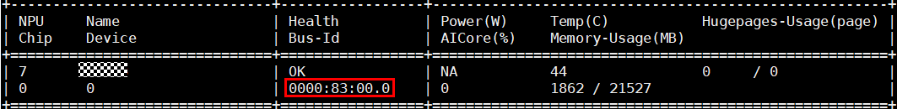
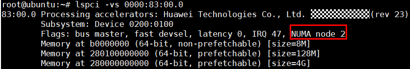
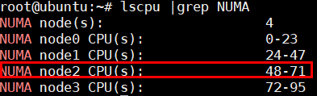

## 模型推理加速<a name="ZH-CN_TOPIC_0000002419102884"></a>

**模型推理加速配置说明<a name="section1745214310349"></a>**

TextEmbedding模型当前支持bert、roberta、xlm\_roberta类embedding模型向量化推理加速，支持的数据类型为float16。如需使用该功能，安装RAG SDK软件包时需将算子模块一并安装，并且确保已经启用该功能（默认为关闭状态），具体示例可以参考[开启推理加速调用示例](./embedding.md#类功能)。

clip模型加速只支持ViT-B-16、ViT-L-14、ViT-L-14-336 、ViT-H-14，下载[链接](https://github.com/OFA-Sys/Chinese-CLIP)参见模型下载说明，开启加速后首次推理会进行图编译，预计耗时 1-2分钟。

-   各类模型推理加速配置如下：

    ```
    from modeling_bert_adapter import enable_bert_speed
    from modeling_roberta_adapter import enable_roberta_speed
    from modeling_xlm_roberta_adapter import enable_xlm_roberta_speed
    from modeling_clip_adapter import enable_clip_speed
    ```

-   设置ENABLE\_BOOST变量激活模型推理加速，设置值为"True"或"False"。

    ```
    os.environ["ENABLE_BOOST"] = "True"
    ```

-   模型加速日志相关环境变量说明。

    ```
    ATB_LOG_TO_STDOUT：设置为1时表示日志记录到标准输出
    ATB_LOG_TO_FILE：设置为1时表示日志记录到文件
    ATB_LOG_LEVEL：设置日志等级，可配置为TRACE，DEBUG，INFO，WARN，ERROR，FATAL
    ```

> [!NOTE] 说明
>对于clip系列模型在Atlas 300I Duo 推理卡上推理，支持加速的batch为<=4，其他batch加速无明显性能提升甚至有劣化情况。

**绑CPU核提升推理性能<a name="section15187132092714"></a>**

如果设备为鲲鹏系列服务器，可通过numactl绑核运行程序，提升推理性能。

1.  通过**npu-smi info**命令获取对应npu卡的_<bus-id\>_。

    

2.  通过**lspci -vs **_**<bus-id\>**_命令查询npu卡对应的NUMA node。

    ```
    lspci -vs 0000:83:00.0
    ```

    

3.  通过lscpu获得NUMA node对应的CPU核数。

    ```
    lscpu | grep NUMA
    ```

    

4.  在程序执行前添加**numactl -C **_**<CPU核数\>**_。

    ```
    numactl -C 48-71 xxxx程序
    ```

**开启推理加速调用示例<a name="section2077111093420"></a>**

```
import os
import torch
import torch_npu
# 适配bert类模型向量化推理加速
from modeling_bert_adapter import enable_bert_speed
from mx_rag.embedding.local import TextEmbedding

# 使能向量化推理加速（设置为"True"时表示使能,"False"表示不使能）
os.environ["ENABLE_BOOST"] = "True"

device_id = 1
torch_npu.npu.set_device(f"npu:{device_id}")

embed = TextEmbedding(model_path="/path/to/model", dev_id=device_id)
print(embed.embed_documents(["北京有哪些景点？"]))
print(embed.embed_query("北京有哪些景点？"))
```

