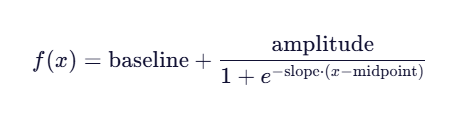

## 排序<a name="ZH-CN_TOPIC_0000002452701713"></a>

### Reranker<a name="ZH-CN_TOPIC_0000002452821633"></a>

#### 类功能<a name="ZH-CN_TOPIC_0000002419262720"></a>

**功能描述<a name="section957011509130"></a>**

重排抽象基类

**函数原型<a name="section12411139493"></a>**

```
from mx_rag.reranker import Reranker
Reranker(k) # 抽象类
```

**输入参数说明<a name="section1054013414143"></a>**

|参数名|数据类型|可选/必选|说明|
|--|--|--|--|
|k|int|必选|返回精排序后最相关的k个结果。|


**返回值说明<a name="section53998444524"></a>**

Reranker对象。


#### rerank<a name="ZH-CN_TOPIC_0000002452701749"></a>

**功能描述<a name="section53998444524"></a>**

抽象函数，子类需实现。方法实现对texts中的列表与query相似性排序，最相似的排序在最前面。

**函数原型<a name="section18789201331417"></a>**

```
@abstractmethod
def rerank(query, texts, batch_size)
```

**输入参数说明<a name="section1054013414143"></a>**

|参数名|数据类型|可选/必选|说明|
|--|--|--|--|
|query|str|必选|输入的排序问题。|
|texts|List[str]|必选|待排序的文本列表。|
|batch_size|int|可选|batch大小，默认为32，可配置的值由设备显存决定。|


**返回值说明<a name="section11818153884917"></a>**

|数据类型|说明|
|--|--|
|np.array|与texts对应的得分数组。|


#### rerank\_top\_k<a name="ZH-CN_TOPIC_0000002419102872"></a>

**功能描述<a name="section53998444524"></a>**

返回列表中得分最高的topk个对象，得分越高，越相似。

**函数原型<a name="section18789201331417"></a>**

```
def rerank_top_k(objs, scores)
```

**输入参数说明<a name="section1054013414143"></a>**

|参数名|数据类型|可选/必选|说明|
|--|--|--|--|
|objs|List|必选|待排序的对象列表，列表长度取值范围[1, 1000*1000], 列表元素Document中内容page_content长度取值范围[1, 128*1024*1024]。|
|scores|np.ndarray|必选|待排序对象对应的得分数组，数组支持维度为1，数组长度取值范围[1, 1000*1000]。|


**返回值说明<a name="section11818153884917"></a>**

|数据类型|说明|
|--|--|
|List|返回k个得分最高对象。|


### LocalReranker<a name="ZH-CN_TOPIC_0000002452821637"></a>

#### 类功能<a id="ZH-CN_TOPIC_0000002419262724"></a>

**功能描述<a name="section957011509130"></a>**

本地使用transformers启动模型，提供文本相关性计算功能。继承抽象类Reranker。当前支持的模型：bge-reranker-large、bge-reranker-base。

> [!NOTE] 说明 
>配置的模型如果不是safetensors权重格式，请先将模型权重转换为safetensors格式后再使用，防止使用ckpt、bin等不安全的模型权重格式引入安全问题。

**函数原型<a name="section12411139493"></a>**

```
from mx_rag.reranker.local import LocalReranker
LocalReranker(model_path, dev_id, k, use_fp16)
```

**输入参数说明<a name="section1054013414143"></a>**

|参数名|数据类型|可选/必选|说明|
|--|--|--|--|
|model_path|str|必选|模型权重文件目录，路径长度不能超过1024，不能为软链接和相对路径。<li>目录下的各文件大小不能超过10GB、深度不超过64，且文件总个数不超过512。<li>运行用户的属组，以及非运行用户不能有该目录下文件的写权限。<li>目录下的文件以及文件的上一级目录的属组必须是运行用户。<br>存放路径不能在路径列表中：["/etc", "/usr/bin", "/usr/lib", "/usr/lib64", "/sys/", "/dev/", "/sbin", "/tmp"]。|
|dev_id|int|可选|模型运行在哪张卡上，取值范围：[0, 63]，默认值为0。|
|k|int|可选|精排后返回最相关的k个结果，取值范围：[1, 10000]，默认值为1。|
|use_fp16|bool|可选|是否将模型转换为半精度，默认值为True。|


**返回值说明<a name="section53998444524"></a>**

LocalReranker对象。

**调用示例<a name="section1911333395714"></a>**

```
from paddle.base import libpaddle
from langchain_core.documents import Document
from mx_rag.reranker.local import LocalReranker
# 同LocalReranker(model_path="path to model", dev_id=0)
doc_1 = Document(
                page_content="我是小红",
                metadata={"source": ""}
            )
doc_2 = Document(
                page_content="我是小明",
                metadata={"source": ""}
            )
docs = [doc_1, doc_2]
rerank = LocalReranker.create(model_path="path to model", dev_id=0)
scores = rerank.rerank('你好', [doc.page_content for doc in docs])
res = rerank.rerank_top_k(docs, scores)
print(res)
```


#### create<a name="ZH-CN_TOPIC_0000002452701753"></a>

**功能描述<a name="section118111227123016"></a>**

创建并返回一个LocalReranker对象。

**函数原型<a name="section544124513018"></a>**

```
@staticmethod
def create(**kwargs)
```

**输入参数说明<a name="section19434210583"></a>**

|参数名|数据类型|可选/必选|说明|
|--|--|--|--|
|kwargs|dict|必选|关键字参数，参考[类功能](#ZH-CN_TOPIC_0000002419262724)的入参，必选参数必须传入，否则将抛出KeyError。|


**返回值说明<a name="section11818153884917"></a>**

|数据类型|说明|
|--|--|
|LocalReranker|LocalReranker对象。|


#### rerank<a name="ZH-CN_TOPIC_0000002419102876"></a>

**功能描述<a name="section53998444524"></a>**

计算文本列表与查询问题的相关性得分。

**函数原型<a name="section18789201331417"></a>**

```
def rerank(query, texts, batch_size)
```

**输入参数说明<a name="section1054013414143"></a>**

|参数名|数据类型|可选/必选|说明|
|--|--|--|--|
|query|str|必选|问题，和所有的text进行相关性计算，字符串长度范围[1, 1024 * 1024]。|
|texts|List[str]|必选|文本列表，列表长度范围[1, 1000*1000]，列表元素文本长度范围[1, 1024 * 1024]。|
|batch_size|int|可选|组batch的大小，每次会组合batch_size的texts进行embed操作，取值范围[1, 1024]，默认值为32。|


**返回值说明<a name="section11818153884917"></a>**

|数据类型|说明|
|--|--|
|numpy.array|和texts长度一致的numpy数组，保存每个text和query的相关性得分。|


### TEIReranker<a name="ZH-CN_TOPIC_0000002452821641"></a>

#### 类功能<a id="ZH-CN_TOPIC_0000002419262728"></a>

**功能描述<a name="section957011509130"></a>**

连接TEI服务，提供文本相关性计算功能，继承抽象类Reranker。

**函数原型<a name="section12411139493"></a>**

```
from mx_rag.reranker.service import TEIReranker
TEIReranker(url,  k, client_param)
```

**输入参数说明<a name="section1054013414143"></a>**

|参数名|数据类型|可选/必选|说明|
|--|--|--|--|
|url|str|必选|TEI rerank服务地址，字符串长度范围[1, 128]。支持"/rerank"、"/v1/rerank"接口。<br>> [!NOTE] 说明 当前基于TEI框架创建的rerank服务不支持https协议，为安全起见可通过搭建一个nginx服务，使该服务与rerank服务处于一个可信网络。使用时客户端以https方式访问nginx，nginx转发请求到rerank服务。|
|k|int|可选|精排后返回最相关的k个结果，取值范围[1, 10000]，默认值为1。|
|client_param|ClientParam|可选|https客户端配置参数，默认值为ClientParam()，具体描述请参见[ClientParam](./univers_api.md#clientparam)。|


**返回值说明<a name="section53998444524"></a>**

TEIReranker对象。

**调用示例<a name="section775131316315"></a>**

```
from paddle.base import libpaddle
from mx_rag.reranker.service import TEIReranker
from mx_rag.utils import ClientParam
# 同LocalReranker(url="https://ip:port/rerank", client_param=ClientParam(xxx))
rerank = TEIReranker.create(url="https://ip:port/rerank",
                            client_param=ClientParam(ca_file="/path/to/ca.crt"))
docs = ['我是小红', '我是小明']
scores = rerank.rerank('你好', docs)
res = rerank.rerank_top_k(docs, scores)
print(res)
```


#### create<a name="ZH-CN_TOPIC_0000002452701757"></a>

**功能描述<a name="section118111227123016"></a>**

创建并返回一个TEIReranker对象。

**函数原型<a name="section544124513018"></a>**

```
@staticmethod
def create(**kwargs)
```

**输入参数说明<a name="section19434210583"></a>**

|参数名|数据类型|可选/必选|说明|
|--|--|--|--|
|kwargs|dict|必选|关键字参数，参考[类功能](#ZH-CN_TOPIC_0000002419262728)的入参，必选参数必须传入，否则将抛出KeyError。|


**返回值说明<a name="section11818153884917"></a>**

|数据类型|说明|
|--|--|
|TEIReranker|TEIReranker对象。|


#### rerank<a name="ZH-CN_TOPIC_0000002419102880"></a>

**功能描述<a name="section53998444524"></a>**

调用TEI服务，计算文本的相关性得分。

**函数原型<a name="section18789201331417"></a>**

```
def rerank(query, texts, batch_size)
```

**输入参数说明<a name="section1054013414143"></a>**

|参数名|数据类型|可选/必选|说明|
|--|--|--|--|
|query|str|必选|问题，会和所有的text进行相关性计算。字符串长度范围[1, 1024 * 1024]。|
|texts|List[str]|必选|文本列表，列表长度取值(0, 1000*1000]，字符串长度范围[1, 1024 * 1024]。|
|batch_size|int|可选|组batch的大小，每次会组合batch_size的texts进行embed操作，取值范围[1, 1024]，默认值为32。|


**返回值说明<a name="section11818153884917"></a>**

|数据类型|说明|
|--|--|
|numpy.array|和texts长度一致的numpy数组，保存每个text和query的相关性得分。|


### RerankerFactory<a name="ZH-CN_TOPIC_0000002452821645"></a>

#### 类功能<a id="ZH-CN_TOPIC_0000002419262732"></a>

**功能描述<a name="section53998444524"></a>**

reranker的工厂方法类，用于生产RAG SDK的reranker。

**函数原型<a name="section18789201331417"></a>**

```
from mx_rag.reranker import RerankerFactory
class RerankerFactory(ABC):
    _NPU_SUPPORT_RERANKER: Dict[str, Callable[[Dict[str, Any]], Reranker]] = {
        "local_reranker": LocalReranker.create,
        "tei_reranker": TEIReranker.create
    }
```

**调用示例<a name="section437712181015"></a>**

```
from paddle.base import libpaddle
from mx_rag.reranker import RerankerFactory
from mx_rag.utils import ClientParam
docs = ['我是小红', '我是小明']
local_reranker = RerankerFactory.create_reranker(similarity_type="local_reranker", model_path="path to model", dev_id=0)
local_scores = local_reranker.rerank('你好', docs)
print(local_scores)
# 根据实际情况修改参数
tei_reranker = RerankerFactory.create_reranker(similarity_type="tei_reranker",
                                               url="https://ip:port/rerank",
                                               client_param=ClientParam(ca_file="/path/to/ca.crt"))
tei_scores = local_reranker.rerank('你好', docs)
print(tei_scores)
```


#### create\_reranker<a name="ZH-CN_TOPIC_0000002452701761"></a>

**功能描述<a name="section53998444524"></a>**

构造reranker。调用LocalReranker和TEIReranker的静态方法create返回实例。

**函数原型<a name="section18789201331417"></a>**

```
@classmethod
def create_reranker(cls, **kwargs):
```

**输入参数说明<a name="section1054013414143"></a>**

|参数名|数据类型|可选/必选|说明|
|--|--|--|--|
|similarity_type|str|必选|该参数在kwargs中，reranker的类型。<br>可取值：<li>local_reranker<li>tei_reranker|
|**kwargs|Any|可选|除去similarity_type，其余参数为构造reranker的参数。<li>如果是local_reranker，请参见[类功能](#ZH-CN_TOPIC_0000002419262724)。<li>如果是tei_reranker，请参见[类功能](#ZH-CN_TOPIC_0000002419262728)。|


### MixRetrieveReranker<a name="ZH-CN_TOPIC_0000002419102832"></a>

#### 类功能<a name="ZH-CN_TOPIC_0000002419408806"></a>

**功能描述<a name="section53998444524"></a>**

提供BM25和稠密向量混合检索结果排序功能，继承抽象类Reranker。

**函数原型<a name="section18789201331417"></a>**

```
from mx_rag.reranker.local import MixRetrieveReranker
MixRetrieveReranker(k, baseline, amplitude, slope, midpoint)
```

**输入参数说明<a name="section1054013414143"></a>**

|参数名|数据类型|可选/必选|说明|
|--|--|--|--|
|k|int|可选|排序后返回最相关的k个结果，取值范围：[1, 10000]，默认值为100|
|baseline|float|可选|权重求取公式基础值，取值范围：[0.0, 1.0]，默认值为0.4|
|amplitude|float|可选|权重求取公式幅度，取值范围：[0.0, 1.0]，默认值为0.3|
|slope|float|可选|控制过渡的陡峭程度，取值大于0，默认值为1|
|midpoint|float|可选|函数值达到基础值和最大值中间点时的query长度，取值大于0，默认值为6|


注意：权重计算公式为如下所示，请确保计算结果取值为：\[0, 1\]。



**返回值说明<a name="section11818153884917"></a>**

MixRetrieveReranker对象。

**调用示例<a name="section1911333395714"></a>**

```
from langchain_core.documents import Document
from mx_rag.reranker.local import MixRetrieveReranker

doc_1 = Document(
    page_content="document1",
    metadata={
        "score": 1.0,
        "retrieval_type": "dense",
    }
)
doc_2 = Document(
    page_content="document2",
    metadata={
        "score": 2.0,
        "retrieval_type": "sparse",
    }
)
docs = [doc_1, doc_2]
query = "这是一个问题"
reranker = MixRetrieveReranker(k=100, baseline=0.4, amplitude=0.3, slope=1, midpoint=6)
res = reranker.rerank(query, docs)
```


#### rerank<a name="ZH-CN_TOPIC_0000002452967713"></a>

**功能描述<a name="section53998444524"></a>**

对混合检索结果进行加权打分并排序，返回最高得分的k个结果。

**函数原型<a name="section18789201331417"></a>**

```
def rerank(query, texts, batch_size)
```

**输入参数说明<a name="section1054013414143"></a>**

|参数名|数据类型|可选/必选|说明|
|--|--|--|--|
|query|str|必选|问题，会和所有的text进行相关性计算。字符串长度范围[1, 1024 * 1024]。|
|texts|list[Document]|必选|文本列表，列表长度取值(0, 1000*1000]，字符串长度范围[1, 1024 * 1024]。|
|batch_size|int|可选|batch大小，默认为32，该变量暂未使用。|


**返回值说明<a name="section11818153884917"></a>**

|数据类型|说明|
|--|--|
|list[Document]|最高得分的k个结果。|


