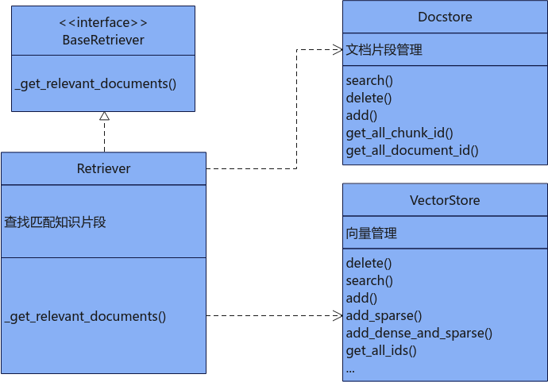

## 检索<a name="ZH-CN_TOPIC_0000002018714873"></a>

### Retriever<a name="ZH-CN_TOPIC_0000001981995612"></a>

#### 类功能<a name="ZH-CN_TOPIC_0000002018595357"></a>

**功能描述<a name="section957011509130"></a>**

将待搜索的问题进行向量化后使用近似算法在向量数据库中检索相似的topk个向量ID，通过向量ID获取关系数据库中topk个相关文档。该类继承langchain\_core.retrievers.BaseRetriever，通过调用基类的invoke方法使用检索功能，待检索的问题为str类型，长度不超过100万。

**函数原型<a name="section12411139493"></a>**

```
from mx_rag.retrievers import Retriever
# 所有参数需通过关键字参数传递
Retriever(vector_store, document_store, embed_func, k, score_threshold)
```

**依赖关系<a name="section424045119368"></a>**




**参数说明<a name="section1054013414143"></a>**

所有参数需通过关键字参数传递

|参数名|数据类型|可选/必选|说明|
|--|--|--|--|
|vector_store|VectorStore|必选|向量数据库实例，具体类型可参见[VectorStore](./databases.md#vectorstore)。|
|document_store|Docstore|必选|关系型数据库实例，具体类型可参见[Docstore](./databases.md#docstore)。|
|embed_func|Callable[[List[str]], Union[List[List[float]], List[Dict[int, float]]]]|必选|embedding回调函数。|
|k|int|可选|检索的条目范围topk，取值范围[1, 10000]，默认值为1。|
|score_threshold|float|可选|检索分数阈值，默认值为None，如果为None则不使能阈值过滤功能。如果使用，则取值范围在[0, 1]，阈值取得越大，匹配越严格；阈值取得越小，匹配越不严格。|
|filter_dict|Dict|可选|默认为{}，由检索条件组成的字典，当前只支持对document_id进行过滤，过滤的文档id以列表形式传入，id列表长度不超过1000*1000。例如，需要在document_id为1，2，4这几篇文档中过滤，则传入的字典为{"document_id": [1, 2, 4]}。|


**调用示例<a name="section723323518481"></a>**

```
from paddle.base import libpaddle
from langchain_community.document_loaders import TextLoader
from langchain.text_splitter import RecursiveCharacterTextSplitter
from mx_rag.embedding.local import TextEmbedding
from mx_rag.storage.document_store import SQLiteDocstore
from mx_rag.storage.vectorstore import MindFAISS
from mx_rag.document import LoaderMng
from mx_rag.knowledge.knowledge import KnowledgeStore
from mx_rag.knowledge.handler import upload_files
from mx_rag.knowledge import KnowledgeDB
from mx_rag.retrievers import Retriever
# STET1:构建知识库,首先注册文档处理器
loader_mng = LoaderMng()
# 加载文档加载器，可以使用RAG SDK自有的，也可以使用langchain的
loader_mng.register_loader(loader_class=TextLoader, file_types=[".txt"])
# 加载文档切分器，使用langchain的
loader_mng.register_splitter(splitter_class=RecursiveCharacterTextSplitter,
                             file_types=[".txt"],
                             splitter_params={"chunk_size": 750,
                                              "chunk_overlap": 150,
                                              "keep_separator": False
                                              })
# 初始化embedding模型
emb = TextEmbedding(model_path="/path/to/acge_text_embedding", dev_id=0)
# 初始化向量数据库
vector_store = MindFAISS(x_dim=1024,
                         
                         devs=[0],
                         load_local_index="./faiss.index",
                         auto_save=True
                         )
# 初始化文档chunk关系数据库
chunk_store = SQLiteDocstore(db_path="./sql.db")
# 初始化知识管理关系数据库
knowledge_store = KnowledgeStore(db_path="./sql.db")
#添加知识库及管理员
knowledge_store.add_knowledge(knowledge_name="test", user_id='Default', role='admin')
# 初始化知识库管理
knowledge_db = KnowledgeDB(knowledge_store=knowledge_store,
                           chunk_store=chunk_store,
                           vector_store=vector_store,
                           knowledge_name="test",
                           user_id='Default',
                           white_paths=["/home"]
                           )
# 完成离线知识库构建,上传领域知识gaokao.txt文档。
upload_files(knowledge=knowledge_db,
             files=["/home/data/gaokao.txt"],
             loader_mng=loader_mng,
             embed_func=emb.embed_documents,
             force=True
             )
# STET2:初始化检索器
text_retriever = Retriever(vector_store=vector_store,
                           document_store=chunk_store,
                           embed_func=emb.embed_documents,
                           k=1,
                           score_threshold=0.2
                           )
res = text_retriever.invoke("请描述一下2024年高考语文作文题目")
print(res)
```


#### set\_filter<a name="ZH-CN_TOPIC_0000002319941789"></a>

**功能描述<a name="section5434255810"></a>**

设置检索的过滤条件

**函数原型<a name="section18789201331417"></a>**

```
def set_filter(filter_dict)
```

**输入参数说明<a name="section19434210583"></a>**

|参数名|数据类型|可选/必选|说明|
|--|--|--|--|
|filter_dict|Dict|必选|由检索条件组成的字典，当前只支持对document_id进行过滤，过滤的文档id以列表形式传入，id列表长度不超过1000*1000。例如，需要在document_id为1，2，4这几篇文档中过滤，则传入的字典为{"document_id": [1, 2, 4]}。|


### MultiQueryRetriever<a name="ZH-CN_TOPIC_0000001981995320"></a>

#### 类功能<a name="ZH-CN_TOPIC_0000002018595425"></a>

**功能描述<a name="section957011509130"></a>**

将输入的query发送给大模型进行问题改写，然后再根据每个问题检索对应的topk个相似文档，对n个问题\*topk个文档去重和按文本长度排序。该类继承mx\_rag.retrievers.Retriever，通过调用基类的invoke方法使用检索功能，输入的query长度不超过100万。

**函数原型<a name="section12411139493"></a>**

```
from mx_rag.retrievers import MultiQueryRetriever
# 所有参数需通过关键字参数传递
MultiQueryRetriever(llm, prompt, parser, llm_config)
```

**参数说明<a name="section1054013414143"></a>**

|参数名|数据类型|可选/必选|说明|
|--|--|--|--|
|llm|Text2TextLLM|必选|大模型对象实例，具体类型请参见[Text2TextLLM](./llm_client.md#text2textllm)。|
|prompt|langchain_core.prompts.PromptTemplate|可选|默认值如下，其中question字符串是固定的，不能更改，表示输入的问题；prompt.input_variables必须包含question，prompt.template的长度取值范围为(0,1 * 1024 * 1024]，表示提示词。实际请求大模型的query为prompt拼接question,其有效取值依赖MindIE的配置，请参见《MindIE LLM开发指南》中的“核心概念与配置 > 配置参数说明（服务化）”章节中关于maxSeqLen的说明。注意：prompt和question的语言类型最好保持一致，或者指明大模型回答语言类型，否则会影响大模型回答效果。<br>```PromptTemplate(    input_variables=["question"],    template="""你是一个人工智能语言模型助理。您的任务是根据用户的原始问题，从不同角度改写生成3个问题。    请从1开始编号且用中文回答，每个问题用换行符分隔开。下面是一个改写例子：    样例原始问题：    你能告诉我关于爱因斯坦相关的信息吗？    样例改写生成后的3个问题：    1.爱因斯坦的生平和主要科学成就有哪些？    2.爱因斯坦在相对论和其他物理学领域有哪些重要贡献？    3.爱因斯坦的个人生活和他对社会的影响是怎样的？    需要改写的问题：{question}""")```|
|parser|langchain_core.output_parsers.BaseOutputParser|可选|对大模型返回内容处理的类OutputParser的实现类，默认值是DefaultOutputParser。其继承实现了langchain_core.output_parsers.BaseOutputParser，对大模型返回的多个问题通过数字编号进行拆分。|
|llm_config|LLMParameterConfig|可选|调用大模型的参数，详细描述可参见[LLMParameterConfig](./llm_client.md#llmparameterconfig)。|


**调用示例<a name="section129100236713"></a>**

```
#知识库构建的示例请参考以上Retriever调用示例STET1，本示例默认已经完成离线知识库构建。

from mx_rag.retrievers import MultiQueryRetriever
from mx_rag.llm import Text2TextLLM
from mx_rag.utils import ClientParam
# 初始化大模型
llm = Text2TextLLM(base_url="https://<ip>:<port>/v1/chat/completions",
                   model_name="Llama3-8B-Chinese-Chat",
                   client_param=ClientParam(ca_file="/path/to/ca.crt"))
# 初始化检索器
multi_text_retriever = MultiQueryRetriever(llm=llm,
                                           vector_store=vector_store,
                                           document_store=chunk_store,
                                           embed_func=emb.embed_documents,
                                           k=1,
                                           score_threshold=0.2
                                           )
res = multi_text_retriever.invoke("请描述一下2024年高考语文作文题目？")
print(res)
```


### BMRetriever<a name="ZH-CN_TOPIC_0000002026136205"></a>

#### 类功能<a name="ZH-CN_TOPIC_0000001989736728"></a>

**功能描述<a name="section957011509130"></a>**

将输入的query通过大模型提取关键词，再使用BM25进行topk检索，该类继承langchain\_core.retrievers.BaseRetriever，通过调用基类的invoke方法使用检索功能，输入的query长度不超过100万。

**函数原型<a name="section12411139493"></a>**

```
from mx_rag.retrievers.bm_retriever import BMRetriever
# 所有参数需通过关键字参数传递
BMRetriever(docs, llm, k, llm_config, prompt, preprocess_func)
```

**输入参数说明<a name="section1054013414143"></a>**

|参数名|数据类型|可选/必选|说明|
|--|--|--|--|
|docs|List[Document]|必选|待检索的文档列表，列表长度取值范围：[0, 1000]。|
|llm|Text2TextLLM|必选|大模型对象实例，具体类型请参见[Text2TextLLM](./llm_client.md#text2textllm)。|
|k|int|可选|检索返回的top k，取值范围：[1,10000]，默认值为1。|
|llm_config|LLMParameterConfig|可选|调用大模型参数，此处默认值temperature为0.5，top_p为0.95，其余参数说明请参见[LLMParameterConfig](./llm_client.md#llmparameterconfig)。|
|prompt|langchain_core.prompts.PromptTemplate|可选|默认值如下，其中question字符串是固定的，不能更改，表示输入的问题；prompt.input_variables必须包含question，prompt.template的长度取值范围为(0,1 * 1024 * 1024]，表示提示词。实际请求大模型的query为prompt拼接question,其有效取值依赖MindIE的配置，请参见《MindIE LLM开发指南》中的“核心概念与配置 > 配置参数说明（服务化）”章节中关于maxSeqLen的说明。注意：prompt和question的语言类型最好保持一致，或者指明大模型回答语言类型，否则会影响大模型回答效果。<br>PromptTemplate(<br>input_variables=["question"],<br>template="""根据问题提取关键词，不超过10个。关键词尽量切分为动词、名词、或形容词等单独的词，<br>不要长词组（目的是更好的匹配检索到语义相关但表述不同的相关资料）。请根据给定参考资料提取关键词，关键词之间使用逗号分隔，比如{{关键词1, 关键词2}}<br>Question: CANN如何安装？<br>Keywords: CANN, 安装, install<br>Question: MindStudio 容器镜像怎么制作<br>Keywords: MindStudio, 容器镜像, Docker build<br>Question: {question}<br>Keywords:<br>""")|
|preprocess_func|Callable[[str], List[str]]|可选|BM25检索前预处理，对大模型返回的文本串数据进行切分获取关键词列表。默认对字符串使用逗号进行切分。|


**调用示例<a name="section129100236713"></a>**

```
from mx_rag.document.loader import DocxLoader
from mx_rag.chain import SingleText2TextChain
from mx_rag.llm import Text2TextLLM
from mx_rag.retrievers.bm_retriever import BMRetriever
from langchain_text_splitters import RecursiveCharacterTextSplitter
from mx_rag.utils import ClientParam
loader = DocxLoader("/path/to/MindIE.docx")
docs = loader.load_and_split(RecursiveCharacterTextSplitter(chunk_size=750, chunk_overlap=150))
client_param = ClientParam(ca_file="/path/to/ca.crt")
llm = Text2TextLLM(base_url="https://ip:port/v1/chat/completions", model_name="qianwen-7b", client_param = client_param)
bm_retriever = BMRetriever(docs=docs, llm=llm, k=10)
text2text_chain = SingleText2TextChain(llm=llm, retriever=bm_retriever)
res = text2text_chain.query("怎么安装MindIE?")
print(res)
```


### FullTextRetriever<a name="ZH-CN_TOPIC_0000002264504614"></a>

#### 类功能<a name="ZH-CN_TOPIC_0000002299145589"></a>

**功能描述<a name="section957011509130"></a>**

使用BM25对输入的query进行topk检索，该类继承langchain\_core.retrievers.BaseRetriever，通过调用基类的invoke方法使用检索功能，输入的query长度不超过100万。

**函数原型<a name="section12411139493"></a>**

```
from mx_rag.retrievers.full_text_retriever import FullTextRetriever
FullTextRetriever(document_store, k)
```

**输入参数说明<a name="section1054013414143"></a>**

|参数名|数据类型|可选/必选|说明|
|--|--|--|--|
|document_store|MilvusDocstore类或OpenGaussDocstore类|必选|存储待检索文本语料的关系数据库实例，当前只支持MilvusDocstore和OpenGaussDocstore两种|
|k|int|可选|检索返回的top k个MxDocument的数目，取值范围：[1,10000]，默认值为1。|
|filter_dict|Dict|可选|默认为{}，由检索条件组成的字典，当前只支持对document_id进行过滤，过滤的文档id以列表形式传入，id列表长度不超过1000*1000。例如，需要在document_id为1，2，4这几篇文档中过滤，则传入的字典为{"document_id": [1, 2, 4]}。|


**调用示例<a name="section129100236713"></a>**

```
import getpass
from pymilvus import MilvusClient
from langchain_text_splitters import RecursiveCharacterTextSplitter
from mx_rag.document.loader import DocxLoader
from mx_rag.storage.document_store import MxDocument, MilvusDocstore
from mx_rag.retrievers import FullTextRetriever


client = MilvusClient("https://x.x.x.x:port", user="xxx", password=getpass.getpass(), secure=True, client_pem_path="path_to/client.pem",   client_key_path="path_to/client.key",   ca_pem_path="path_to/ca.pem",   server_name="localhost")

chunk_store = MilvusDocstore(client)
docs = DocxLoader("test.docx").load_and_split(
        RecursiveCharacterTextSplitter(chunk_size=750, chunk_overlap=100))
mxdocs = [MxDocument(page_content=doc.page_content, metadata=doc.metadata, document_name="text.docx") for doc in docs]
chunk_store.add(mxdocs, 1)
full_retrive = FullTextRetriever(document_store=chunk_store, k=3)
print(full_retrive.invoke("爪哇岛"))
```


#### set\_filter<a name="ZH-CN_TOPIC_0000002319871057"></a>

**功能描述<a name="section5434255810"></a>**

设置全文检索的过滤条件。

**函数原型<a name="section18789201331417"></a>**

```
def set_filter(filter_dict)
```

**输入参数说明<a name="section19434210583"></a>**

|参数名|数据类型|可选/必选|说明|
|--|--|--|--|
|filter_dict|Dict|必选|由检索条件组成的字典，当前只支持对document_id进行过滤，过滤的文档id以列表形式传入，id列表长度不超过1000*1000。例如，需要在document_id为1，2，4这几篇文档中过滤，则传入的字典为{"document_id": [1, 2, 4]}。|


