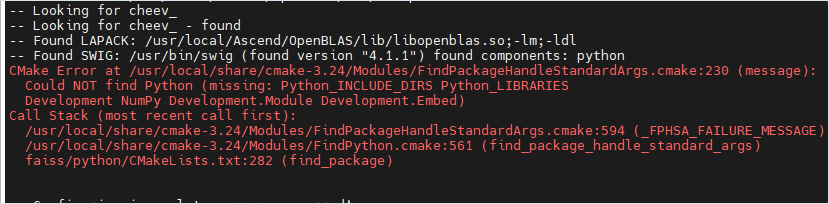
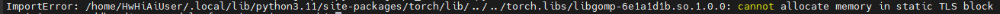
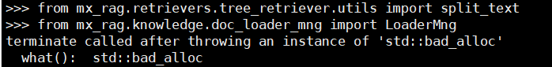

# FAQ<a name="ZH-CN_TOPIC_0000002018715009"></a>

## 软件安装时常见问题<a name="ZH-CN_TOPIC_0000002256243668"></a>

### 在Kylin V10上遇到错误<a name="ZH-CN_TOPIC_0000001988919442"></a>

**问题现象<a name="section238219259714"></a>**

在操作系统Kylin V10上遇到无法安装ascendfaiss等问题。

**问题原因<a name="section147095251275"></a>**

依赖没有正确安装。

**解决方案<a name="section19641271973"></a>**

正确安装依赖，如下：

```
# 升级swig
tar -xzvf swig-4.0.2.tar.gz
cd swig-4.0.2
./configure --prefix=/usr/local/share
make && make install
# 安装Python3.10或Python3.11，以下以安装Python3.10.14为例
# 首先从官网下载并安装python3.10.14
tar zxvf Python-3.10.14.tgz
cd Python-3.10.14
./configure --prefix=/usr/local
make && make install
echo 'export PATH=/usr/local/python3.10.14/bin:$PATH' >> /etc/profile
source /etc/profile
# 安装openblas
git clone https://github.com/xianyi/OpenBLAS.git
cd OpenBLAS && make -j8 && make install
export LD_LIBRARY_PATH=/opt/OpenBLAS/lib:$LD_LIBRARY_PATH
```


### openEuler的REPO源配置<a name="ZH-CN_TOPIC_0000002251012161"></a>

1.  新建yum源配置文件

    ```
    vim /etc/yum.repos.d/openEuler.repo
    ```

    内容如下：

    ```
    [openEuler] 
    name=openEuler repository 
    baseurl=https://mirrors.aliyun.com/openeuler/openEuler-24.03-LTS/OS/x86_64/
    gpgcheck=1 
    enabled=1 
    gpgkey=https://repo.openeuler.org/openEuler-24.03-LTS/OS/x86_64/RPM-GPG-KEY-openEuler
    ```

2.  更新yum缓存

    ```
    yum makecache
    ```


### 编译Faiss 1.10.0时，CMake出现报错信息<a name="ZH-CN_TOPIC_0000002472901917"></a>

**问题现象<a name="section428442235616"></a>**

编译Faiss 1.10.0时，出现报错信息，提示“CMake 3.24.0 or higher is required”。

**问题原因<a name="section243812295615"></a>**

当前CMake的版本过低，Faiss 1.10.0需要配套CMake 3.24.0及以上版本。

**解决方案<a name="section18586112214564"></a>**

安装CMake 3.24.0或以上版本。以安装CMake 3.24.0版本为例：

-   x86环境：
    1.  获取CMake安装脚本。

        ```
        wget https://github.com/Kitware/CMake/releases/download/v3.24.0/cmake-3.24.0-linux-x86_64.sh
        ```

    2.  运行安装脚本。

        ```
        bash ./cmake-3.24.0-linux-x86_64.sh --skip-license --prefix=/usr
        ```

        ```
        # 安装过程中遇到：
        # 选择1
        Do you accept the license? [y/n]: 
        # 输入 y
        # 选择2
        By default the CMake will be installed in:
          "/usr/cmake-3.24.0-linux-x86_64"
        Do you want to include the subdirectory cmake-3.24.0-linux-x86_64?
        Saying no will install in: "/usr" [Y/n]:
        # 输入 n
        ```

    3.  查看CMake版本。

        ```
        cmake --version
        ```

        显示当前的CMake版本：

        ```
        cmake version 3.24.0
        ```

-   aarch64环境：
    1.  获取CMake安装脚本。

        ```
        wget https://github.com/Kitware/CMake/releases/download/v3.24.0/cmake-3.24.0-linux-aarch64.sh
        ```

    2.  运行安装脚本。

        ```
        bash ./cmake-3.24.0-linux-aarch64.sh --skip-license --prefix=/usr
        ```

        ```
        # 安装过程中遇到：
        # 选择1
        Do you accept the license? [y/n]: 
        # 输入 y
        # 选择2
        By default the CMake will be installed in:
          "/usr/cmake-3.24.0-linux-aarch64"
        Do you want to include the subdirectory cmake-3.24.0-linux-aarch64?
        Saying no will install in: "/usr" [Y/n]:
        # 输入 n
        ```

    3.  查看CMake版本。

        ```
        cmake --version
        ```

        显示当前的CMake版本：

        ```
        cmake version 3.24.0
        ```


### 编译安装ascendfaiss报Python错误<a name="ZH-CN_TOPIC_0000002439453562"></a>

**问题现象<a name="section428442235616"></a>**

编译安装ascendfaiss，出现如下报错信息。



**问题原因<a name="section243812295615"></a>**

源码编译安装Python时，未配置<b>--enable-shared</b>参数进行编译。

**--enable-shared**：保留之前生成的共享库。

**解决方案<a name="section18586112214564"></a>**

重新编译安装Python，编译参数示例如下。

```
./configgure --prefix=/usr/local/python3.11.11 --enable-shared
```


## 运行时常见问题<a name="ZH-CN_TOPIC_0000002256346734"></a>

### cannot allocate memory in static TLS block<a name="ZH-CN_TOPIC_0000001982155048"></a>

**问题现象<a name="section238219259714"></a>**

import报错示例：ImportError: xxxxx cannot allocate memory in static TLS block



**问题原因<a name="section147095251275"></a>**

不同组件引用so时冲突报错。

**解决方案<a name="section19641271973"></a>**

1.  在运行的demo或者示例代码第一行加入以下内容：

    ```
    from paddle.base import libpaddle
    ```

2.  重试，如果还没解决将上述报错so全路径添加到LD\_PRELOAD环境变量，注意可能会有多条。示例如下：其中xxxx为报错的so路径信息

    ```
    export LD_PRELOAD=xxxx:$LD_PRELOAD
    ```


### 运行时报错：std::bad\_alloc<a name="ZH-CN_TOPIC_0000001981995388"></a>

**问题现象<a name="section238219259714"></a>**

Python导包时出现以下报错：



**问题原因<a name="section147095251275"></a>**

不同组件引用libgomp时冲突报错。

**解决方案<a name="section19641271973"></a>**

在运行的Demo或者示例代码第一行加入以下内容：

```
from paddle.base import libpaddle
```


### 运行时报错：corrupted size vs. prev\_size或者Segmentation fault<a name="ZH-CN_TOPIC_0000002023064214"></a>

**问题现象<a name="section238219259714"></a>**

运行完成最后报错：corrupted size vs. prev\_size或者Segmentation fault。

**问题原因<a name="section147095251275"></a>**

可能是由于用户的业务进程中，有别的组件使用了acl资源并调用aclFinalize进行释放，从而导致acl资源重复释放。

**解决方案<a name="section19641271973"></a>**

-   方案一

    可以设置环境变量“MX\_INDEX\_FINALIZE”为0，则Index SDK不调用aclFinalize；设置为“1”表示仍调用aclFinalize。其他为无效设置。

    确保安装的Index SDK版本配套的版本，添加环境变量：

    ```
    export MX_INDEX_FINALIZE=0
    ```

-   方案二

    若方案一无效，删除from paddle.base import libpaddle，然后调整导包顺序。若同时导入mx\_rag.retrievers或mx\_rag.storage相关包与mx\_rag.document或mx\_rag.knowledge相关包，需先导入后者。


### 抛出异常时，堆栈信息只打印了一行异常信息<a name="ZH-CN_TOPIC_0000002087879053"></a>

**问题现象<a name="section1288715213318"></a>**

抛出异常时，堆栈信息只打印了一行异常信息。

**问题原因<a name="section1714153416395"></a>**

当前默认堆栈限制设置为0，即只打印堆栈的栈顶信息。

```
sys.tracebacklimit = 0
```

**解决方案<a name="section1165122414"></a>**

在运行的Demo或调用处，导入mx\_rag的包后，增加配置：

```
import mx_rag
import sys
# 在import mx_rag或mx_rag的子模块后增加：
sys.tracebacklimit = 1000
```

> [!NOTE] 说明
>打印堆栈信息可能导致打印调用点的参数，参数中可能有敏感信息，请注意识别。


