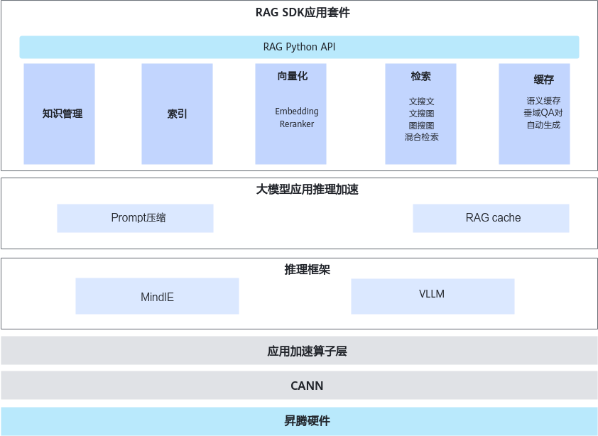

# 简介

随着近些年人工智能技术的飞速发展，大模型展现出强大的能力。然而，在实际应用中，大模型仍面临一些挑战，如准确性不足、知识更新速度慢以及答案透明度欠缺等问题。为了解决这些问题，检索增强生成（Retrieval-Augmented Generation，RAG）技术应运而生。RAG通过为大模型接入外部知识库，有效提升了问答系统的准确率，解决了大模型的幻觉和时效性问题。

RAG技术能够以较低成本将基础大模型转换为领域专用大模型，成为提升大模型“最后一公里”落地应用效果的关键技术。基于昇腾平台的知识增强RAG SDK，旨在实现高效的检索增强生成功能。RAG SDK可以帮助用户构建面向具体应用场景的问答系统，从而提高系统的实用性和可靠性。

**RAG SDK是什么**

RAG SDK是昇腾面向大语言模型的知识检索增强开发套件，为解决大模型知识更新缓慢以及垂直领域知识回答弱的问题，提供各模块化功能接口（包含向量模型垂域微调数据生成、检索、知识管理等功能）供用户开发上层应用，不包含用户、权限等和业务强相关的功能接口。

**RAG SDK的主要功能**

RAG SDK提供快速构建基于昇腾平台问答系统的能力，提供多模态文档解析、知识库管理等能力，降低用户大模型应用开发门槛，支持对接开源生态。

-   快速搭建：提供模块化功能接口，支持按需进行调用。通过预置的端到端工作流模板，支持用户通过极少量代码快速拉起问答服务。
-   多模态解析：支持文档、表格、PDF、图片等多种类型文件的解析，为大模型提供多样性语料。
-   高性能推理：提供昇腾亲和模型优化加速，实现更高的吞吐和更短的响应时间。

**读者对象**

本文档主要适用于以下人员：

-   华为技术支持工程师
-   渠道伙伴技术支持工程师

# 软件架构

RAG SDK软件架构如[图1](#fig10342102918356)所示，架构图中的关键模块介绍如下。

**图 1**  软件架构图  

-   RAG Python API：Python API提供模块化功能接口，方便用户灵活调用各类RAG服务。
-   知识管理：提供RAG场景的知识库管理，支持用户创建多个知识库，每个知识库可上传文档、表格、图片等文件，检索时可选择作为大模型的外挂知识库。支持文档、表格、图片的加载与解析，文档切分，以及高效的向量检索技术，显著提升检索效果和召回率。为后续的向量化和检索提供数据支持。
-   索引：通常包括语料收集、语料解析、语料切割和索引构建（向量化），以便之后进行向量检索。生成的索引基于知识管理模块的内容，并且依赖向量化的结果来完成检索的高效匹配。
-   向量化：提供调用向量化模型的能力，包括embedding类和reranker类。支持本地部署和服务化部署两种形态，服务化框架采用text-embeddings-inference。提供嵌入模型、重排模型的加载和第三方服务对接，支持对接大语言模型、图像生成模型服务。向量化结果是检索的基础，确保查询与知识库内容的匹配。
-   检索：向量检索加速利用昇腾NPU异构检索加速框架，针对高维空间中的海量数据，提供高性能的检索。当接受到用户查询后，调用大模型将查询文本进行查询转换，并生成查询向量；依据查询向量进行搜索和重排，然后把搜索结果返回给大模型进行进一步处理。检索依赖向量化的结果，通过向量对比进行高效匹配。
-   缓存：对接开源gptcache，支持完全一致缓存（memory cache）和语义相似缓存（similarity cache），加速RAG应用。通过缓存已查询的结果，减少重复计算，提升检索速度。
-   应用加速算子层：提供昇腾亲和模型优化加速，实现更高的吞吐和更短的响应时间。优化向量化、检索等核心模块的运行效率，确保整体系统快速响应。

# 支持的硬件和运行环境

<table>
<tr>
<th>产品型号</th>
<th>操作系统版本</th>
</tr>

<tr>
<td>Atlas 300I Duo 推理卡</td>
<td rowspan="2"><li>Ubuntu 20.04<li>Ubuntu 22.04<li>Ubuntu 24.04<li>KylinOS V10 SP3<li>BCLinux 21.10<li>EulerOS 2.13 for aarch64<li>EulerOS 2.15 for aarch64<li>Huawei Cloud EulerOS for x86_64<li>openEuler 24.03<li>openEuler 22.03 LTS SP4 for aarch64<li>CUlinux 3.0<li>CtyunOS 23.01<li>Kylin V10 SP3 2403<li>KylinOS V11</td>
</tr>
<td>
Atlas 800I A2 推理服务器
Atlas 800I A3 超节点服务器</td>
<tr>
</table>
